# 1. The gola of RL
Policy gradients are the simplest RL algorithm. Policy gradients directly attempt to differentiate the objective and perform gradient descent on the policy parameters.

The model free RL don’t assume that we know the transition probabilites $p(s): p(s_1), \ p(s_{t+1} \mid s_t,a_t), \cdots$.
The model free RL assume that we can interact with the real world which effectively samples from those transition probabilities.

The objective of RL is:

  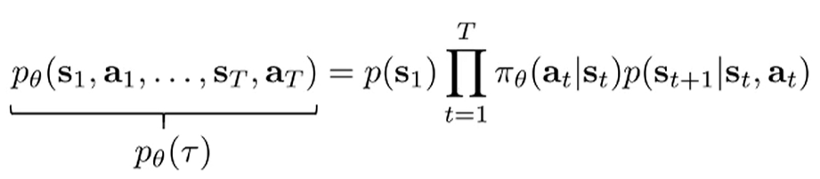
  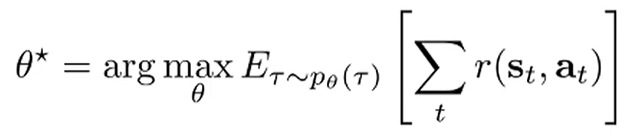

The objective is an expectation under the trajectory distributed according to $p_\theta(\tau)$

  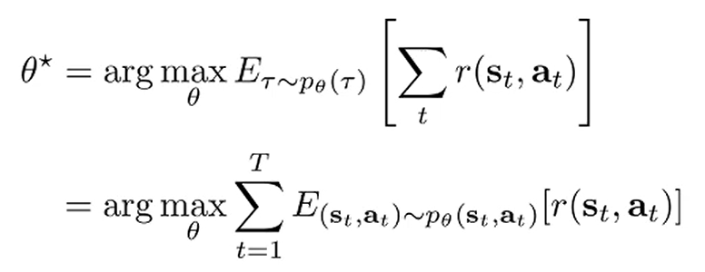

The trajectory distributuion follows a markov chain.
So, the objective could be written as the sum over time of the expectation values under the state, action marginal by linearity of expectation.

1. Pulling out the sum by linearity of expectation.

$$ \mathbb{E}_{\tau \sim p_\theta(\tau)}\left[\sum_t r(s_t, a_t)\right] = \sum_t \mathbb{E}_{\tau \sim p_\theta(\tau)}[r(s_t, a_t)]$$

2. Marginalizing out variables other than $s_t$ and $a_t$ by the Markov property.

$$\sum_t \mathbb{E}_{\tau \sim p_\theta(\tau)}[r(s_t, a_t)] = \sum_t \mathbb{E}_{(s_t,a_t) \sim p_\theta(s_t,a_t)}[r(s_t, a_t)]$$

For the infinite horizon case with stationary distribution, the objective becomes:

  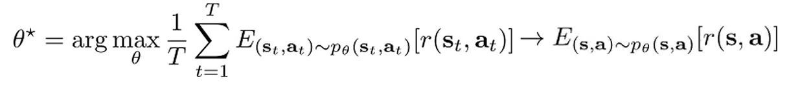

If $T = \infty$ (*i.e.*, the episode never terminates — a continuing task), the undiscounted objective may be ill-defined when rewards are always positive (that is, the objective can diverge to infinity).
There are a few ways of making the objective finite.
One way is to use the average, for convenience but acutally not the most common.
Another way is to use the discount factor $\gamma \in (0,1)$ to discount future rewards.
When the transition probability admits a stationary distribution, the state–action marginals are determined by that stationary distribution.

This lecture will focus on the finite horizon.
By using value functions, the finite horizon policy gradients can be extended to the infinite horizon policy gradients

# 2. Evaluating the objective

  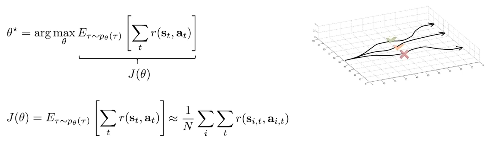

Since the transition probability is unknown, we evaluate the objective by sampling $N$ trajectories under the policy in the real world. This sampling procedure yields an unbiased estimate of the objective $J(\theta)$, since the sample mean of the returns converges to the true expectation by the law of large numbers.

# 3. Direct policy differentiation

  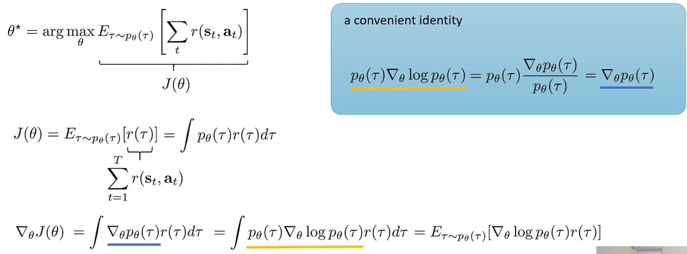

Differentiation operator is linear.
So, we can push it inside the integral.
In this way, we differentiate the objective value using only smaples like evaluation.

  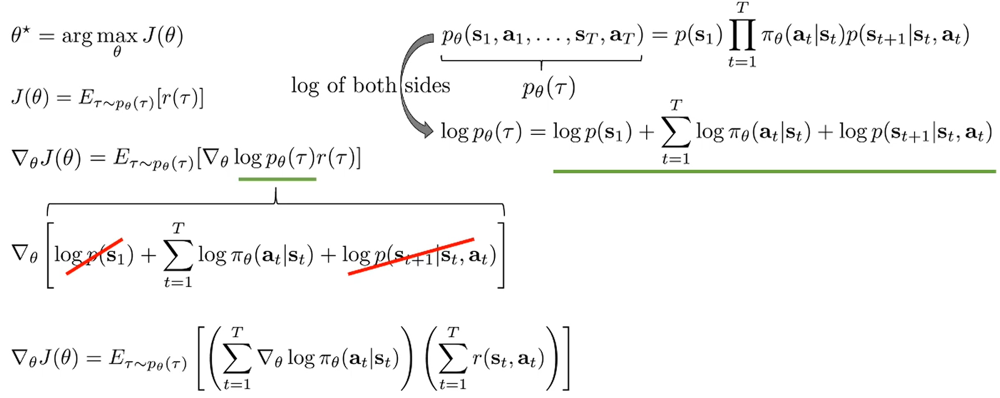

# 4. Evaluation the policy gradient

  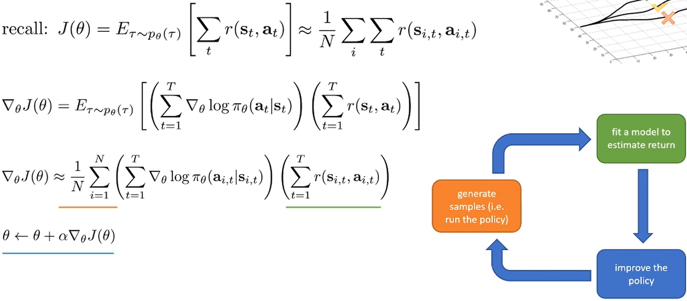

Using the same procedure as for evaluating the objective, we can estimate the policy gradient by executing the policy and computing sample gradients from the resulting trajectories. Then we improve the policy by taking a step of gradient ascent.

> REINFORCE algorithm:
> 1. Sample trajectories $ \{\tau^{(i)}\}_{i=1}^N \sim \pi_\theta(\cdot)$
> 2. $\nabla_\theta J(\theta) \approx \sum_i
\left(\sum_t \nabla_\theta \log \pi_\theta(a_t^{(i)} \mid s_t^{(i)})\right)
\left(\sum_t r\big(s_t^{(i)},a_t^{(i)}\big)\right)$
> 3. $\theta \leftarrow \theta + \alpha \,\hat{\nabla}_\theta J(\theta)$
> 
> Williams introduced the REINFORCE algorithm (early 1990s), so it won't work very well in practice due to the high variance.
> In the remainder of the lecture, we'll discuss practical improvements.

# 5. Understanding Policy Gradients

  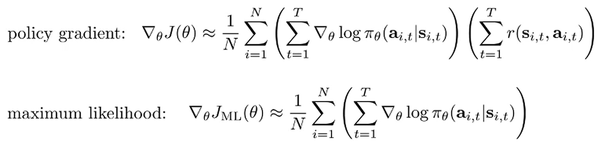

Maximum likelihood assumes the actions $a_{i, t}$ in the training data are good.
In policy gradient, the actions $a_{i,t}$ were sampled from the (possibly suboptimal) policy, so the actions are not necessarily good.
* Maximum likelihood increases the log probabilities of actions in the training data.
* Policy gradient increases log probabilities for actions that lead to high rewards and decreases them for actions that lead to low rewards. (Trial-and-error)

# 6. Partial observability

  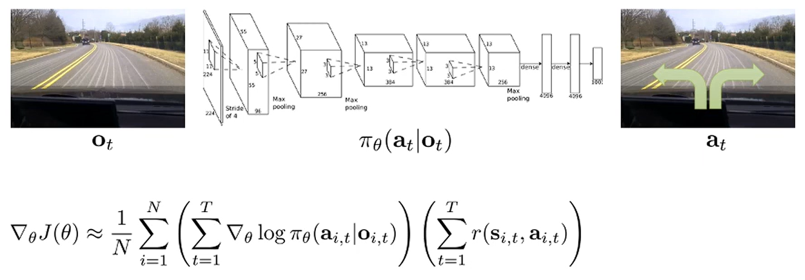

The main difference between a state and an observation is whether it satisfies the Markov property. A state satisfies the Markov property, whereas an observation generally does not.
Even in partially observable settings, the policy gradient equation remains valid, because its derivation does not rely on the Markov property.

# 7. Limitation of the policy gradient: high variance

  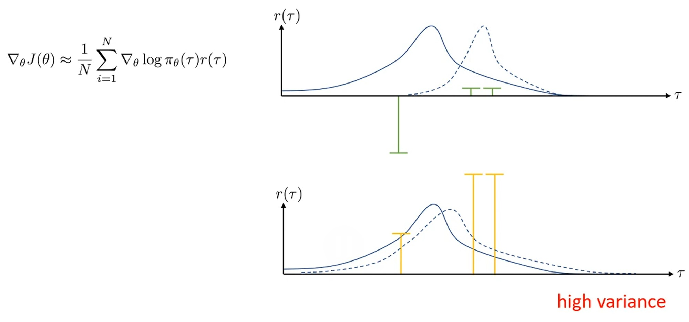

Suppose we have three sampled trajectories. The height of each green bar represents that trajectory's reward, and the blue curve shows the probability of each trajectory under the policy.
The policy gradient is a weighted sum of the gradients of the log probabilities of each trajectory, where the weights are given by the trajectory rewards.
* In the first example, the policy distribution shifts to the right mainly trying to avoid a large negative sample.
* In the second example, we offset the reward by a constant. The optimal policy remains unchanged. However, with these adjusted rewards, the policy increases the log probabilities across all samples, making the resulting policy different from the first one.

From these results, we observe the high variance of the policy gradient, as even under the same policy the gradient direction can vary significantly depending on the sampled trajectories.

But, as the number of samples goes to infinity, the policy gradient estimator yields the correct answer.
Thus, adding constants to rewards makes no difference.

# 8. Reducing variance of policy gradient: causality

  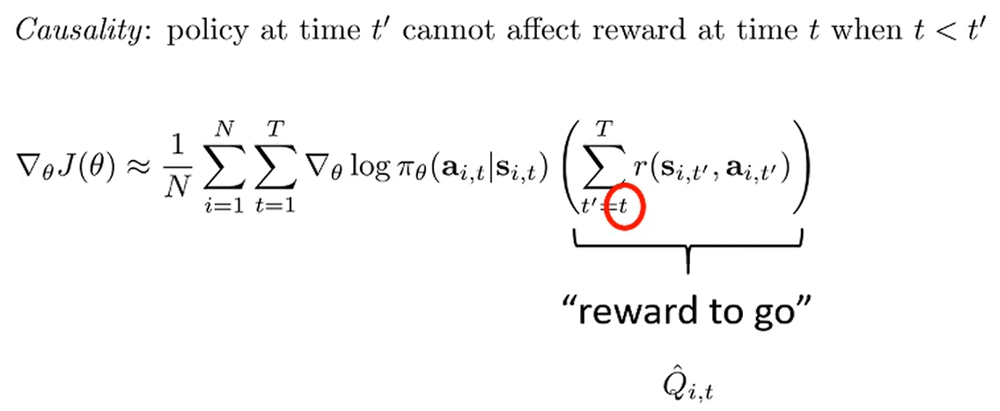

Causality property, which is always true, means that current action cannot affect past rewards.
Therefore, if we generate enough samples past rewards cancel out to zero when averaged.

$$
\begin{align*}
\mathbb{E}\!\left[\nabla_\theta \log \pi_\theta(a_t \mid s_t)\; r_{t'}\right]
&= \mathbb{E}_{s_t \sim p(\tau)}\!\left[
    \mathbb{E}_{(a_t, r_{t'}) \sim p(\tau)}\!\left[
        \nabla_\theta \log \pi_\theta(a_t \mid s_t)\; r_{t'} \,\mid\, s_t
    \right]\right] \\[6pt]
&= \mathbb{E}\!\left[
    \mathbb{E}[r_{t'} \mid s_t] \cdot
    \mathbb{E}[\nabla_\theta \log \pi_\theta(a_t \mid s_t)\mid s_t]
\right] \quad \because \text{conditional independence (causality)} \\[6pt]
&= \mathbb{E}\!\left[
    \mathbb{E}[r_{t'}] \cdot
    \mathbb{E}[\nabla_\theta \log \pi_\theta(a_t \mid s_t)\mid s_t]
\right]\\[6pt]
\mathbb{E}[\nabla_\theta \log \pi_\theta(a_t \mid s_t)\mid s_t]
&= \sum_{a} \pi_\theta(a \mid s_t)\,\nabla_\theta \log \pi_\theta(a \mid s_t) \\[6pt]
&= \sum_{a} \pi_\theta(a \mid s_t)\,
    \frac{\nabla_\theta \pi_\theta(a \mid s_t)}{\pi_\theta(a \mid s_t)}
    \quad \because \nabla \log f = \frac{\nabla f}{f} \\[6pt]
&= \sum_{a} \nabla_\theta \pi_\theta(a \mid s_t) \\[6pt]
&= \nabla_\theta \sum_{a} \pi_\theta(a \mid s_t) \quad \because \text{linearity of differentitation} \\[6pt]
&= \nabla_\theta 1 \\[6pt]
&= 0 \\[6pt]
\therefore\quad
\mathbb{E}\!\left[\nabla_\theta \log \pi_\theta(a_t \mid s_t)\; r_{t'}\right] &= 0
\quad \text{for } t' < t.
\end{align*}
$$

The variance is reduced since some terms are removed from from the summation.
Note that , for a finite sample size, past rewards wouldn't cancel out to zero.
Removing all past rewards will change the policy gradient estimator, but the estimator is still unbiased.

# 9. Reducing variance of policy gradient: baselines

If all of rewards are positive, policy gradient increase log probablility of all trajectories.
Intuitively, policy gradients are more effective in practice when the rewards are centered.
In that case, rewards that are better than average get increased and worse than average get decreased.

$$
\nabla_\theta J(\theta) \approx 
\frac{1}{N} \sum_{i=1}^N 
\nabla_\theta \log p_\theta(\tau)\,[r(\tau) - b]
, \quad b = \frac{1}{N} \sum_{i=1}^N r(\tau)
$$

A baseline ($b$) is a reference value used to reduce variance, while keeping policy gradient estimator unbiased.

  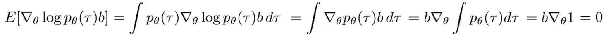 

The average reward is not the best baseline, but in many cases it is used as a quick approximation. 
An optimal baseline can be derived as follows:

  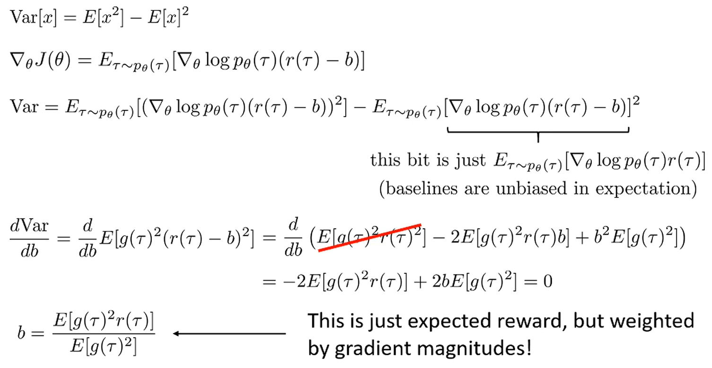 

The optimal baseline is not used very much in practical policy gradient algorithm because the optimal baseline differs for each trainable parameter.

# 10. Off-policy policy gradients

In on-policy policy gradients, trajectories must be sampled at every gradient step.
Because neural networks change only slightly with each gradient step due to their nonlinearity, deep reinforcement learning requires generating new samples often through costly real-world interactions.
To use off-policy samples, policy gradients can be modified with importance sampling.
* Importance sampling evaluates an expectation under one distribution using samples from a different distribution.
* Importance sampling can change the variance of estimator but keeps the estimator unbiased.

  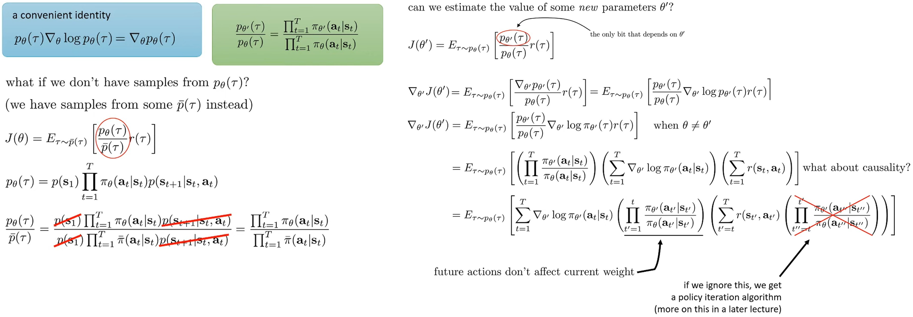 

* The log probability is reweighted by the probability of arriving at state $s_t$ under the new policy.
* The rewards is reweighted by the probability of obtaining reward $r_t$ in the future under the new policy.

Removing reward reweighting corresponds to policy iteration.
Policy iteration is no longer gradients, but it provides guaranteed improvement of the policy.
However, this is not the case for log probability reweighting.

# 11. A first-order approximation for IS (preview)

  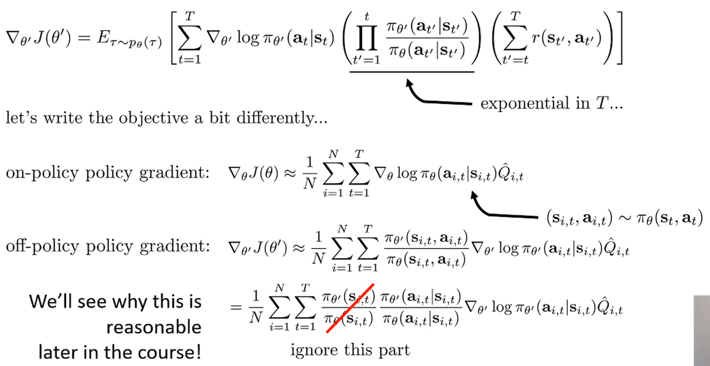 

One issue is that the log probability reweighting term is expoential in trajectory length $T$.
If the term is less than one at every time step t, then the product quickly approaches zero exponentially.
Consequently, since the estimator is unbiased, occasionally very large values appear, which in turn lead to extremely high variance.
* Policy gradients also suffer from high variance, so this is a really bad idea.

By markov property, we can think that each state and action pair is sampled from the state-action marginal distribution at time step $t$.
* Therefore, instead of applying importance sampling over the entire trajectory, we can formulate an alternative off-policy policy gradient that uses importance sampling over these state–action marginals.

Calculating the probabilities of these marginals is impossible without knowing the initial state distribution and transition probabilities.
Therefore, by applying the chain rule of probability, we can decompose the marginal distribution into two terms.

Ignoring the state marginals is similar to the top of the slide, where all importance sampling ratios are neglected except at $t^\prime$, thereby reducing the variance.
* Strictly speaking, this does not provide the correct policy gradient.
* Nevertheless, it remains reasonable, as the resulting error is bounded when the two distributions are sufficiently close

# 12. Implementing policy gradients

  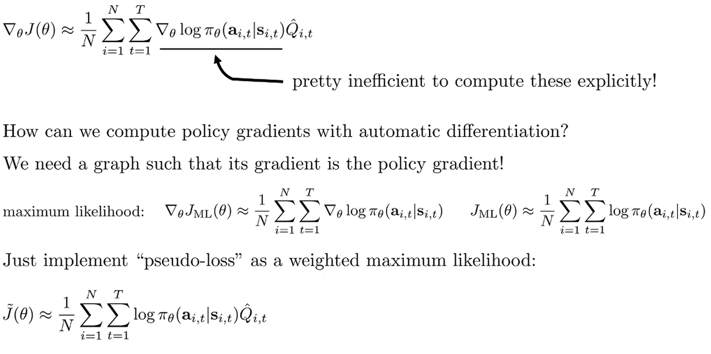 

Naively, one could compute the gradient of $\text{log}\ \pi_\theta$ for every state–action pair across all parameters, but this approach is highly inefficient.
To use automatic differentiation tools (such as TensorFlow or PyTorch), we implement a 'pseudo-loss' as a weighted maximum likelihood.
This is not the true RL objective, but its differentiation is equivalent to policy gradient.
* With this, we utilize backpropagation with reasonable computational and memory efficiency.
* The gradient has high variance, so it is often necessary to use much larger batches. This same high variance also makes tuning the learning rate hard. While adaptive step size methods such as ADAM can be OK, using SGD with momentum tends to be extremely difficult in practice. We'll learn about policy gradient-specific learning rate adjustment methods later.

# 13. Advanced Policy Gradients

In continuous action spaces in particular, numerical issues arise: poor conditioning.
* Poor conditioning can be solved by using pre-conditioner.

  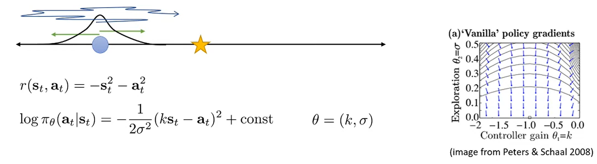 

* The goal is to drive the state to zero (denoted by ★).
* The term $\log \pi _{\theta}(a_t \mid s_t)$ follows a normal distribution centered at $ks_t$ with variance $\sigma^2$, where $k, \sigma$ are parameters.

The optimal parameters are $k=-1, \sigma=0$, but the arrow of right plot do not point towards the optimum.
The reason is that as $\sigma$ gets smaller, the gradient with respect to $\sigma$ gets larger.
Since the probability scales as $1/\sigma^2$, differentiating it produces a $1/\sigma^4$ term.
This means that as $\sigma$ decreases, the gradient increases rapidly.
The gradient with respect to $k$ is much smaller than the $\sigma$ gradient.
When we re-normalize the gradient, the $\sigma$-component dominates and the update in the $k$ direction becomes negligible.
* The optimization takes a very long time, with most of the effort spent on reducing $\sigma$

# 14. Covariant/natural policy gradient.

  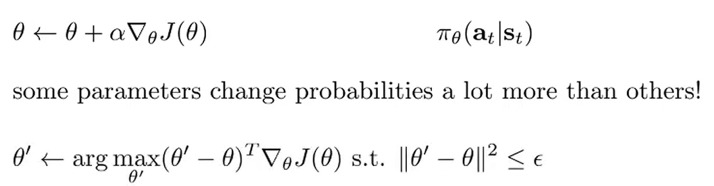 

Picking a single step size that works for $k, \sigma$ is very hard because of poor conditioning.
Gradient ascent can be seen as iteratively solving the first order taylor expansion of the objective $J(\theta)$ with a constraint.

* The first order taylor expansion: $J(\theta^\prime) \approx J(\theta) + (\theta^\prime - \theta)^T \nabla_\theta(J(\theta))$
* The constraint is similar to a learning rate, where $\alpha$ serves as the Lagrange multiplier corresponding to $\epsilon$.

If the parameter space is constrained, we have the same problem: poor conditioning.
To fix this, we can change the constraint to be in terms of the KL divergence between the old and new policy.

  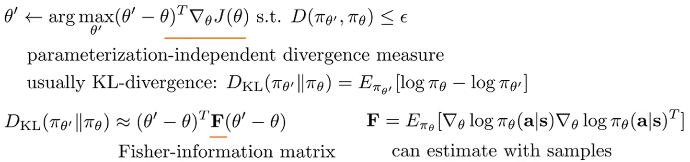 

* The term parameterization-independent divergence measure denotes a divergence that is invariant under changes of coordinate system or parameterization.
* $D_{KL}(p(x)\parallel q(x))=D_{KL}(p(y)\parallel q(y)), \quad \text{where } y=f(x)$

Constrainted optimization is conducted at every gradient step, so it should be very simple.
If we take the second-order Taylor expansion of the KL divergence around $\pi_{\theta^\prime} \approx \pi_\theta$, the KL divergence can be approximately expressed as a quadratic form involving the Fisher information matrix.
* The Fisher Information Matrix shows how much information the data contains about distribution parameters. For a parameter vector $\theta$, it is the covariance matrix of the score function (the gradient of the log-likelihood).

  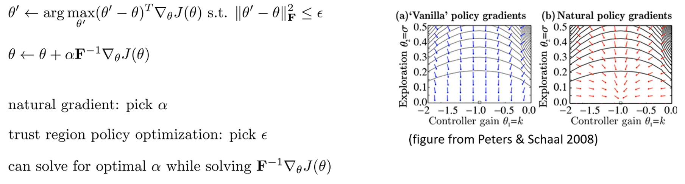 

* $(\theta^\prime - \theta)^TF(\theta^\prime - \theta) = ||\theta^\prime - \theta||^2_F$

Using the lagrangian, the soultion can be derive, where $\alpha$ is lagrangian multiplier and $F$ is the pre-conditioner.
* In this formula, $F$ measure the sensitivity of the policy distribution to changes in the parameters. $F_{kk}$ represents the variance of gradient of $\theta_k$.

Applying $F^{-1}$ scales the gradient by accounting for the curvature of the parameter space, effectively reducing the variance in updates.

Algorithms that use this approach: natural gradient, trust region policy optimization.
* Trust region policy derives $\alpha$ from the chosen $\epsilon$