# 1. Improving the policy gradient

  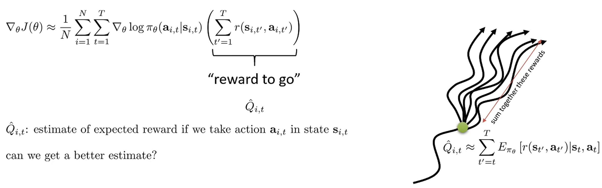

In lecture 5, we discussed policy gradient, which adjust the probability of taking action $a_{i,t}$ in state $s_{i,t}$ based on the expected cumulative reward after that action.
However, we might get a different outcome in the same state because the policy $\pi$ and MDP (reward function and trasition function) have some randomness. 
Thus, by computing the full expectation, we can obtain a more accurate estimate with reduced variance.
Additionally, a baseline further reduces the variance.

  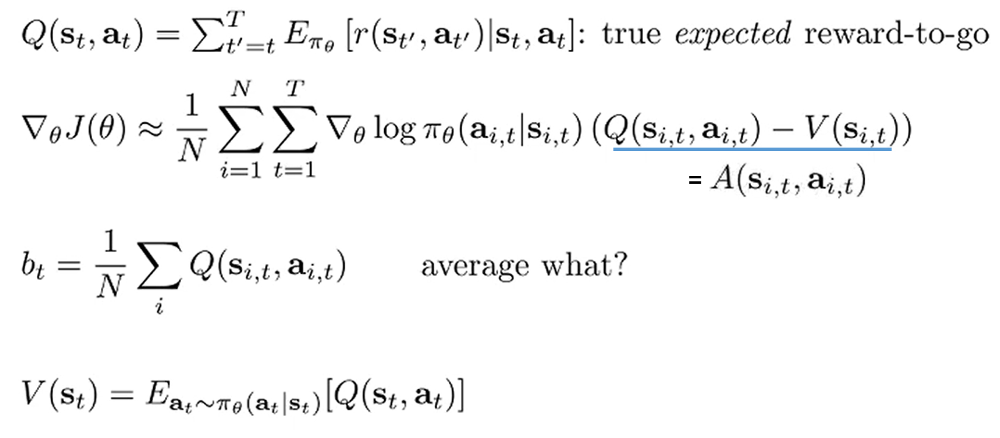

The average of the $Q(s_{i,t}, a_{i,t})$ could serve as a baseline.
However, if the baseline depends on the action, bias is introduced into the policy gradient.
Thus, we use the state-value function $V(s_{t})$ as the baseline which only depends on the state.
* State-value function is the average of Q values over all the actions in a particular state.

The difference between the Q-value and the V-value is called the advantage function.

> Actor-critic methods, to be discussed in the lecture, do not necessarily provide unbiased estimates of the advantage function.
> The enormous reduction of variance is worth more than the slight icrease in bias by approximating the Q-value and V-value

# 2. Value function fitting

  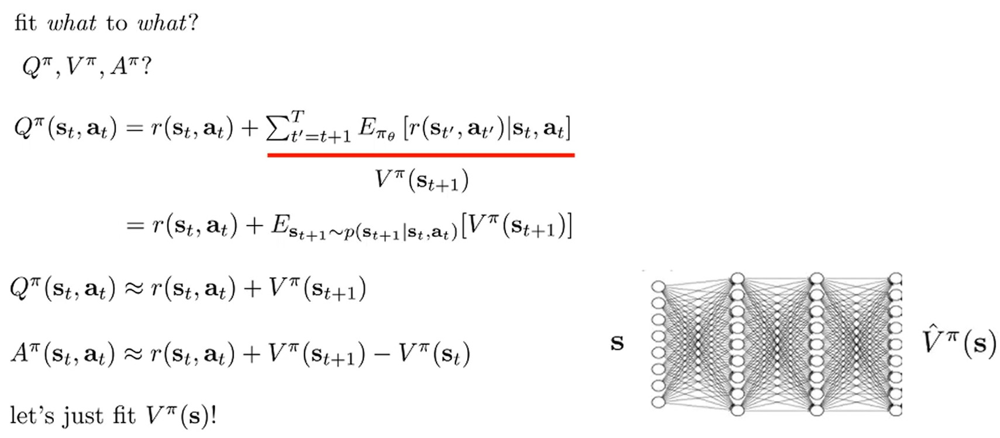

Since the value function only depends on the state, fitting the value function with neural network can be more stable in some cases than fitting the Q function or the advantage function.
Furthermore, we could approximate the Q function and the advantage function using the value function.

  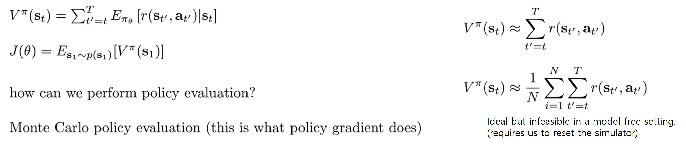

The value function is sometimes referred to as policy evaluation.
In fact the RL objective can be expressed as the expectation of the value function over the initial state distribution.
Thus, we can evaluate the policy by averaging the values over the initial states.
In practice, Monte Carlo policy evaluation approximates the value function $V(s_t)$ by summing all the rewards obtained after visiting state $t$.
Ideally, the value function would be approximated by summing over all possible trajectories from state s_t.
However, in a model-free setting this is infeasible, since it requires the ability to reset to state s_t.
* Our only assumption is that multiple trials can be run from the initial state. Therefore, we cannot guarantee sufficient trajectories starting from s_t.

# 3. Monte Carlo evaluation with function approximation

  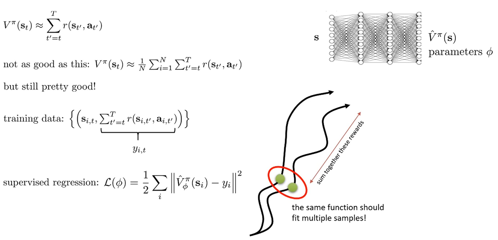

Instead of plugging the reward directly into the policy gradient, we use a neural network $\hat{V}^\pi_\phi(s)$ to approximate the value function.
The neural network reduces variance at the cost of introducing some bias.

* Although the exact same state $s_t$ cannot be revisited twice, the network learns similarities among states and propagates value information. This is what enables generalization.

  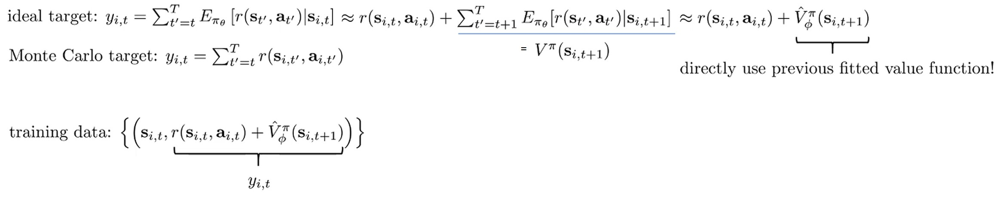

By using a bootstrap estimate, we can further reduce variance, although this introduces additional bias since $V^\pi_\phi$ might be incorrect.
The bootstrap estimate combines the reward at time t with the estimated value of the next state $s_{t+1}$ to approximate the Monte Calro target $y_{i,t}$.

# 4. From Evaluation to Actor Critic

  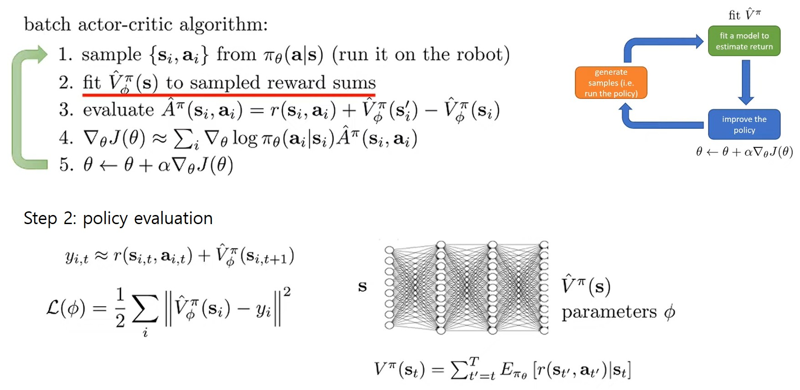

# 5. Discount Factors

Let's discuss fitting value functions using bootstrap in the infinite horizon setting, where episode length is $\infin$.
If the rewards are always postivie, $V^\pi_\phi$ may get infinitely large.

$$
y_{i,t} \approx r(s_{i,t}, a_{i,t}) + \gamma \hat{V}^\pi_\phi(s_{i,t+1}), \quad \gamma \in [0, 1] \ (0.99 \text{ works well})
$$

Applying discount factors ($\gamma$) ensures finite value estimates and makes the agent prefer rewards sooner rather than later.
- Discount factors also reduce variance at the cost of introducing bias.

  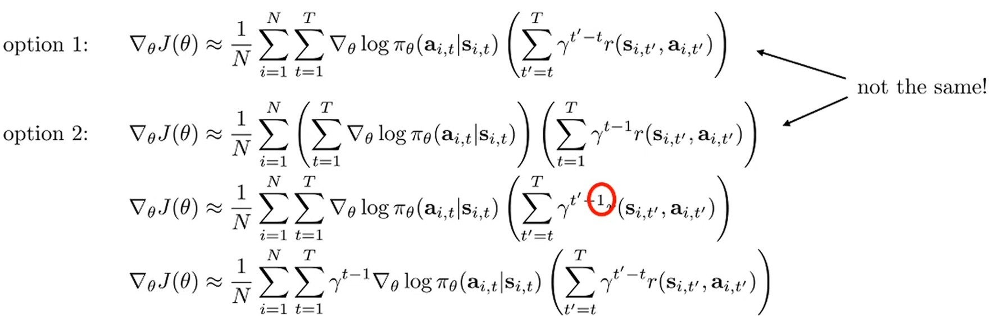

There are two ways to apply discount factors in policy gradients.

* Option 1: Apply the causality trick to the option2
* Option 2: Use the original RL objective

Option 2 can be interpreted as penalizing decisions according to the time step, just like rewards, because decisions made in the future will only influence future rewards.
As a result, the gradient is discounted at every time step by $\gamma^{t-1}$ making earlier decisions more important than later ones, since later decisions cannot influence earlier rewards.

  

Option 2 is right thing to do in discounted problem factor but, in reality, option 1 is usually used.
Let's think about the cyclic continuous RL tasks where the gola is to make the character run as far as possible.
In this case, we do not want the discounted problem, but we use discounting to get finite value estimates for RL, since the policy should act correctly at every time step, not only in the early ones.

# 6. Actor-cricit algorithms (with discount)

  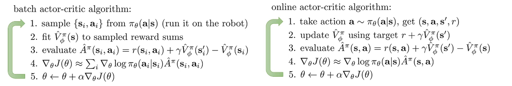

With discounting, only step 3 is modified in the batch actor-critic algorithm.
In the infinite-horizon setting, we can also derive an online actor-critic algorithm.
In the online actor-critic algorithm, the policy is updated at every single time step.
However, the online actor-critic algorithm has a few challenges in deep reinforcement learning.

# 7. Actor-Critic Design Decisions

  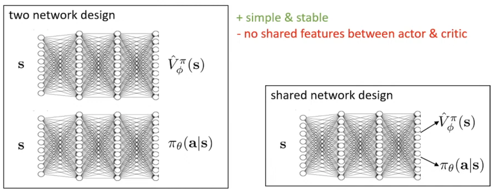

A couple of choices can be made to represent the value function network and the policy network.
* One is to have two completely separte networks. 
  * This deisgn is relatively simple to implement and stable to train. 
  * However, it is somewhat inefficient because there is no parameter sharing-for example, when the state is represented by images.
  * If the value function figures out good representations first, the policy could benefit from them.
* Another is to have a shared network with two heads.
  * This design is more efficient, but it is also more challenging to train. 
  The gradients from the value function and the policy can interfere with each other because they have different scales and statistics. 
  As a result, it may require more hyper-parameter tuning to achieve stability.

  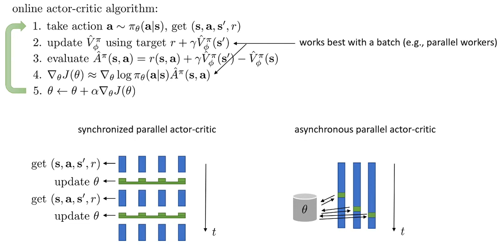

Stochastic gradient desent (SGD) using one sample (transition) is not work very well because of the high variance.
One solution is updating the value function (critic) and the policy (actor) with a batch obtained by using parallel workers.
* Synchronized parallel actor-critic  
  * By using different random seeds, multiple trajectories are generated.
  The actor-critic is then updated synchronously at each time step.
  * The number of workers should match the batch size, which can be computationally expensive.
* Asynchronous parallel actor-critic
  * Updating the actor-critic asynchronously is faster than updating it synchronously.
  The actor-critic is updated as soon as the batch trajectories have been accumulated from all workers, which run at their own speed.
  * However, a problem arises: the transitions may not have been collected under exactly the same parameters. 
  In general, all of the transitions combined into a batch may have been generated with slightly different actors.
  * The differences, however, are usually not very large.
  In practice, the asynchronous method usually yields performance gains that outweigh the bias incurred from using a slightly older actor.

# 8. Off-policy Actor-critic

  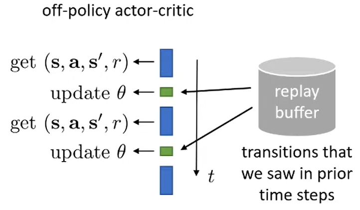

If transitions generated by much older actors could be utilized during SGD, we might not need multiple workers, since we could reuse older transitions from the same actor in its earlier version.
That is the principle behind off-policy actor-critic where a single worker is used.
All transitions are stored in a replay buffer from which an entire batch is sampled for updates.
* An intuitive implementation is a ring buffer, a first-in, first-out buffer.
* The algorithm must be modified, since the sampled transitions from the buffer clearly came from much older policies

  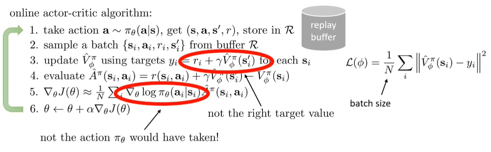

Online actor-critic algorithm, dicussed previously, has two problems because the actions in transitions sampled from the replay buffer were tabken by older actors.
* First, the transition ($s_i, a_i, r_i, s_i^\prime$) was not generated by the latest actor $\pi_\theta$.
Therefore, when updating the latest value function model $\hat {V}_{\phi }^{\pi }$, older actor's evaluation could be included in $\hat{V}_\phi^\pi(s_i^\prime)$, which can introduce bias.
* Second, similarly, the policy gradient cannot be computed directly, since the action $a_i$ did not come from the latest policy $\pi_\theta$.
Note that, when computing the policy gradient, the actions should be sampled from the same policy, since the policy graidents needs to be computed as an expected value under $\pi_\theta$.

Although importance sampling can be used as a correction method, a more effective approach exists for off-policy actor-critic.

# 9. Fixing the value function

  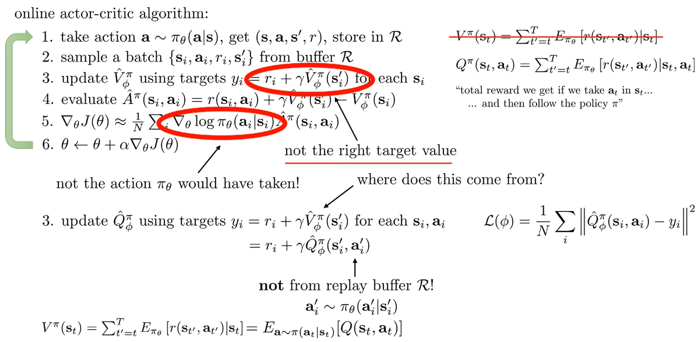

Instead of learning state value function ($V$), we can learn the state-action value function ($Q$) which gives the expected reward when starting from state $s_t$, taking action $a_t$, and then following policy $\pi_\theta$.
Note that, the transition ($s_i, a_i, r_i, s_i^\prime$) could be sampled under the latest policy because the MDP is independent of the policy.
However, the transition frequency could affect the value function model because the value function $\hat{V}_\phi^\pi(s_i^\prime)$ depends on the policy.

In the Q function, we sample ($s_i, a_i, r_i, s_i^\prime$) from the replay buffer, but $a_i^\prime$ is obtained by the latest policy.
Since the Q function is valid for any action and assumes that the policy $\pi_\theta$ is followed in subsequent steps, the taken action $a_i^\prime$ does not need to come from the current policy.
Therefore, the action input to the Q function can be sampled from the latest policy, and because $\hat {Q}_\phi^\pi$ is a neural network, it can output Q values even for states and actions it has never seen before.
- The value $V_\phi^\pi(s_i)$ is computed as the expectation of the learned Q values.

# 10. Fixing the policy update

  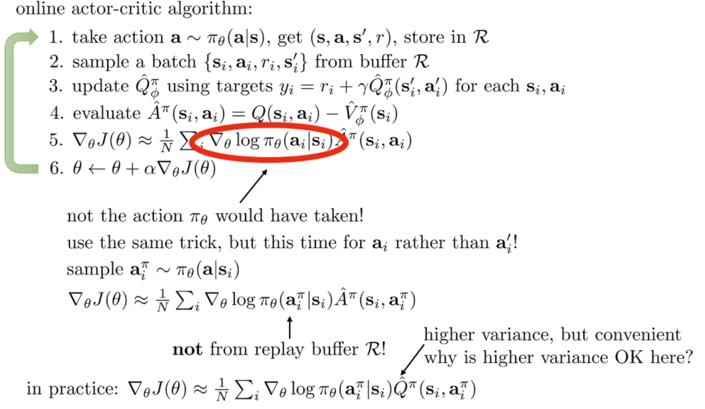

In policy gradient, similar to before, we do not update with respect to $a_i$ from sampled transition ($s_i, a_i, r_i, s_i^\prime$).
Instead, we update with respect to the action sampled from the latest policy, $a_i^{\pi }\sim \pi _{\theta }(a|s_i)$.
- $a_i^{\pi}$ is not the action stored in the replay buffer. It is the action sampled by the current policy at the buffer state $s_i$. 
This provides an unbiased estimator of expectations under $\pi_{\theta}$.

In practice, when running off-policy actor-critic algorithms, we do not use advantage values $\hat{A}^\pi(s_i, a_i)$. 
Instead, we directly plug in $\hat{Q}$ into the equation.
- Using Q values means there is no baseline, so the variance is higher compared to using advantage. 
However, this allows us to skip the complex Step 4 of computing advantages.
- Moreover, we can reduce variance simply by sampling multiple actions from the same state using the policy $\pi_{\theta}$, without needing new interactions with the environment.

# 11. Fixed Asynchronous Online Actor-critic algorithm

  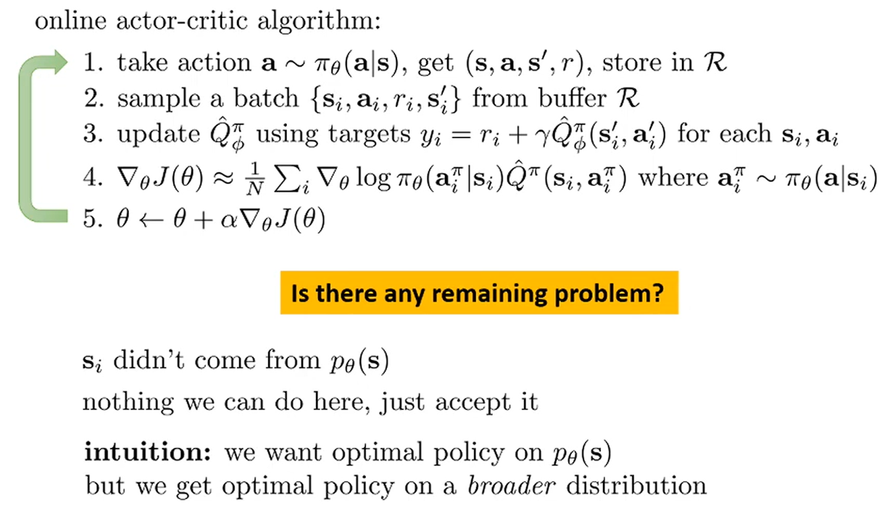

There is still a small issue because the transitions were generated by older policies.
However, this is not too problematic. 
Intuitively, we end up learning the optimal policy over a broader distribution of transitions from the replay buffer.
- The samples in the buffer come from both the latest policy and many older policies.
- As a result, the policy performs well on many states that might never actually be visited, while also not missing the important states sampled from the latest policy, which is why the method tends to work in practice.

There are several implementation details worth noting. 
* Step 4 can be handled in more sophisticated ways, such as using the Reparameterization Trick to better estimate integrals. 
* Likewise, there are more advanced methods for fitting the Q-function beyond the simple approach described. A practical example of this idea is the Soft Actor-Critic (SAC) algorithm, which is one of the most widely used actor-critic methods today.

Traditionally, online value-based actor-critic methods were more common, but in practice, off-policy Q-based actor-critic methods are now used more frequently. While the current focus is on stochastic policies, deterministic-policy versions of off-policy actor-critic will also be studied later when discussing Q-learning.

# 12. Critics as Baselines

  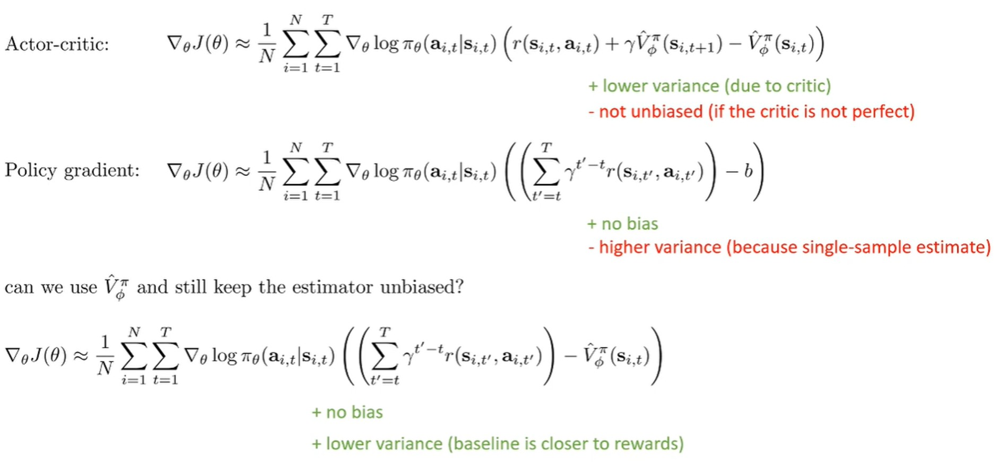

Actor-critic
* Advantages: low variance
  * The critic’s function approximator reflects all future possibilities not only a single sample.
* Disadvantages: introduces bias
  * The value function is only an approximation learned from finite data, so the gradient is not guaranteed to match the true policy gradient in expectation.
  
Policy Gradient
* Advantages: unbiased
* Disadvantages: high variance
  * Mitigating this requires collecting more samples and using smaller learning rates.

A state-dependent baseline can reduce variance using the critic, while still remaining unbiased.
The state value function $V(s)$ is a good choice for such a baseline.
- The policy gradient remains unbiased under the following conditions:
  - When the baseline is a constant.
  - When the baseline is any function that depends only on the state and not on the action.
- Although this does not reduce variance as much as a full actor-critic method, it provides much lower variance compared to using a constant baseline.

# 13. Control variates: Action-dependent Baselines

  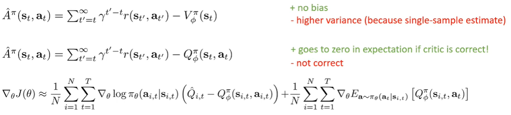

Variance can be reduced further without introducing bias by depending on the action as well as the state because this removes randomness in action selection.
However, once the action-dependent advantage estimator is used in the policy gradient, the gradient is no longer coorect.
* Because an action-dependent baseline no longer vanishes to zero in expectation, the policy gradient becomes incorrect.

Therefore, an error correction term is required.
If the critic depends only on the state, the error term vanishes because there is no component tied to the policy.
* The error term can be evaluated accurately by sampling many state–action pairs, since it does not need to interact with the MDP. Thus, the variance of the error term is very close to zero.

# 14. Eligibility Traces and n-step returns

  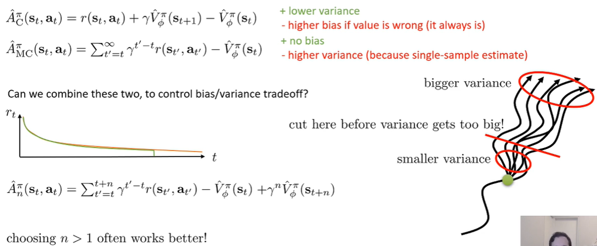

There are other methods that reduce variance but introduce a little bias.

In actor–critic methods, the one‑step advantage has low variance, but it can be biased if the value function is inaccurate. 
In contrast, the Monte Carlo advantage considers all future steps after a state, so it is unbiased, but its variance is very high because of the single sample estimate.

The n‑step return is an intermediate approach that considers the rewards over the next n time steps.
It is a nice way to control the bias variance trade-off.
When using a single‑sample estimator, it is better to apply it to the near future and cut it off before the variance becomes too large. 
After that, you replace it with the value function estimate with discount factor ($\gamma$), which has much lower variance
* When discounting is applied, future rewards become smaller, so even if the value function is slightly inaccurate, the resulting bias is not a major problem.

The value function estimate, however, does not capture all possible outcomes and may introduce a small bias.
* In practice, choosing $n > 1$ is often better than choosing $n = 1$.
* When n is large → bias decreases, variance increases
* When n is small → variance decreases, bias increases

# 15. Generalized advantage estimation (GAE)

  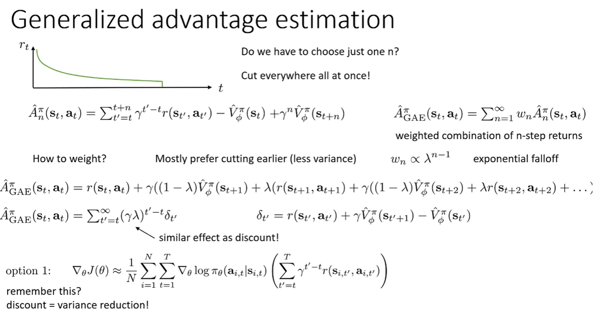

Generalized advantage estimation (GAE) generalize the n step return estimator.
GAE ($\hat{A}^\pi_\text{GAE}(s_t, a_t)$) is a hybrid estimator that computes weighted averages of n‑step returns ($\hat{A}^\pi_n(s_t, a_t)$) over all n.
* The weight $w_n$ depends on the step $n$: $w_n \propto \lambda^{n-1}$
  * Basically, since lower variance is preferred, $w_n$ becomes smaller as $n$ increases, while still allowing some future information to be reflected.

GAE can be formulated in different ways: either recursively, or in the simple form $(\gamma \cdot \lambda)^{t^\prime-t}\delta_{t^\prime}$
* $\lambda =0$ → uses only the 1‑step return (higher bias, lower variance)
* $\lambda =1$ → approaches the Monte Carlo return (lower bias, higher variance)
* $0< \lambda <1$ → balances bias–variance trade‑off between the two extreme

Using a small discount ($\gamma$) gives lower weight to distant future rewards, which reduces variance but increases bias.
* If you rely only on the discount, it effectively cuts off future rewards and deviates from the 'true' value.

By introducing $\lambda$, the truncated future part is replaced with the value function.
In other words, instead of directly sampling future rewards, you approximate them with the value function, which helps compensate for the bias introduced by discounting.