# 1. Policy iteration

Advantage function $A^\pi(s_t, a_t) = r(s_t, a_t) + \gamma  \hat{V}_\phi^\pi(s_t^\prime)$은 policy $\pi$를 따랐을 때 얻을 수 있는 평균 reward 대비, action $a_t$를 선택했을 때 얼마나 더 나은 보상을 얻을 수 있는지 알려준다.
* $r(s_t, a_t) + \gamma  \hat{V}_\phi^\pi(s_t^\prime)$: State $s_t$에서만 action $a_t$를 직접 선택하고, 이후에는 policy $\pi$를 따랐을 때 얻을 수 있는 return.
* $\hat{V}_\phi^\pi(s_t)$: policy $\pi$를 따랐을 때 얻을 수 있는 평균적인 return.

  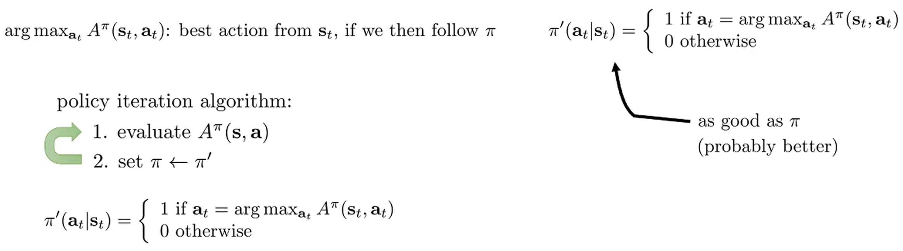

State $s_t$에서 advantage function $A^\pi(s_t, a_t)$를 가장 크게 만드는 action $a_t$를 고르는 것을 생각해보자.
이는 policy $\pi$가 무엇이었든, $s_t$에서 가장 좋은 선택을 한 것으로 볼 수 있다.
새로운 policy $\pi^\prime$을 갱신할 때, policy gradient를 활용하는 대신 greedy하게 action을 선택한다. 

해당 알고리즘은 value-based methods 중 하나인 policy iteration이다.
Policy iteration의 step 2는 discrete action space에서 직관적이다.
Action이 continuous sapce의 경우는 이후에 다루고 지금은 discrete space라고 가정한다.

# 2. Evaluate Value Function: Dynamic programming

Trasition probability $p(s^\prime|s, a)$는 알고 있고 (model-based RL), $s$와 $a$도 discrete하면서 cardinality는 작다고 가정한다.

  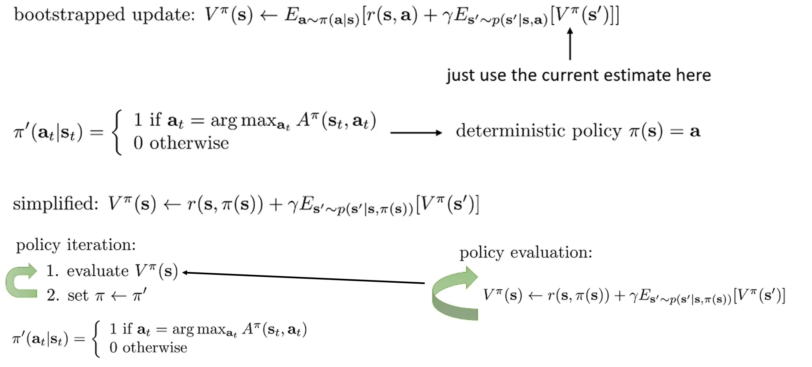

Policy iteration으로 policy를 업데이트하면, $\pi^\prime$은 deterministic이기 때문에 $V$ function 값을 구할 때 expectation을 더 간단하게 변한다.
이를 policy iteration 대입하면 $V$ function을 평가하고 이를 바탕으로 greedy하게 action을 고르는 알고리즘으로 표현할 수 있다.
해당 과정을 반복하면 각 state에 대한 $V$ 값이 true $V$ 값으로 고정된다.
* 또한, transition probability를 알고 state와 action이 작은 discrete sapce에 존재한다면, V function의 true 값은 linear equation으로 쉽게 풀 수 있다.

  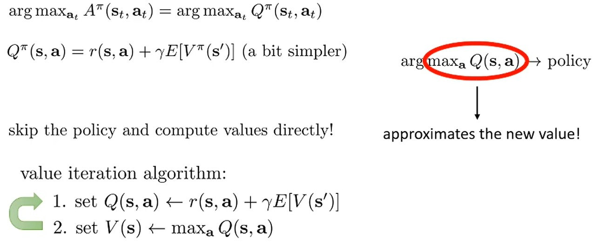

Advantage를 max를 만드는 action $a_t$는 결국 해당 state에서 $Q$ 값을 max로 만드는 action $a_t$와 같다.
그렇기 때문에 greedy라는 policy가 있지만 이를 explicit하게 계산하여 새로운 $\pi$로 업데이트 하지 않고, step 2 처럼 $Q$ 값을 최대화하는 action을 고르는 것으로 implicit하게 policy를 표현할 수 있다.
이를 value iteration이라고 한다.
* 또한 step 2에서 max 값을 고르는 것이기 때문에 step 1이랑 합쳐서 expectation이 없는 하나의 단계로 표현할 수 있다. $Q(s,a) \leftarrow r(s,a) + \gamma \text{max}_aQ(s,a)$

# 3. Fitted Value Iteration Algorithm

  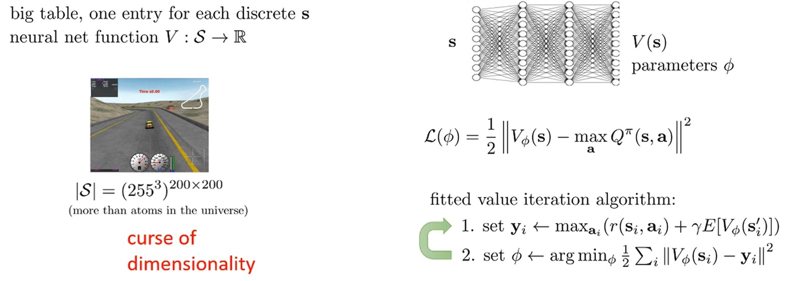

작은 state와 action이면 value function table을 구성해 value iteration을 할 수 있다.
하지만 continuos state space이면 각 state마다 value function을 평가하고 table을 나타내야 한다.
만약 200 x 200 사진이 한 state라고 하면, $(255^3)^{200 \times 200}$ state에 대한 value를 평가해야 한다.

* 이는 curse of dimensionality라고 한다.
* 강화학습에서 curse of dimensionality란, 큰 dimension을 가지는 state에 대해서 table을 구성하려면 dimension에 지수적으로 증가하는 table 크기가 필요하다는 것을 의미한다.

이를 완화하기 위해, 이전 강의에서 배웠던 것 처럼 neural network를 활용해서 state에 대한 $V$ 값을 추정하는 방법을 고려할 수 있다.

# 4. Fitted Q Iteration Algorithm

  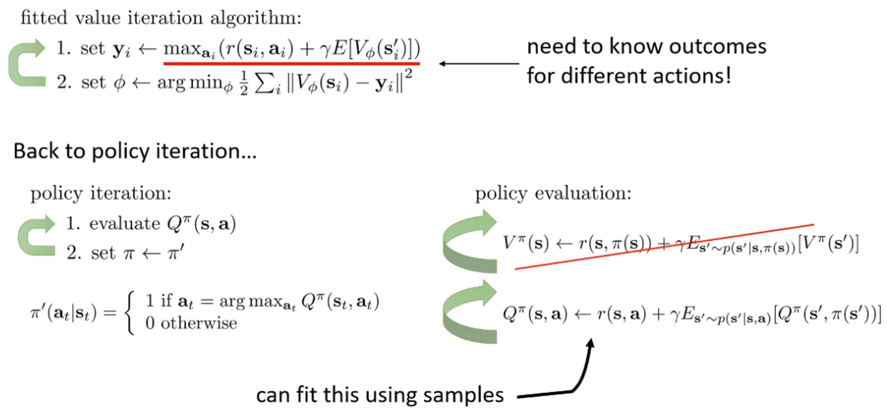

Transition probability를 모른다면, step 1에서 2가지 문제가 발생한다.
1. 정확히 같은 state $s_i^\prime$에서 모든 action에 따른 다음 state $s^\prime$을 sampling하여 $V_\phi(s_i^\prime)$을 계산할 수 있어야 한다.
2. 마찬가지로 $r(s_i, a_i)$에서 $\text{max}_{a_i}$를 선택하기 위해 같은 state $s_i$에서 모든 action에 대한 reward를 구할 수 있어야 한다.

Policy iteration에서는 $Q^\pi$를 평가한 후, policy를 agreedy update하였다.
Policy evaluation에서도 마찬가지로 $V^\pi$ 대신 $Q^\pi$를 활용해 위의 문제를 해결할 수 있다. $V^\pi$로 policy를 평가할 때는 state에만 종속되어 있어, action을 $\pi$에 따라 sampling해야 하지만, $Q^pi$로 policy를 평가하면 state와 action 둘 다에 종속되기 때문에 $(s, a, s^\prime)$ sample만 존재한다면 transition probabilities가 필요없다.
* 학습 sample로 $Q^\pi$ neural network를 학습하고, 주어진 state와 action에 대한 $Q$ 값을 추론할 수 있다.
* $(s, a, s^\prime)$ sample은 policy $\pi$와 상관 없는 관찰된 사실로, 업데이트 되기 전 policy에 의해 생성 되었더라도 현재 policy를 evaluation할 때 (expectation을 구할 때) 활용될 수 있다. $\rightarrow$ 대부분의 value-based model free RL의 핵심이다.

  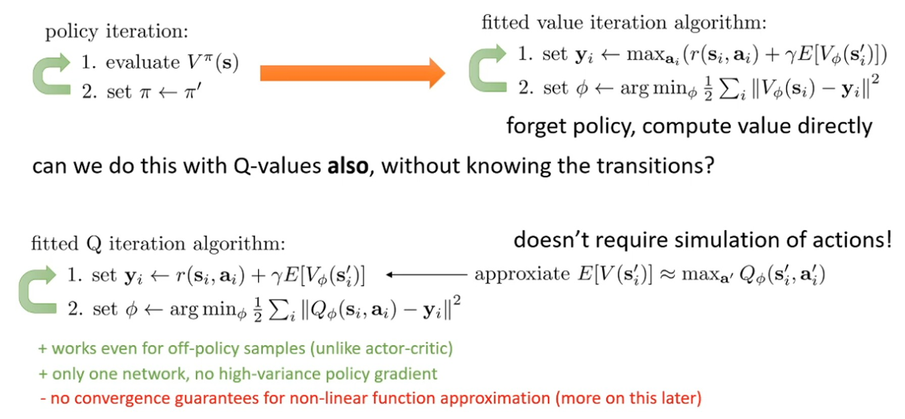

Section 2에서 policy를 greedy update를 하여 policy가 사라졌고, 그에 따라 value iteration algorithm도 2 단계도 1 단계로 축약됐다.
* $Q(s,a) \leftarrow r(s,a) + \gamma \text{max}_aQ(s,a)$

유사하게 model free 환경에서 fitted Q iteration algorithm에 greedy update를 적용할 수 있다.
Step 1에서 expecation을 구할 때 $Q_\phi$를 최대로 만드는 action을 취하여 target $y_i$를 설정할 수 있다.
* Actor-critic은 latest policy에서 샘플링된 것만 활용해 policy를 업데이트 해야 한다.
하지만, fitted Q iteration algorithm에서는 policy에 의존하지 않기 때문에 샘플링된 모든 trajectories를 바로 활용할 수 있다.
즉, fitted Q iteration은 off-policy algorithm이다.
* Variance가 높은 policy gradient를 활용하지 않고, 오직 $Q$를 추정하는 neural network만 활용한다.
* Tabular representation에서는 수렴하지만, non-liear neural network에 대해서 수렴이 보장되지 않는다. (추후에 다룸)

  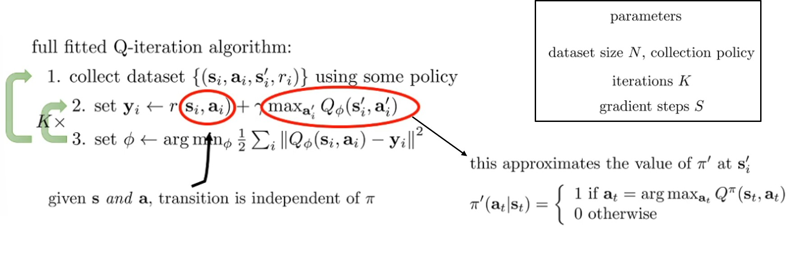

Fitted Q iteration이 off-policy algorithm이지만, importance sampling은 수식적으로 생략된다.

$$
\begin{aligned}
\mathbb{E}_{a \sim \pi}[Q(s,a)] &= \int \pi(a) Q(s,a) da \\
&= \int \pi^\prime(a)\frac{\pi(a)}{\pi^\prime(a)}Q(s,a)da \\
&= \int Q(s, \text{argmax}_a(a)) da  \\
&= \int Q(s, a_\text{max})da \quad \text{where } a_\text{max} = \text{argmax}_aQ(s,a) \\
&= Q(s, a_\text{max}) \\
&= \text{max}_aQ(s,a)
\end{aligned}
$$

수집하고자 하는 dataset 크기 $N$과 trajectories를 sample하는 policy 그리고 $Q_\phi$를 반복적으로 학습하는 $K$와 gredient step (batch size) $S$가 hyper-parameter로 생각할 수 있다.
* Policy는 일반적으로 latest policy를 선택하지만, exploration을 위해 $\epsilon$-greedy를 추가로 활용한다.

이는 $Q$ iteration의 기본적인 design이고, $Q$-learning과 같은 다양한 fitted $Q$-iteration algorithm은 변형된 design으로 해석할 수 있다.

  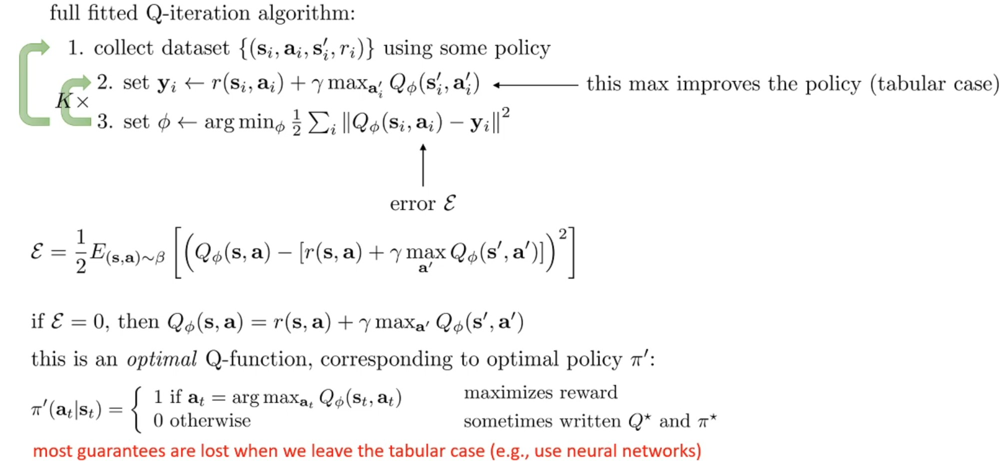

$Q$ iteration algorithm에서는 step 2에서 정책을 update하고 step 3에서 $Q_\phi$ neural network를 최적화한다.
Tabular에서는 step 2가 항상 policy를 좋게 만들지만, continuous space에서는 $Q_\phi$ 추정치에 에러값이 있을 수 있기 때문에 항상 policy를 좋게 만든다고 할 수 없다.

# 5. Q-learning Algorithm

  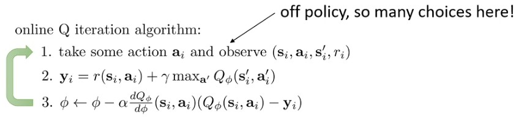

Fitted Q iteration algorithm에서 hyper-parameter를 특정 값으로 설정하면 online Q iteration algorithm으로 변경할 수 있다.
* $N = K = S = 1$

이것이 가장 기본적인 Q-learning algorithm (watkins Q learning)이고, $Q_\phi(s_i, a_i) - y_i$는 temporal difference error라고 불린다.
TD error가 0이면 현재 policy가 최적이므로 greedy하게 action을 선택해도 되지만, 학습 과정에서는 좋은 선택이 아니다.
초기 $Q_\phi$는 추정 값은 좋지 않다.
그렇기 때문에 계속 greedy하게 action을 선택한다면, 특정 state에서는 하나의 action(어쩌면 매우 나쁜 action)만 선택하게 된다.
그렇기 때문에 exploration을 위해 약간의 randomness를 추가한다.

  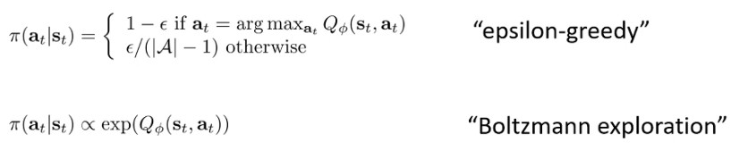

가장 간단한 방법이고 많이 선택되는 방법으로 $\epsilon$-greedy가 있다.
* $(1-\epsilon)$만큼 $\text{argmax}_a$를 선택하고, $\epsilon$만큼 $\text{argmax}_a$를 제외한 모든 actions을 uniform하게 선택한다.
* 학습 초기에는 큰 $\epsilon$ 값을 사용하고 학습이 진행될수록 $\epsilon$ 값을 줄이는 것도 좋은 선택이다.

또한 $Q_\phi$의 exponential에 비례하게 action을 선택하는 방법이 있는데, 이를 Boltzmann exploration 또는 softmax exploration이라고 부른다.
* $\epsilon$-greedy는 2번째로 좋은 action도 매우 낮은 확률로 샘플링된다. 하지만, Boltzmann exploration은 2번째로 좋은 action도 $Q_\phi$값만 비슷하다면 1번째로 좋은 action과 비슷한 비율로 선택되기 때문에 더 선호될 때도 있다.

# 6. Value Functions in Theory

  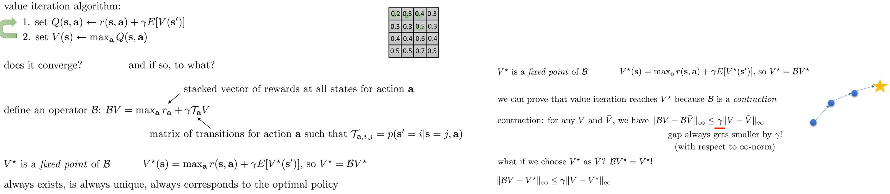

Tabular space에서 value iteration을 살펴보자.
Value iteration은 2 step으로 이뤄진다: (1) $Q(s,a)$를 평가하고, (2) $V(s) \leftarrow \text{max}_a Q(s, a)$로 value를 업데이트한다.
Bellman operator $\mathcal{B}$ 연산을 활용해 모든 state에 대한 value를 동시에 업데이트하는 수식(Bellman backup)으로 표현할 수 있다.
* $\mathcal{B}: \mathcal{B}V=\text{max}_a(r_a + \gamma \mathcal{T}_aV)$
  * $V \in \mathbb{R}^{|\mathcal{S}|\times 1}$은 각 state의 value를 나타내는 vector이다.
  위의 예시에서는 $|\mathcal{S}| = 16$이다.
  * $\mathcal{T}_a \in \mathbb{R}^{|\mathcal{S}| \times |\mathcal{S}|}$는 state $s$에서 $a$ action을 하면 $s^\prime$으로 이동할 확률을 나타낸다.
  * $r_a \in \mathbb{R}^{|\mathcal{S}| \times 1}$은 각 state에서 $a$ action을 하면 얻는 reward를 의미한다.
  * 물론 $\text{max}_a$는 vector의 element (state) 별로 따로 적용하는 것이다.

$V^*$는 bellman operator를 적용해도 변하지 않는 optimal value 값이다.
$V^*$를 기준으로 greedy하게 action을 선택하는 것이 곧 optimal policy와 같다.

$$
\begin{aligned}
\|\mathcal{B}V_1 - \mathcal{B}V_2\|_\infty &= \|\max_a(r_a + \gamma \mathcal{T}_aV_1) - \max_a(r_a + \gamma \mathcal{T}_aV_2)\|_\infty \\
&\leq \|\max_a(\gamma \mathcal{T}_a(V_1 - V_2))\|_\infty \\
&\leq \gamma \|V_1 - V_2\|_\infty
\end{aligned}
$$
* $\mathcal{T}$는 transition probabilites matrix로, infinity norm에서 축소성을 가진다.

> $$
> \begin{aligned}
> \|V\|_\infty &= \lim_{p \to \infty}\big(\sum_{i=1}^n|V(s_i)|^p\big)^{1/p} \\
> &= \lim_{p \to \infty}\big(\sum_{i=1}^n\big(|V(s_i)|\big)^p\big)^{1/p} \times \frac{\text{max}_s|V(s)|^p)^{1/p}}{\text{max}_s|V(s)|^p)^{1/p}} \\
> &= \lim_{p \to \infty}\bigg(\sum_{i=1}^n\bigg(\frac{|V(s_i)|}{\text{max}_s|V(s)|}\bigg)^p\bigg)^{1/p} \times (\text{max}_s|V(s)|^p)^{1/p} \\
> &= \lim_{p \to \infty}(0+0+ \cdots + 1)^{1/p} \times \max_s |V(s)| \\
> &= \max_s |V(s)|
> \end{aligned}
> $$
> P-norm은 $\|V\|_p = (\sum_{i=1}^n|V(s_i)|^p)^{1/p}$로, infinity-norm은 $\|V\|_\infty = \max_s |V(s)|$이다.

Bellman operator $\mathcal{B}$는 $\gamma$-contraction이다 ($0 < \gamma < 1$).
Banach fixed point theorem에 의해 contraction mapping은 항상 unique한 fixed point $V^*$가 존재하며, 임의의 $V_0$에서 시작해도 $V_{k+1} = \mathcal{B}V_k$를 반복하면 $V^*$로 수렴한다.

# 7. Non-tabular Value Function Learning

  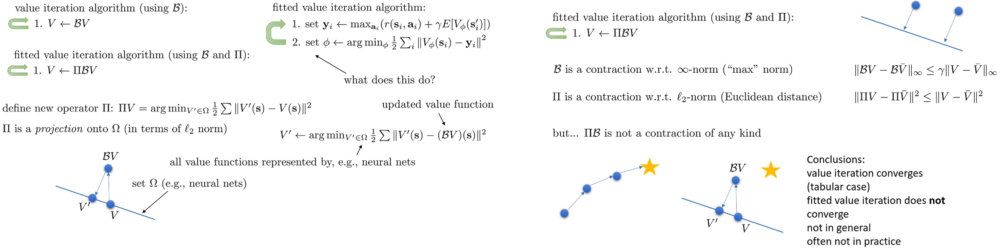

Fitted value iteration는 step 1에서 bellman backup을 하지만, step 2에서 neural network $V_\phi$를 학습해 value 값을 추정한다.
Step 2 연산을 $\Pi$라고 하자.
$\Omega$를 neural netowrk가 표현할 수 있는 space (hypothesis scpace)라고 하면, $\Pi$는 bellman backup으로 구한 value vector $\mathcal{B}V$를 $\Omega$ space에 project하는 것으로 해석할 수 있다.
$Pi$는 $\ell$-2 norm distance 기준으로 contraction operator이지만, $\Omega$가 모든 value vector $V$를 표현할 수 없다.

$\mathcal{B}$는 infinity norm에서 $\Pi$는 $ell-2$ norm에서 contraction이지만, $\Pi\mathcal{B}$는 어떠한 norm에서도 contraction이 아니다.
심지어, $\mathcal{B}V$를 $\Omega$에 projection한 $V^\prime$이 $V$보다 최적점에더 더 멀 수도 있다.
그렇기 때문에, fitted value iteration 일반적으로 수렴을 하지 않고, 최적점이 보장되지 않는다.

# 8. Fitted Q Function Learning

  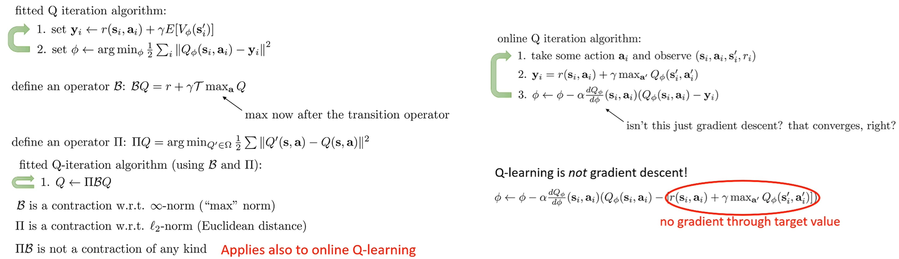

Fitted Q iteration algorithm도 같은 원리로 수렴을 보장하지 않는다.
여기서 조심해야 할 점은, fitted Q iteration algorithm은 gradient descent로 잘 정의된 objective에 regression하는 게 아니라는 것이다. (Regression은 일반적으로 수렴한다.)

Q iteration algorithm은 target value가 Q function에 의존하는 bootstraping이다.
이 과정에서 target value $y_i$는 상수 취급을 하기 때문에, $y_i$를 계산할 때 활용되는 $Q_\phi(s_i^\prime, a_i^\prime)$에 대한 gradient를 활용하지 않는다.
* Max를 고려하는 trick으로 $y_i$에 존재하는 gradient를 활용할 수 있는 residual algorithm이 있고 수렴이 보장된다.
하지만, bad numerical properties (높은 분산, gradient 소실/폭발 등) 때문에 residual algorhtim이 기본적인 fitted Q iteration algorithm보다 성능이 안 좋은 경향이 있다.

# 9. A Sad Corollary

  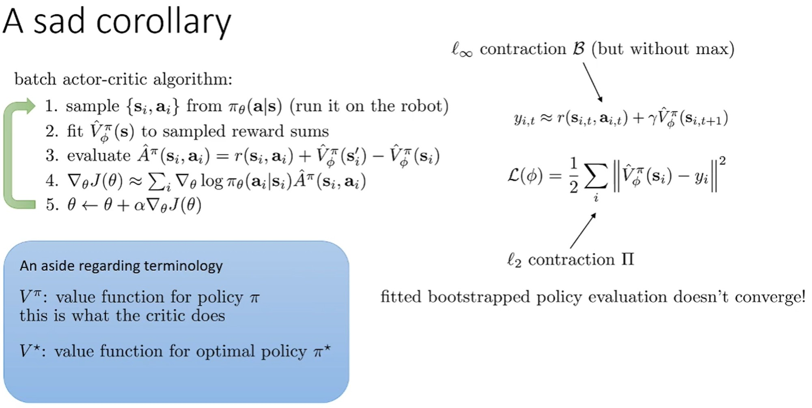

이전 강의에서 배웠던 actor-critic 알고리즘도 function approximation을 활용하면 수렴이 보장되지 않는다.