# 1. Limitation of Online Q Iteration Algorithm

  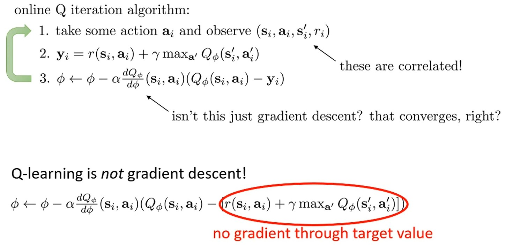

이전 강의에서도 살펴 봤다시피, online Q iteration algorithm은 수렴이 되지 않는다는 문제가 있다.
* $y_i$를 계산할 때 활용되는 $Q_\phi$에 대한 gradient를 활용하지 않는다.
Residual algorithm로 보완할 수 있지만, numerical 문제 때문에 성능이 좋지 않다.
일반적인 suprevised regression은 target $y_i$가 고정되어 있지만, Q iteration algorithm에서는 $y_i$는 계속 변하기 때문에 학습이 안정적이지 않다.
* Sample $(s_i, a_i, s_i^\prime, r_i)$와 다음에 뽑힐 sample $(s_i^\prime, a_i^\prime, s_i^{\prime\prime}, r_i^\prime)$ 간에 강한 상관관계 (correlation)가 존재한다. ($s_i$와 $s_i^\prime$이 매우 유사할 가능성이 높다.)

# 2. Solutions of Strong Correlation

  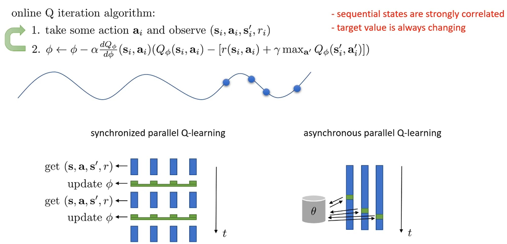

Online algorithm에서는 trajectories가 한 번에 추출되는 것이 아니라 매우 국소적으로 높은 상관관계를 가진 window를 한 번에 보기 때문에, 연속적으로 관찰되는 상태들은 강하게 상관되어 있다.
이는 SGD (Stochastic Gradient Descents)에서 일반적으로 가정하는 조건들을 위반한다.
즉, online algorithm에서 학습 데이터간 correlation 이 존재하기 때문에 graidnet가 비슷한 state에 대해 연속적으로 업데이트되는 편향 문제(overfitting)가 발행한다.

이는 actor-critic에서 언급했던 병렬화(parallelization)으로 완화할 수 있다.
Workers가 동시에 다른 경험을 수집하면서 배치 내에서 samples간 상관관계가 줄어들기 때문이다.
* Workers는 오래된 policy로 실행되어도 이론적으로 큰 문제가 아니므로 최신 policy를 사용할 필요가 없다.

  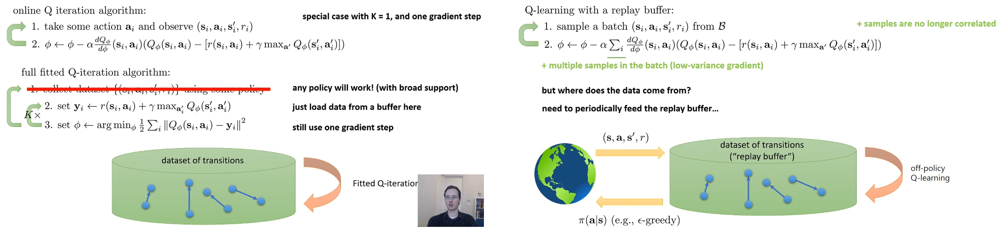

또 다른 해결책은 실제로도 매우 잘 작동하는 replay buffer 방법이다.
Replay buffer는 1990년대에 도입된 방법으로 임의의 policy로 dataset을 만들고, 해당 dataset으로 $Q_\phi$를 업데이트한다.

Fitted Q-iteration 관점에서 $K > 1$일 경우, 같은 dataset으로 여러번 학습을 진행할 수 있다.
Online Q-learning은 $K=1$이고 하나의 sample에 대해서만 gradient descent를 하는 특수한 경우이다.

Replay buffer를 사용한 Q-learning algorithm은 buffer에서 여러 transition sample $(s_i, a_i, s_i^\prime, r_i)$의 배치를 무작위로 샘플링한다.
그런 다음, 배치의 모든 항목에 대해 gradient를 합산한다.
이때, 배치에 대해 gradient를 합산하므로 상대적으로 낮은 분산의 gradient를 얻는다.
이 과정에서 buffer를 i.i.d 방식으로 샘플링하여 반복하기 때문에 transition samples간 상관관계가 약화된다.

Buffer는 최신 policy에서 $\epsilon$-greedy 방법으로 샘플링된 trasition이 저장된다.
이것은 더 나은 커버리지를 얻는 행동으로 buffer를 새로 고친다.
* 초기 policy는 성능이 안 좋을 것이고 sapce의 모든 흥미로운 영역을 방문하지 못 할 수 있기 때문이다.

Q-learning을 fitted Q-iteration처럼 같은 dataset에 대해 여러 번 $(K>1)$ 학습을 진행하여 더 효율적으로 수행할 수 있다.
* $K=1$인 경우가 전형적인 DQN (Depp Q-Network) 방식이다.

# 3. Target Networks

앞서 replay buffer를 도입해 상관관계 문제를 해결했지만, 실용적인 DQN이 되기 위해 $y_i$에서 gradient가 흐르도록 해야하고 특히, moving target을 해결해야 한다.
이를 해결하는 방법 중 하나는 target networks를 활용하는 것이다.

  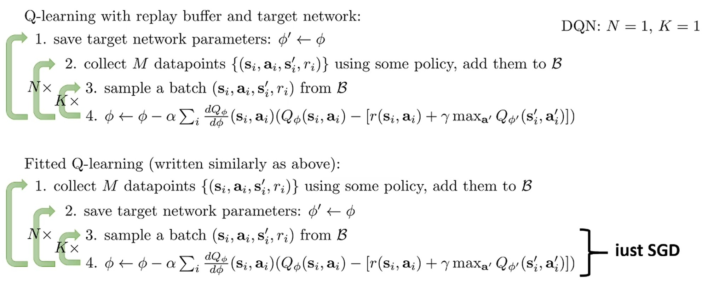

Replay buffer를 사용한 업데이트와 매우 유사하지만, max 안의 파라미터$(\phi^\prime)$가 업데이트하려는 파라미터$(\phi)$와 다르다.
데이터를 수집하고 업데이트를 하는 과정(Step 2, 3)을 N번 반복하고 $\phi^\prime$를 $\phi$로 업데이트하는 큰 외부 loop가 있다.
* 큰 외부 loop 내에서는 $\phi^\prime$가 고정되어 있으므로, target $y_i$가 변경되지 않는다.
이를 통해 훨씬 안정적이고 의미 있는 Q function을 학습할 가능성이 높다.
* 처음에는 $\phi$와 $\phi^\prime$를 랜덤으로 초기화하고, N 스텝(약 10,000) 후에 $\phi^\prime$를 업데이트한다.
* Step 2, 3, 4는 fitted Q-learning (target이 변하지 않는 regression)과 매우 유사해 보인다.
유일한 차이점은 학습 도중 계속해서 데이터가 최신 $\epsilon$-greedy policy를 사용해 수집될 수 있다는 것이다.
* Classic DQN은 $N=1, K=1$인 특수한 경우이다.

# 4. Alternative target network

  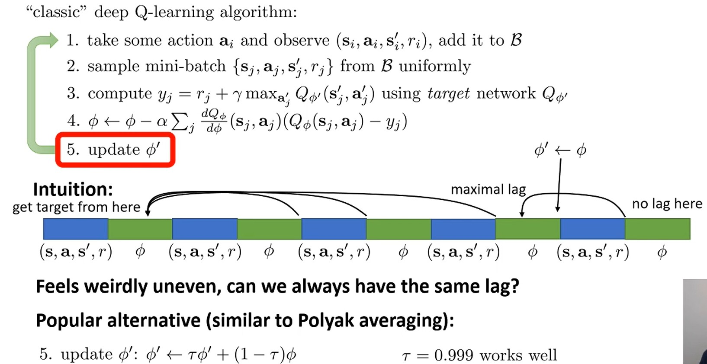

이전에 살펴본 target network에는 이상한 점이 하나 있는데, 얼마나 오래된 target을 사용하는가 매 step마다 불규칙하게 변한다는 것이다. 
즉, target network가 일관성이 없는 것으로 해석할 수 있다.
* $\phi^\prime$을 4 step 이후에 업데이트 한다고 가정해보자.
  * 1 step: $\phi^\prime = \phi = \phi_1$로 초기화한다. $\phi \leftarrow \phi_2$로 업데이트 (차이 없음)
  * 2 step:  $\phi^\prime = \phi_1$ 고정, $\phi \leftarrow \phi_3$로 업데이트 (1 step 차이남)
  * 3 step:  $\phi^\prime = \phi_1$ 고정, $\phi \leftarrow \phi_4$로 업데이트 (2 step 차이남)
  * 4 step:  $\phi^\prime = \phi_1$ 고정, $\phi \leftarrow \phi_5$로 업데이트 (3 step 차이남), $\phi^\prime = \phi_5$로 업데이트
  * 5 step: $\phi^\prime = \phi_5$ 고정, $\phi \leftarrow \phi_6$로 업데이트 (차이 없음)
    * 해당 step에서는 직전에 얻은 $\phi_5$를 target network로 사용해 마치 moving target 처럼 보인다.

실제로는 큰 문제가 아니지만 약간 이상하게 느낄 수 있다.
이를 해결하는 한 가지 방법은 target network를 점진적으로 업데이트하는 것이다.
즉, 매 step마다 다음과 같이 업데이트한다.

$$\phi^\prime \leftarrow \tau \phi^\prime + (1 - \tau) \phi$$

* 이것은 convex 최적화에 등장하는 Polyak averaging의 변형으로 인식할 수 있다.

Neural network가 parameter에 대해 선형이 아니므로 선형으로 보간하면 완전히 쓰레기가 생성될 수 있다고 생각가능하다.
그러나 Polyak averaging와 연결지으면 이론적 정당성을 부여할 수 있다.
* 비선형 함수의 parameter를 선형으로 보간하는 것이 괜찮은 이유를 알고 싶다면 Polyak averaging을 살펴보자. $\rightarrow$ Polyak averaging 이론에서는 파라미터 공간에서의 평균이 의미가 있다고 증명됨.
* 주의할 점은 $\phi, \phi^\prime$가 유사할 경우 의미가 있다는 것이다.
즉, $\phi^\prime$를 점진적으로 $\phi$와 더 유사하게 만들기 때문에 이 절차는 실제로 괜찮다.

이것의 좋은 점은 이제 $\phi'$가 매 단계마다 같은 방식으로 업데이트되어 모든 단계가 같은 양만큼 지연된다는 것이다.

# 5. A General View of Q-Learning

  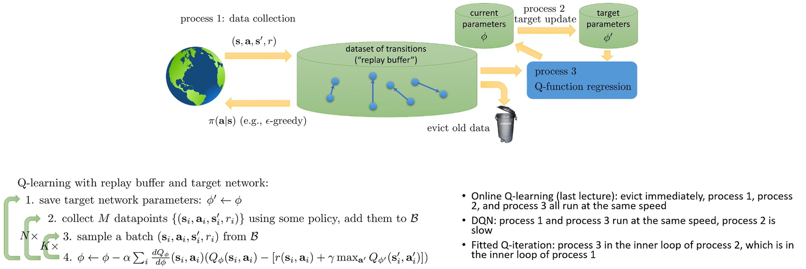

Fitted Q-iteration과 replay buffer와 target network를 사용한 일반적인 Q-learning의 차이점은 새로운 transition 샘플링 여부이다.
이들을 일반적인 Q-learning으로 보는 관점이 존재하는데, 바로 각각의 단계를(transition 샘플링, target parameter update, policy evaluation, policy update)가 병렬로 실행되는 프로세스로 보는 것이다.
언급한 두 가지 algorithm 모두 병렬 프로세스 관점에서 특수한 instance라고 볼 수 있다.
중심에는 transition들의 데이터셋, 즉 replay buffer가 있고, 이것이 모든 것의 중심에 있는 기본 객체이다.
* 프로세스 1: 데이터 수집
  * 주기적으로 환경과 상호작용한다.
  * 최신 파라미터 $\phi$를 policy로 설정하고 환경과 상호작용( $\epsilon$-greedy나 Boltzmann exploration 등)하여 하나 이상의 transition을 가져온다.
  * 이것은 주기적으로 내리는 개별 결정이 아니라 항상 실행되는 연속적인 프로세스이다.
  * 각 스텝마다 replay buffer로 데이터를 보낸다.
* Eviction 프로세스
  * Replay buffer는 유한한 크기이므로 영원히 추가만 할 수 없어, 주기적으로 buffer가 너무 커지면 항목을 제거한다.
  * 간단하고 합리적인 선택은 replay buffer를 ring buffer로 구조화하는 것으로, 가장 오래된 항목이 새 항목이 추가될 때 제거된다. (FIFO)
* 프로세스 2: Target 파라미터 업데이트
  * Target 파라미터 $\phi^\prime$가 있고, 이는 target 값을 계산하는 데 사용된다.
  * 현재 파라미터 $\phi$가 있고, 이는 프로세스 1에 제공되어 $\epsilon$-greedy policy를 구성한다.
  * 주기적으로 $\phi$를 $\phi^\prime$로 복사하거나 Polyak averaging을 수행한다.
  * 일반적으로 매우 느린 프로세스로 드물게 실행된다.
* 프로세스 3: 메인 학습
  * Replay buffer에서 transition 배치를 로드하고, target 파라미터 $\phi^\prime$를 로드한다.
  * Target 파라미터를 사용해 샘플링된 배치의 모든 transition에 대한 target 값을 계산하고, 이를 사용해 현재 파라미터 $\phi$를 업데이트한다.

| 특징 | Online Q-learning (Watkins) | DQN | Fitted Q-iteration |
|------|---------------------------|-----|-------------------|
| **Replay Buffer 크기** | 1 (즉시 eviction, ring buffer) | 매우 큼 (~100만) | 고정된 dataset |
| **프로세스 1** (데이터 수집) | 매 스텝 1개 수집 | 매 스텝 1개 수집 | 가장 느림 (외부 루프) |
| **프로세스 2** (Target 업데이트) | 매 스텝 업데이트 $\phi^\prime = \phi$ | 매우 느림 (~10,000 스텝마다) | 중간 속도 (중간 루프) |
| **프로세스 3** (학습) | 매 스텝 1번 업데이트 | 매 스텝 1번 업데이트 | 가장 빠름 (내부 루프) 수렴할 때까지 반복 |
| **프로세스 실행 구조** | 1 → 2 → 3 순차 실행 (모두 같은 속도) | 1, 3 병렬 (같은 속도) 2는 독립적 (느림) | 3 ⊂ 2 ⊂ 1 (중첩된 루프) |
| **데이터 재사용** | ✗ (1번 쓰고 버림) | ✓ (여러 번 재사용) | ✓ (수렴까지 재사용) |
| **데이터 상관관계** | 매우 높음 (연속된 transition) | 낮음 (랜덤 샘플링) | 낮음 (고정 dataset) |
| **Target 안정성** | 불안정 (매 스텝 변함) | 안정적 (오래 고정) | 매우 안정적 (완전 고정) |
| **학습 안정성** | 낮음 | 높음 | 가장 높음 |
| **샘플 효율성** | 낮음 | 중간 | 높음 |

각 algorithm는 매우 유사하고, 단지 프로세스들을 실행하는 속도에 대한 특정 선택일 뿐이다.
* 각 프로세스는 다른 모든 프로세스에 대해 비정상성(non-stationarity)을 만든다는 문제가 있다.
* 다른 프로세스들의 속도를 변경하고 서로 다른 속도로 실행하게 함으로써, 본질적으로 비정상성의 영향을 완화하고 있다.
* 프로세스 2와 1이 완전히 멈추면, 프로세스 3은 표준적인 수렴하는 supervised learning 문제와 같다.
  * 프로세스 2의 속도가 프로세스 3과 매우 다르면, 훨씬 빠르게 실행되는 프로세스 3 입장에서는 모든 것이 거의 정상적인 것처럼 보인다. ($y_i$가 고정되어 있는 것처럼 보인다.)
* 이것이 세 가지 다른 프로세스를 서로 다른 속도로 실행하는 것이 Q-learning 알고리즘을 더 효과적으로 수렴하도록 도울 수 있는 이유이다.

# 6. Improving Q-Learning

Q-learning 알고리즘은 Q value를 학습하고 argmax로 policy update하는 거지만, 특정 state와 action에서 시작하여 policy를 따를 때 미래에 얻을 총 return을 예측하는 문제이기도 하다.
따라서 이러한 예측이 실제로 얻는 것과 일치하는지 평가하는 것이 합리적이다.

  

실제 Atari breakout 게임에서 value function 값은 미래 보상을 합리적으로 예측하고 있고, Pong 게임에서도 각 상황에 맞게 상대적인 값 측면에서  Q-value가 행동과 상태에 대해 직관과 일치하는 것을 보여준다.
이것이 합리적으로 보이지만, 절대값 측면에서 Q-value는 부정확하다는 문제가 존재한다.

  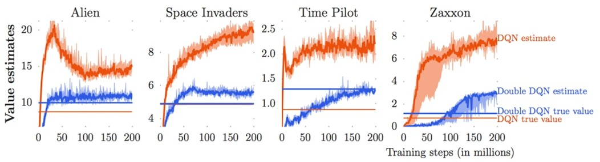

실제로 위 그래프처럼 학습된 Q 값과 실제로 얻는 return 값(discount factor 고려)이 유사하지 않다는 것을 발견할 수 있다.
보통 Q 값이 실제로 얻게되는 return 값보다 더 높게 측정된다.
* 빨간 선이 Q-learning으로 얻은 추정값이고, 파란 선이 실제 trajectories를 기반으로 계산한 discount factor가 고려된 return 값이다.
이는 우연이 아닌, Q-learning이 overestimation bias 문제를 가지고 있기 때문에 발생하는 systematic 현상이다.

# 7. Overestimation in Q-learning

  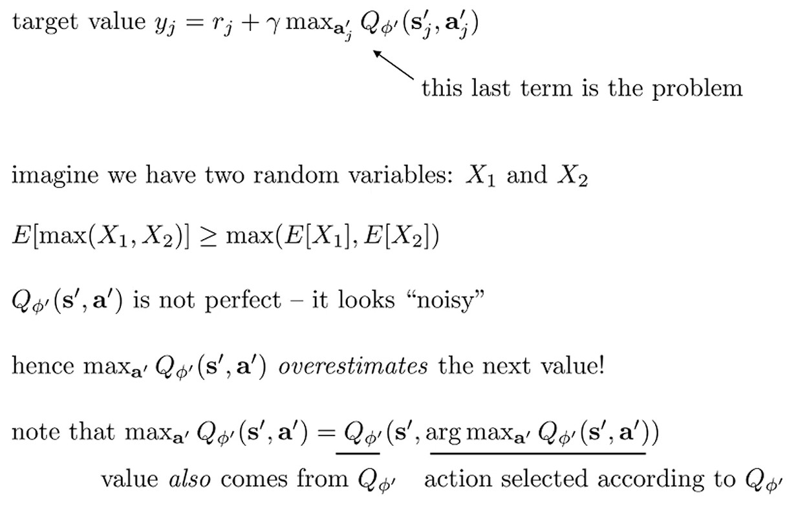

Q-learning 알고리즘에서 target value $y_i$ 계산 시 $Q_{\phi^\prime}$의 max값을 취하는데 이로 인해 overestimation이 발생한다.

별개의 문제로 랜덤 변수 $X_1, X_2$가 단변량 가우시간 분포를 따른다고 가정하자.
각 랜덤 변수는 참값($\mu$)에 노이즈($\sigma$)가 더해진 형태일 것이다.
그러면 아래 수식은 자명하다.

$$
\mathbb{E}[\text{max}(X_1, X_2)] \geq \text{max}(\mathbb{E}[X_1], \mathbb{E}[X_2])
$$

* 단변량 가우시안일 때 $X_1, X_2$ 노이즈의 평균은 0이다. 하지만, $\text{max}(X_1, X_2)$에서는 일반적으로 노이즈 평균이 0이 아니다.
* 노이즈가 양수/음수일 확률이 반반이라면, 둘 다 양수일 확률은 75%가 되어 노이즈의 max값은 더 커지게 된다.

Q-learning에서 $y_i$를 계산할 때 max를 취하면 유사한 현상이 발생한다.
즉, $Q_{\phi^\prime}(s_i^\prime, a^\prime)$가 참값 $Q(s_i^\prime, a^\prime)$에 노이즈가 더해진 형태라고 가정할 때, 이러한 오차들은 편향되어 있지 않다.
하지만, target 값에서 max를 취하면 양수인 오차를 선택하게 되어 학습이 진행될수록 참값 $Q$를 체계적으로 과대평가하게 된다.
Overestimation 문제를 해결하는 한 가지 방법은 Double Q-learning이다.

# 8. Double Q-learning 

  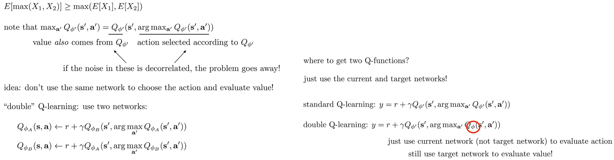

$\max_{a'} Q_{\phi'}(s', a') = Q_{\phi'}(s', \text{argmax}_{a'} Q_{\phi'}(s', a'))$와 같다.
문제는 $Q_{\phi'}$에 따라 action을 선택하는 것인데, 약간의 노이즈 때문에 어떤 action이 조금 더 낫다고 잘못 생각하여 그것을 선택하게 된다.
이를 해결하는 방법은 action 선택의 노이즈를 value evaluation의 노이즈와 decorrelate시키는 것이다.

이를 위한 한 가지 방법으로,  Double Q-learning에서는 argmax를 취할 때와 value를 평가할 때 서로 다른 parameter set을 사용한다.
* Target 값을 평가하기 위해 $\phi_B$의 값을 사용하지만 $\phi_A$에 따라 action을 선택한다.
* $\phi_A$가 양의 노이즈로 인해 action을 선택 했더라도, 해당 노이즈는 $\phi_B$가 가진 노이즈와 달라 value 평가가 낮아지게 되는 일종의 self-correcting 시스템인 것이다.

실제 환경에서는 action 선택에는 현재 파라미터 $\phi$를 사용하고, value 평가에는 target 파라미터 $\phi^\prime$를 사용한다.
* $\phi'$와 $\phi$가 너무 유사하지 않는 한, 이들은 decorrelate될 것이다.

$\phi$가 변함에 따라 action도 변하기 때문에 여전히 약간의 moving targets 문제가 있다고 말할 수 있다.
하지만 $\text{argmax}$는 그렇게 자주 변하지 않을 것이다.
더욱 중요한 문제는 $\phi'$와 $\phi$는 물론 서로 완전히 분리되어 있지 않다는 것이다.
따라서 이 솔루션은 완벽과는 거리가 멀다.
하지만 실제로는 꽤 잘 작동하는 경향이 있고, 실제로 과대평가 문제의 상당 부분을 완화한다.

# 9. Multi-step Returns

  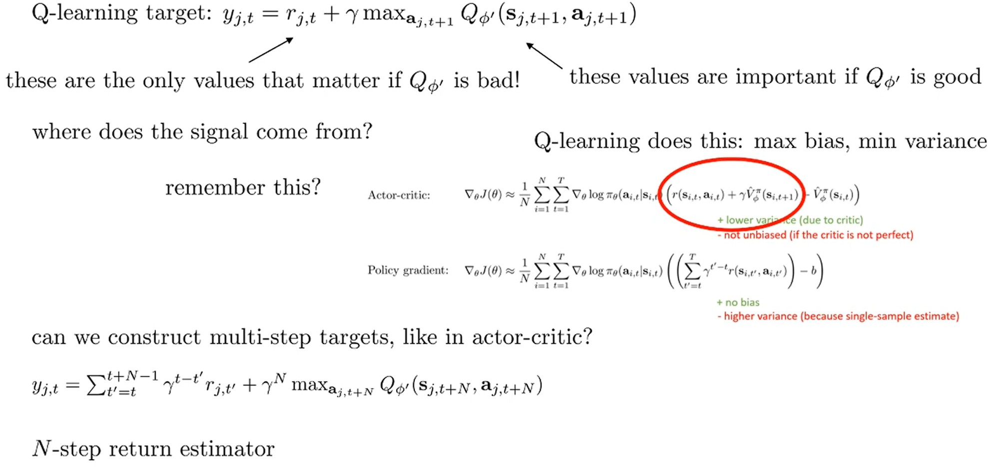

* 제일 아래 수식에서 $\gamma^{t - t^\prime}$이 아니라 $\gamma^{t^\prime - t}$인 것 같다.
* 즉, $y_{j,t} = r_{j,t} + \gamma r_{j,t+1} + \cdots + \gamma^{N-1} r_{j,t+N-1} + \gamma^N \cdots$

Q-learning 알고리즘을 개선하는 데 사용할 수 있는 또 다른 방법은 Actor-Ctiric과 유사하게 multi-step returns를 사용하는 것이다.

Q-learning 알고리즘에서 학습이 진행될수록 $Q_{\phi^\prime}$이 미래 예측을 잘 반영하기 때문에 그 값이 커지고 중요해진다.
하지만, 학습 초기에는 $Q_{\phi^\prime}$의 추정 성능이 매우 낮아 성능이 개선되는 과정이 매우 느릴 수 있고, $Q_{\phi^\prime}$보단 즉각적인 보상 ($r_{j,t}$)이 더 중요하다.
이는 Actor-Critic에서 본 것과 매우 유사하다.
* Actor-Critic에서는 advantage function 값이 정확하지 않기 때문에 더 낮은 분산을 가지지만 편향되지 않은 것은 아니다.

Actor-Ctiric에서는 Monte Carlo 합(N-step Returns)을 사용한 것처럼, Q-learning도 같은 아이디어를 사용할 수 있다.
이는 때때로 N-step return estimator라고 부른다.
* Q-learning은 기본적으로 1-step backup을 수행하는데, 이는 최대 편향과 최소 분산을 가진다. 하지만 Actor-Critic처럼 multi-step target을 구성할 수 있다.

Actor-Critic과 마찬가지로, n-step return estimator의 trade-off는 $r$에 대한 단일 샘플 추정치 때문에 더 높은 분산을 제공하지만, $Q$ 함수가 틀려도 $\gamma^n$이 곱해져 그 영향도가 작아져 더 낮은 편향을 제공한다.

# 10. Q-learning with N-step returns

  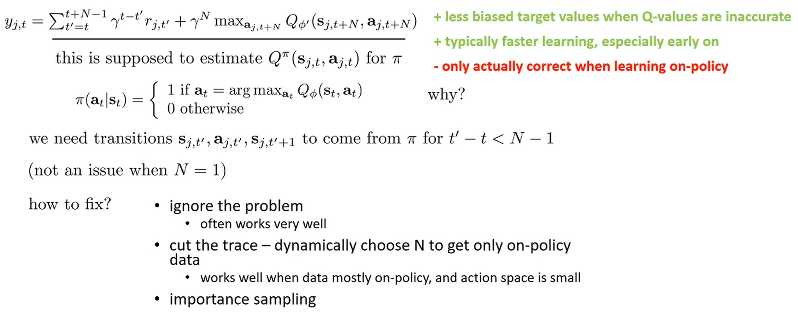

N-step returns를 사용한 Q-learning은 편향이 적고 초기에 개선 속도가 빠르다는 장점이 있지만, on-policy 샘플이 있을 때만 $Q$ 값의 추정치가 올바르다는 문제가 있다.
다른 policy로 수집된 샘플이 있다면, 두 번째 스텝 $t+1$이 새로운 policy에 대해 다를 수 있기 때문이다.
따라서 off-policy 데이터에서는 기술적으로 $N=1$만 사용할 수 있다.

해당 문제를 handling하는 방법은 여러 개가 있다.
1. 문제를 무시
    * 종종 매우 잘 동작한다.
2. On-policy 데이터만 얻기 위해 $N$을 동적으로 선택한다.
    * Deterministic greedy policy가 무엇을 할지 볼 수 있고, 샘플에서 무엇을 얻었는지 볼 수 있으므로 모든 action들이 policy가 했을 것과 정확히 일치하도록 하는 가장 큰 값으로 $N$을 선택해 만들 수 있다. 
    그러면 편향도 제거될 것이다.
    이것은 데이터가 대부분 on-policy이고 action space가 꽤 작을 때 잘 작동한다.
3. Importance sampling

여기에 적지 않은 솔루션으로 Q 함수 대신, 다른 추가 정보로 조건화된 다른 함수를 학습하여 off-policy로 만들 수 있다.
* Q-learning을 off-policy로 만들기 위해 사용했던 것과 같은 트릭을 활용하여 n-step 버전을 off-policy로 만드는 방법을 바탕으로, 어떤 종류의 객체를 학습해야 하는지 스스로 생각해보자.

# 11. Q-learning with Continuous Actions

지금까지 주로 discrete action spaces에서 Q learning 알고리즘을 살펴보았다.
실제로 continuous actions을 가질 경우 Q learning 절차를 확장하는 것이 가능하지만 다소 복잡해진다.
Greedy하게 policy update할 대와 target $y_i$를 계산할 때 $\text{argmax}_{a_t}$를 수행하는 것은 쉽지 않다.
이를 해결하는 방법은 3가지가 있다.

1. Optimization
2. Function that is easy to optimize
3. Learning an approximate maximizer - (ICLR'16) DDPG

  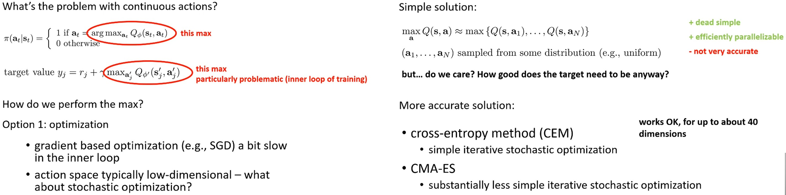

기본적인 gradient descent로 최적화 절차를 수행할 수 있지만, 속도 느리고 action space가 일반적으로 저차원 (low-dimension) 이므로 SGD보다 더 쉬운 최적화 문제를 사용할 수 있다.
미분이 필요 없는 확률적 최적화 절차(derivative free stochastic optimization procedure)가 max를 평가하는 좋은 선택이 될 수 있다는 것이 밝혀졌다.

매우 간단한 해결책은 행동을 무작위로 N개 샘플링해서 discrete action ste에 대한 max로 근사하는 것이다.
이는 매우 단순하지만, action space가 저차원이고 충분히 많은 샘플링을 할 수 있다면 실제로 잘 작동하는 경향이 있다.
또한 병렬화를 쉽게 할 수 있고, max가 덜 효과적이기 때문에 overestimation 문제를 덜 겪을 수 있다.

문제는 action space가 커질수록 max 근사값의 정확도가 떨어진다는 것이다.
* Overestimation 관점에서 정확도가 떨어지는 게 오히려 더 좋은 결과를 낼 수도 있다.

더 정확하게 근사할 수 있는 방법으로 CEM (Cross-Entropy Method)이 있다.
직관적으로 CEM은 단순히 위의 무작위 샘플링처럼 행동 집합을 샘플링하는 것으로 구성된다.
차이점은 샘플링된 것 중 단순히 max 값을 선택하는 대신 샘플링하는 분포를 개선하여 좋은 영역에서 더 많은 샘플을 구하는 과정을 반복한다.
* 처음에는 무작위로 action을 샘플링한다.
그리고 $Q$값이 높은 action 근처(좋은 영역)에서 샘플링을 추가로 진행하고 계속해서 이 과정을 반복해 max 근사값의 정확도를 높인다.

CMA-ES는 CEM보다 더 복잡하기만 개선된 버전으로 생각하면 된다.
이러한 종류의 방법들은 약 40차원 action space까지는 속도와 정확도 측면에서 꽤 괜찮게 작동한다.
Cross-Entropy Method는 간단한 반복적 확률적 최적화 기법으로, 나중에 model-based RL에 대해 이야기할 때 훨씬 더 많이 논의할 예정이다.

  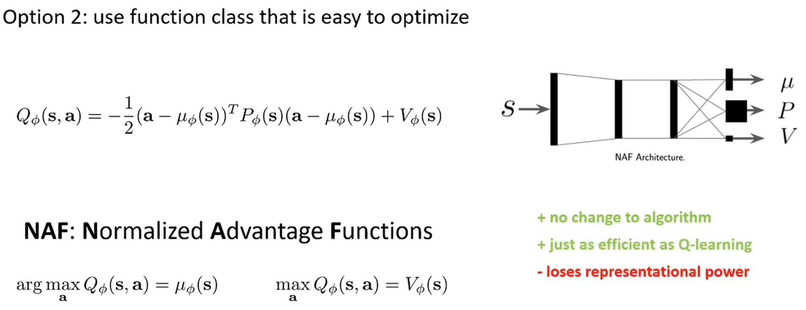

두 번째는 neural network대신 최적화하기 쉬운 function class를 사용하는 것이다.
예를 들어, $Q$ 함수를 action에 대해 closed form solutions을 가지는 이차 함수(quadratic function)로 표현할 수 있다.
이것을 할 수 있는 방법 중 하나는 2016년 Gu et al.의 논문에서 제안된 NAF(Normalized Advantage Function)라고 불리는 것이다.
* NAF는 state를 입력받아 3가지를 출력한다.
  * $V(s)$ - 스칼라 값: 이 상태의 기본 가치
  * $\mu(s)$ - 벡터: 최적 행동
  * $P(s)$ - 행렬: 그릇의 모양 (얼마나 가파른지)
* 벡터($\mu$)와 행렬 $P(s)$가 행동에 대한 이차 함수를 정의하고 항상 최대값을 찾을 수 있다.
  * $a - \mu_\phi(s)$는 action $a$가 최적 행동 $\mu(s)$에서 얼마나 떨어져 있는가를 표현한다.
  * $P(s)$가 positive definite이면 최댓값은 단지 $\mu_\phi(s)$이다.
* $Q_\phi$의 argmax는 $\mu_\phi$이고 max는 $V_\phi$이다.

$$
\text{exp}(Q(s,a)) \propto \text{정규화된 가우시안 분포}
$$

Nomrlize라고 불리는 이유는 해당 수식에 exponential을 취하면 정규화된 가우시안 분포를 얻게 되기 때문이다.

  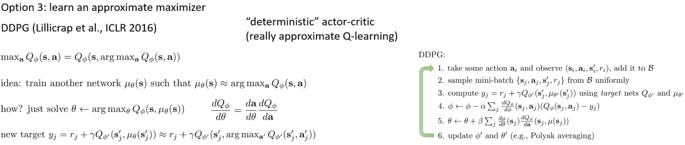

마지막 방법은 approximate maximizer를 학습하는 것으로, 첫 번째 방법(optimizaiton)과 유사하지만 해당 방법은 샘플링 대신 새로운 nerual network를 학습하여 근차시를 추정한다.
이는 ICLR 2016 논문인 DDPG와 관련되어 있지만, DDPG 자체는 훨씬 더 일찍 제안된 NFQCA라는 또 다른 알고리즘과 거의 동일하다.
NFQCA는 deterministic actor-critic 방법으로도 해석될 수 있지만, Q learning 알고리즘으로 생각하는 것이 더 간단하다.

$\max_a Q_\phi(s,a)$는 단지 argmax에서 평가된 $Q_\phi$라는 것으로, argmax를 수행할 수 있는 한 Q learning을 수행할 수 있다. 
이에 핵심은 $\mu_\theta(s)$가 대략적으로 $Q_\phi$의 argmax가 되도록 또 다른 네트워크 $\mu_\theta(s)$를 훈련시키는 것이다.
$\mu_\theta(s)$는 state를 보고 argmax action을 출력하기 때문에 일종의 policy로 생각할 수 있다. 
$s, \mu_\theta(s)$에서 $Q_\phi$를 최대화하는 $\theta$를 찾기 위해 Q 함수에서 $\theta$에 gradient를 구하고 chain rule로 $\theta$를 업데이트한다.
그리고 구해야 하는 target은 $y_j = r_j + \gamma \times Q_{\phi'}(s_j', \mu_\theta(s_j'))$로 주어진다.

우측의 pseodu-code는 DDPG 알고리즘이지만, 더 최근의 변형들과 더 오래된 변형들도 많이 있다.
* 고전적인 연구로는 NFQCA, 최근 변형으로는 TD3와 SAC가 있다.

# 12. Simple practical tips for Q-learning

  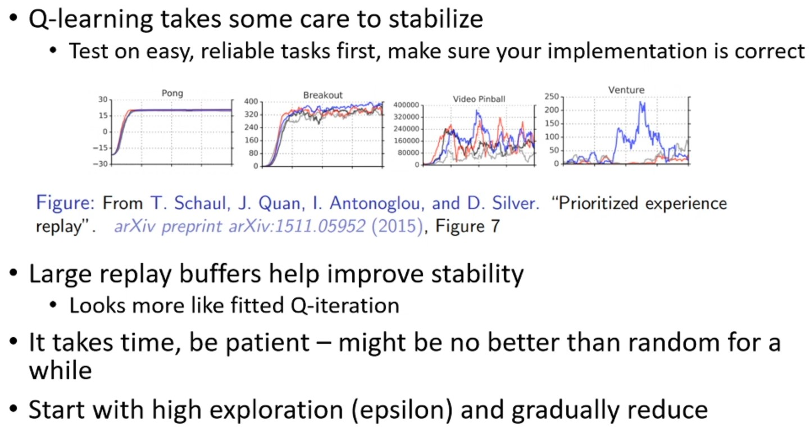

일반적으로 Q-learning 방법들은 policy gradient 방법보다 사용하기가 더 까다롭다.
기본적으로 추천하는 방법들을 살펴보자.
* 시작할 때 쉽고 신뢰할 수 있는 문제들에서 알고리즘 테스트해 구현이 올바르게 올바른지 확인하자.
  * Q-learning은 문제에 따라 성능이 매우 다르게 나타나므로, 올바른 구현이라면 반드시 잘 작동하는 문제로 테스트를 진행하자.
  * Atari에서도 게임 종류에 따라 Q-learning의 안정성이 다르게 나타난다.
    * 서로 다른 색의 선들은 동일한 알고리즘을 서로 다른 랜덤 시드로 실행한 결과를 나타낸다.
    * Pong에서는 서로 다른 랜덤 시드들이 거의 동일한 결과를 보인다.
    * Breakout에서는 전반적인 형태는 비슷하지만 노이즈 차이가 있다.
    * Venture 같은 경우에는 어떤 실행은 성공하고 어떤 실행은 완전히 실패한다.
* 큰 리플레이 버퍼를 사용하는 것이 안정성을 크게 개선하는 경향이 있다.
* 학습 초기에 오랜 시간 동안 랜덤보다 나아 보이지 않을 수 있지만, 인내심을 가져라.
Pong 게임에서 비슷한 현상을 겪을 수 있다.
* 학습 초기에는 탐색 비율을 높게 시작하고, 점차적으로 탐색을 줄여나가라. (스케줄링)

# 13. Advanced tips for Q-learning

  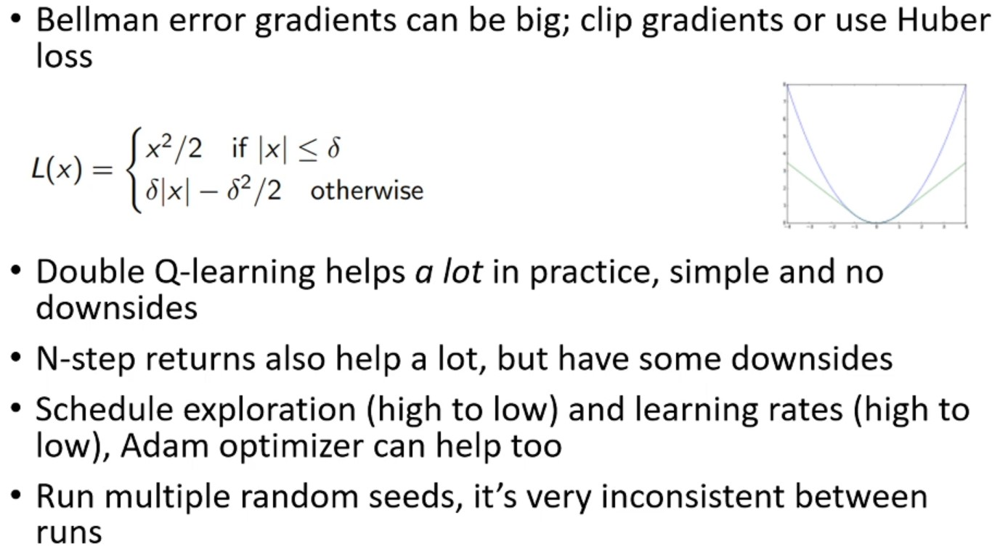

Bellman error는 일종의 최소제곱 회귀 문제이기 때문에, 제곱 오차 항이 매우 큰 값을 가질 수 있고, 그 결과 gradient도 매우 커질 수 있다.
* 문제가 되는 점은, 어떤 액션이 아주 나쁜 경우 사실 그 action의 정확한 값에는 별로 관심이 없다는 것이다.
하지만 제곱 오차 objective function는 그 action이 얼마나 나쁜지를 정확히 맞추려고 한다.
예를 들어, 좋은 action들이 +10, +9, +8 정도이고, 나쁜 action이 -1,000,000이라면, 그 -1,000,000이 엄청난 gradient를 만들낸다.
하지만 실제로는 -900,000으로 예측해도 policy는 동일하다. 
그럼에도 불구하고 Q function의 objective function는 그 값을 정확히 맞추는 데 집착하고, 이로 인해 큰 gradient가 발생합니다.

이를 해결하기 위해 gradient clipping할 수 있고, 또는 Huber loss을 사용할 수 있다. 
* Huber loss은 제곱 오차 손실과 절댓값 손실 사이를 보간한 것이라고 생각할 수 있다.
* 최소점에서 멀리 떨어진 곳에서는 Huber loss이 절댓값처럼 동작하고, 최소점 근처에서는 이차 함수로 부드럽게 만들어 미분이 가능하도록 한다.
* 초록색 곡선이 Huber loss이고, 파란색 곡선이 이차 손실이다.
* Huber loss은 기계적으로 보면 gradient clipping과 매우 유사하게 동작하지만, 구현하기가 더 쉽다.

Double Q-러닝은 구현도 매우 간단하고 단점이 없어 실제로 매우 큰 도움이 된다.

N-step returns도 학습 초기 단계에서 큰 도움이 될 수 있다.
하지만 N 값이 커질수록 objective function에 systematic bias를 추가한다는 단점을 주의해야 한다.
* 그럼에도 불구하고 초기 학습 단계에서 성능을 개선할 수 있다는 점은 기억하자.
* Systematic bias와 bias는 서로 다른 관점을 얘기한다.
* N이 커질수록 bias는 줄어들지만, systematic bias는 커질 수 있다.
  * Systematic bias란 bootstrap 오차가 구조적으로 퍼진다는 뜻으로, N이 커지면 동일한 $Q_\phi(s_{t^\prime}, a_{t^\prime})$를 $y_{t_1}, y_{t_5}$ 등에서 사용할 확률이 높아진다.
  * 예를 들어, N이 1이면 $Q_\phi$의 오차는 직전의 state-action에만 영향을 끼치지만 N이 커지면 해당 $Q_\phi$의 오차는 더 많은 state-action에 영향을 끼친다.

탐색 스케줄을 적용하고, 학습률도 스케줄링하자.
* Adam 같은 적응형 최적화 기법도 큰 도움이 된다.
* 예전엔 RMSProp 같은 방법을 사용했는데, 이는 Adam만큼 잘 작동하지 않는다.

알고리즘을 디버깅할 때는 반드시 여러 개의 랜덤 시드로 실행하자.
* Random seed에 따라 결과의 변동성이 매우 크다는 것을 보게 될 것이다.
* 실행마다 알고리즘이 매우 일관되지 않게 동작할 수 있기때문에, 몇 개의 다른 랜덤 시드로 실행해서 결과가 정말로 기대한 대로 나오는지 확인해야 한다. 