이전 강의에서는 model-free reinforcement learning을 배웠다.
* Model을 모르는 상태에서 학습도 하지 않았고, 오직 샘플된 trajectories만 활용했다.
* Value functions을 활용하지 못하기 때문에 Q functions으로 대체하였다.

이제 discrete/continuous space에서 dynamics model(학습된 것 또는 정의된 것)이 주어졌을 때 planning을 하는 방법을 알아볼 것이다.
* $p(s_{t+1}|s_t, a_t)$: dynamics model, transition dynamics, ...

# 1. Model-based Reinforcement Learning

게임, 시뮬레이션 환경 등에서는 대개 transition dynamics를 알고 있다.
그리고 모르더라도 dynamics를 학습할 수 있고, dynamics를 알고 있으면 강화 학습은 보통 쉬워진다.

* System identification: fit unknown parameters of a known model
  * 모델 구조는 알고 있음 (예: 물리 법칙, 미분방정식 형태)
  * 파라미터만 모름 (예: 질량, 마찰계수, 강성)
  * 관측 데이터로 특정 파라미터 값을 추정
* Learning: fit a general-purpose model to observed transition data
  * 모델 구조도 모름
  * 범용 함수 근사기(neural network 등)로 transition dynamics 전체를 학습
  * 데이터에서 패턴 자체를 발견

  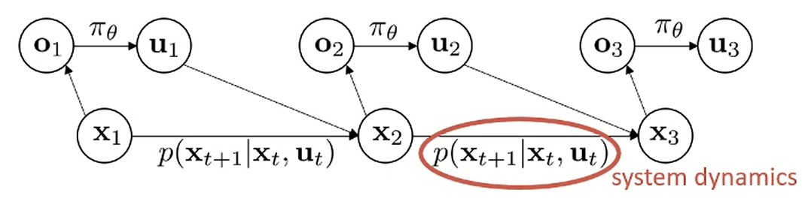

Model-based라는 것은 POMDP(Partially Observable Markov Decision Process) graphical model에서 edge가 정확히 무엇인지 안다는 것을 의미한다.
* MDP: state를 완전히 관측 ($s_t$를 직접 봄)
* POMDP: state를 부분적으로만 관측 ($o_t$만 봄, $s_t$는 숨겨짐)
  * 로봇이 센서 노이즈 때문에 정확한 위치($s_t$)를 모르고, 노이즈 섞인 센서값($o_t$)만 받음
  * 포커 게임에서 상대방 카드($s_t$)를 모르고, 상대방 행동($o_t$)만 관측
* Edge를 안다는 것은 CPT(Conditional Probability Table)의 모든 항목을 알거나, continuous case에서는 해당 CPD(Conditional Probability Distribution)의 함수 형태를 안다는 것이다.

Model이 주어졌을 때 의사결정을 내리는 알고리즘은 optimal control, trajectory optimization, planning 등으로 불린다.
* Optimal Control: 가장 포괄적인 개념으로 reward 최적화/cost 최소화하는 control 선택하는 것이다. 모든 RL이 결국 optimal control 문제이다.
* Trajectory Optimization: Continuous space에서 state-action sequence를 선택하는 문제로, 일반적으로 smooth gradient 기반 최적화를 수행한다. Optimal control에 접근하는 방법으로 볼 수 있다.
* Planning: Discrete space에서 action sequence 선택하는 문제이다. Planning이 continuous 버전을 칭할 수도 있는데, 이 경우 planning과 trajectory optimization은 본질적으로 같다. 일반적으로 planning이라는 이름의 알고리즘들은 discrete branching 설정에서 branching/tree search 방식으로 여러 가능성을 고려한다.

이번 강의에서는 dynamics가 주어졌다고 가정한다.
* 이후에는 dynamics를 모를 때 이것을 학습(lecture 11)하여 policy도 학습(lecture 12)할 수 있는 방법에 대해 알아볼 것이다.

  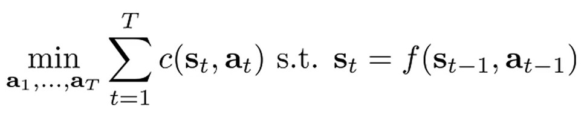

*  $c(\cdot)$은 cost를 의미한다.

Model-based RL의 objective에는 policy가 없고 state와 action만 있다.
이때, 현재의 action이 미래 state에 영향을 끼치는 것을 고려하기 위해 $s_{t+1} = f(s_{t}, a_t)$이라는 제약 사항을 둔다.
이것이 deterministic dynamics case에 대한 formula이고 stoc ahstic dyanmics case로도 확장할 수 있다.
이번 강의에서는 일반적으로 deterministic case에 대한 표기법을 사용할 것이다.

  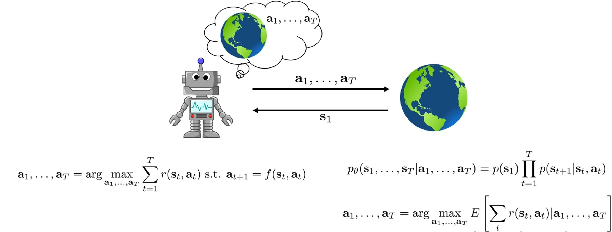

Deterministic case는 비교적 간단하다.
Environment가 agent에게 어떤 state($s_1$)에 있는지 알려주면, agent는 최적화를 수행한다.
그 결과 reward를 최대화할 action sequences $a_1, \cdots, a_T$를 planning하고 world는 이 actions에 따라 실행된다. (예: 미로 찾기 등)

Stochastic case에서는 actions가 주어지면 state sequence에 대한 분포를 정의할 수 있다.
Planning 문제이기 때문에 $p(a_t|s_t)$는 등장하지 않고 오로지 action sequence에만 dependent하다.
따라서 action sequence를 조건으로 가지는 state sequence 분포 하에서 reward 기대값을 최대화해야 한다.
주의할 점은 stochastic open-loop case에서 이런 종류의 plan은 어떤 state가 올지 모르는 상황에서 action을 선택하기 때문에 나쁜 결과를 가져올 수 있다.
즉, 문제를 모르는 채 답을 정해야 하는 상황이므로 결과가 나쁠 수밖에 없기 때문에 open-loop control은 sub-optimal 이다.
만약 매 step마다 $s_{t+1}$를 관측할 수 있다면, 즉 closed-loop planning 문제에서는 훨씬 더 높은 reward를 얻을 수 있다.

  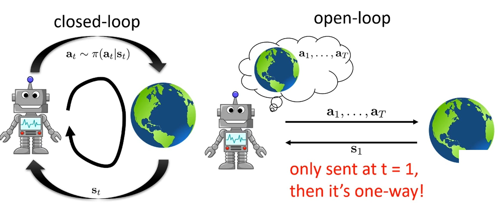

Closed loop는 agent가 state를 관측하고 policy에 따라 action을 취하는 과정으로 perception과 control 사이의 loop가 close한다.
반면 open loop case에서는 state가 주어지고 나서 action sequence를 commit한다.
그리고 새로운 state가 드러나는 것을 실제로 보지 않고 그 action들을 실행하며 actions이 open loop로 실행된다.

  

RL은 일반적으로 closed loop 문제를 푼다.
Closed loop에서 policy $\pi(a_t|s_t)$를 만들고, reward는 고정된 action set $a_1, \cdots, a_T$가 아니라 policy에 의존하게 된다.
이는 이전에 살펴본 RL의 objective function과 일치한다.

Neural netowrk는 표현력이 풍부한 것으로 일종의 어떤 state에서도 action을 도출하는 global policy로 생각할 수 있다.
하지만 훨씬 덜 표현력 있는 policy class로도 near optimal closed-loop planning을 할 수 있다.
* Time-varying linear policy 등 매우 local한 policy를 사용해 RL 문제를 풀 수 있다.
* 예를 들어 어떤 궤적을 따라 로켓을 제어하는 것은 기류, 바람, 로겟의 모터 특성으로 인해 계획된 궤적을 벗어날 수 있는 stochastic 설정이다.
하지만, 크게 벗어나지는 않을 것이고 그 편차를 빠르게 수정하면 대부분 계획된 궤적에 가까이 머물게 되어 단순하고 local한 policy로 충분하다.
* 이런 종류의 controller는 optimal control과 trajectory optimization 영역에서 훨씬 더 일반적이다.

# 2. Open-Loop Planning

Dynamics model에 대해 최소한의 가정만 하는 open loop planning을 위한 몇 가지 알고리즘을 살펴보자.
Dynamics model을 알아야 하지만 그 외에는 어떤 가정도 하지 않는다.
* Continuous인지 discrete인지, stochastic인지 deterministic인지, 미분 가능한지 등 어떤 것에 대해서도 가정 하지 않는다.

  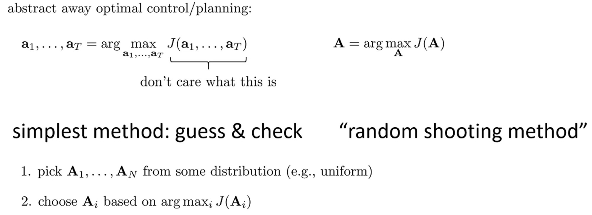

Stochastic optimization 방법으로 광범위하게 간주될 수 있는 black box optimization 방법들을 살펴보겠다.
해당 방법들은 최적화 문제를 black box에 두는 것으로, 서로 다른 time step이 있다는 사실 그리고 시간에 따른 trajectory 분포가 있다는 사실을 신경쓰지 않는다.
단순히, N개의 action sequence $A$를 특정 분포로부터 추출하고 $J(\cdot)$를 최대화하는 $A$를 선택하는 것이다.
* 이것은 때때로 random shooting 방법이라고 불린다.
Action sequence를 선택하는 방법을 일종의 environment에 무작위로 쏘는 것으로 생각할 수 있기 때문에 shooting이라고 부른다.

Random shooting은 나쁜 방법처럼 보일 수 있지만, 실제로 저차원 시스템과 짧은 horizon에서는 실제로 매우 잘 작동할 수 있으며, 꽤 매력적인 장점을 가지고 있다.
* 구현하기가 매우 간단하다.
* 현대 하드웨어에서 꽤 효율적이다.
  * $A_1, \cdots, A_N$을 mini-batch로 취급하고, nerual network로 병렬로 평가를 진행하면 매우 빠르다.

하지만, 매우 좋은 action을 선택하지 못할 가능성이 높다는 단점이 있다.

  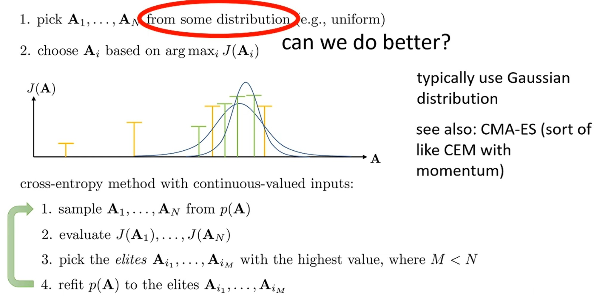

Random shooting 방법을 극적으로 개선하면서도 많은 이점을 유지할 수 있는 한 가지 방법은 Cross Entropy Method (CEM)이다.
* 저 ~ 중 차원/horizon을 가진 control 문제에 대한 black box 최적화 알고리즘을 원한다면 꽤 좋은 선택이다.

Cross entropy method에서는 random shooting처럼 random으로 action sequence를 선택하지 않고, 좋은 action이 있을 것 같은 영역에 집중하도록 이 분포를 선택한다.
* 처음에는 random으로 $A_i$를 샘플링하고 J(A)가 나아 보이는 곳으로 샘플링 분포를 fitting한다. (보통 상위 10% 샘플 M개에 fitting한다.)
* 새로운 분포에서 더 많은 샘플을 생성하고, 분포를 다시 fitting하는 과정을 반복한다.
  * $p(A)$를 Gaussian 분포로 가정한 뒤, M개의 샘플의 maximun likelihood를 최대화하는 방향으로 parameter를 fitting한다.

Cross-entropy method는 충분히 큰 초기 분포를 선택하고 충분한 샘플을 생성하면, 일반적으로 실제로 global optimum을 찾는 것을 보장한다.
물론 복잡한 문제의 경우 그 샘플 수와 반복 횟수가 엄청나게 클 수 있지만, CEM은 꽤 잘 작동한다.
또한, 이 action에 대해 모델이 미분 가능할 것을 요구하지 않으며, 실제로 다른 분포 class를 사용하여 discrete action 같은 것으로 확장될 수 있다.
* CMA-ES는 Covariance Matrix Adaptation Evolution Strategies의 약자로, momentum 스타일 항을 포함하여 CEM을 더 정교하게 만든 것이다.

구현이 간단하고 병렬화가 가능해 효율적이지만, 고차원이 되면 여러 challenge가 있고 open-loop planning만 생성한다는 문제가 있다.
* 경험적으로 60차원 이상이 되면 잘 작동하지 않는다.
* 때때로 강한 상관 관계를 가지면 더 긴 sequence도 해낼 수 있다.
* 예를 들어 10차원 문제가 있고 15 time step이 있다면 기술적으로 150차원이지만, 연속적인 time step들이 서로 강하게 상관되어 있으면 여전히 잘 동작할 수 있다.

# 3. Discrete case: Monte Carlo Tree Search (MCTS)

MCTS는 closed-loop에서 discrete와 continuous state를 입력으로 받을 수 있지만 discrete state에서 더 일반적으로 사용된다.
* 특히, board 게임에서 인기가 많고 AlphaGo도 MCTS를 변형한 것이다.

  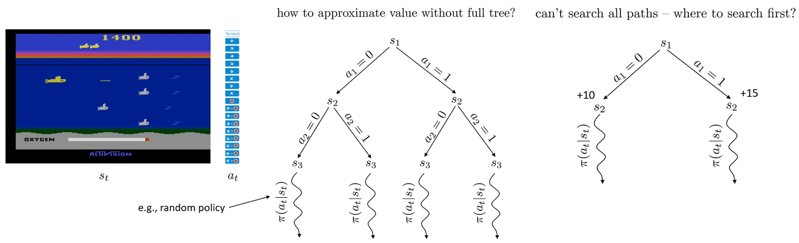

Atari 게임에서 어뢰로 물고기를 맞추는 게임을 살펴보자.
* 작은 잠수함을 제어하기 위해 discrete action set에서 action을 선택한다.
* 두 개의 action (위, 아래)만 있다고 했을 때, 시작 state $s_1$에서 두 가지 action을 취하면 서로 다른 state에 놓이게 된다. (stochatic일 수 있지만, 관찰만 하면 된다.)
* 도달한 각 state에 대해 $a_2$의 모든 가능한 값을 시도하고 이를 계속 반복한다.
* 이를 통해 최적의 action을 찾을 수 있지만 실행 cost가 지수적으로 증가한다.

이 문제를 해결하는 방법은 전체 tree를 확장하지 않고 특정 depth까지만 tree를 확장한 후 baseline policy (random policy 등)을 실행하는 것이다.
Actions를 취했을 때 얻게되는 실제 value와 정확히 일지하지 않지만, 충분한 action을 확장했고 discount factor를 고려하면 합리적인 value를 예상할 수 있다.
* 예를 들어 depth 3까지 tree를 확장한 후 random policy로 rollout하자.
* 만약 나쁜 state $s_3$에 도착했다면 random policy의 결과 나쁜 value를 얻게 될 것이고 정말 좋은 state $s_3$에 도착했다면 좋은 value를 얻게될 것이다.

실제로 MCTS는 closed-loop case를 고려하는 discrete stochastic 설정에서 잘 동작하는 알고리즘이다.
물론 모든 경로를 탐색할 수는 없으므로 어떤 경로를 먼저 탐색할 것인가를 선택해야 한다.
이때, action에 대한 결과를 모르기 때문에 임의로 하나의 action을 선택한다.
* 직관은 최고의 return을 가진 action을 선택하되, 거의 해보지 않은 action을 선호한다는 것이다.
* 예를 들어, $a_1$을 선택하고 baselinep policy를 다랐을 때 +10 reward를 얻었다고 해보자.
다른 action에 대해 아무것도 모르기 때문에 이것이 좋은지 안 좋은지 모른다.
* $a_2$를 선택해서 +15 reward를 얻었다고 가정하자.
* $a_2$가 더 좋아 보이지만, stochastic planning에서 random policy를 수행한다는 것을 기억해라.
* 따라서 각 action에 대해 많이 시도하고, 수집된 샘플을 기반으로 value를 추정하여 더 나은 action을 선택해야 한다.

  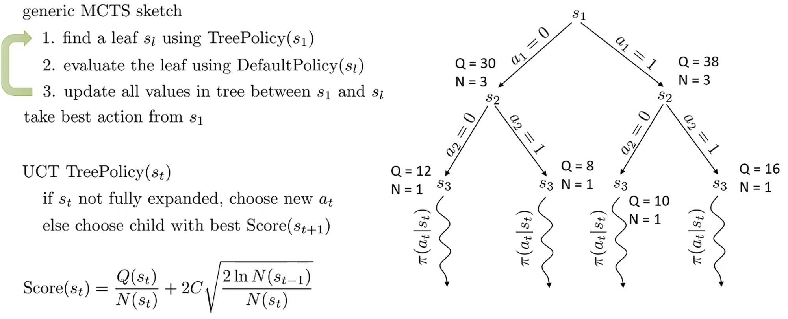

이를 formula로 나타내면 다음과 같다.
* Tree를 가져와서 특정 tree policy를 이용해 leaf $s_1$을 찾는다.
  * Tree policy란 tree를 보고 어떤 leaf node를 확장할지 선택하는 전략을 의미한다.
* DefaultPolicy를 이용해 선택한 leaf node를 확장한다.
  * DefaultPolicy는 random policy와 같이 environment에서 동작하는 policy를 의미한다.
    * Leaf node를 평가하는 방법은 root1에서 leaf까지의 모든 action을 취한 다음 DefaultPolicy를 따르는 것이다. 
* $s_1$과 $s_l$ 사이에 있는 모든 value를 업데이트한다.

위 과정을 반복 후, root $s_1$에서 최고의 action을 취한다.
일반적으로 MCTS에서는 각 time step마다 전체 planning 과정을 다시 실행한다.
* Root에서 최고의 action을 취하고, planning을 처음부터 다시 시작한다.

초기 tree policy는 아무것도 모르기 때문에 $a_1 = 0$으로 tree를 확장한다.
* 확장 후 DefaultPolicy를 따르고 수집된 return으로 $s_1$과 $s_2$ 사이의 value를 업데이트 한다.
Subnodes의 value도 root까지 전파되어야 하므로 그림에 나타난 node별 Q는 sub-tree의 value를 까지 합한 것이다.
이때, node를 방문한 횟수도 같이 기록한다.
* 그리고 다른 action $a_1 = 1$에 대해서도 확장을 진행해 평균적으로 좋은 action을 선택해야 한다.
* 만약 동점이라면, 임의로 action을 선택한다.

Tree policy는 일반적으로 UCT tree policy를 선택한다.
* 완전히 확장되지 않았다면 새로운 action을 선택한다.
* 완전히 확장되었다면 최고의 score를 가진 child를 선택한다.
  * Score의 수식을 살펴보면 q-value의 평균값 $\frac{Q(s_t)}{N(s_t)}$에 방분횟수까지 고려한다.
  직관적으로 덜 자주 방문될수록 해당 action을 더 취하는 전략이다.
* 이를 특정 횟수만큼 재귀적으로 수행한다.
* 평균적으로 좋은 action을 선택하고 다시 planning을 수행한다.

MCTS에 대해 더 알고 싶다면 "A Survey of Monte Carlo Tree Search Methods"라는 논문을 추천한다.
* 이 논문은 high-level 개요를 제공한다.

일반적으로 MCTS 방법은 이론적으로 분석하기 매우 어렵고 최적을 보장하지 않지만, 실제로는 매우 잘 작동한다.
* Stochasticity가 있는 일종의 chance 게임(운이 필요한 카드 게임 등)이면, MCTS 종류의 알고리즘이 매우 좋은 선택이다.

AlphaGo는 MCTS에서 학습된 policy를 default policy로 활용하고 학습된 value function으로 terminal node를 평가하는 방법들을 활용한 RL이다.

# 4. Trajectory Optimization with Derivatives

  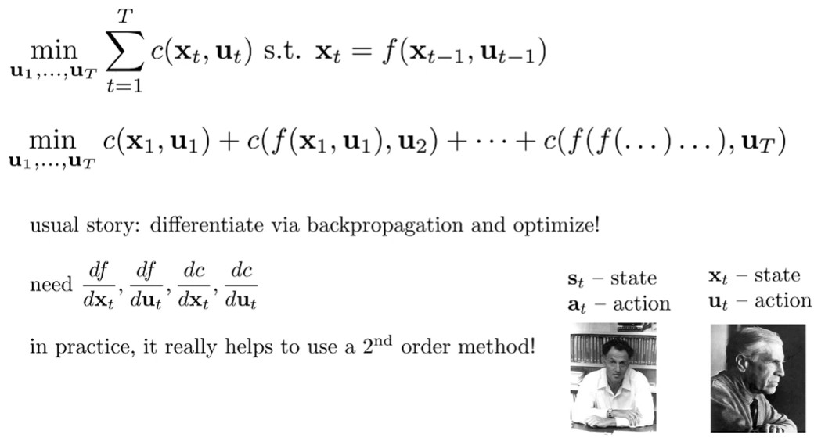

* Optimal control 또는 trajectory optimization에서는 주로 state를 $x_t$, action을 $u_t$로 표기하고 reward 대신 cost를 활용한다.

Continuous environment에서 dynamics의 미분이 가능할 때 이를 활용해 planning을 해보자.
이전에 살펴본 model-based planning에서는 dynamics의 constraint가 있었다.
보통 constraint가 있을 때 이를 변수에 대입하여 non-constraint 최적화 문제를 얻을 수 있다. (Lagrangian 최적화 등)
그리고 미분과 chain-rule을 사용해 non-constraint 최적화 문제를 해결해야 하기 때문에 $x_t$와 $u_t$에 대한 cost $c$와 dynamics $f$의 미분값을 알아야 한다.
그리고 대개 이런 문제(시간에 따라 순차적으로 진행되고 직전 값과 상관관계가 큰 문제)는 1차 gradient descent (Jacobian)보단 2차 방법론인 Newton's method (Hessian)가 더 잘 작동한다.
* 1차 gradient에서는 순차적으로 gradient가 전파된다.
즉, time step이 작은 state나 action의 gradient에는 많은 Jacobian들이 함께 곱해지기 때문에 gradient vanishing 또는 exploding 문제가 발생한다.
2차 방법은 이것을 효과적으로 보완할 수 있다.
* 2차 방법에서 거대한 Hessian 행렬을 계산하는 것을 해결해야 하는데, 문제 구조 상 매우 효율적으로 처리할 수 있는 알고리즘이 있다.
  * 시간적 순차성에 상관관계가 크기 때문에 Hessian 행렬의 대부분이 0이고, 0이 아닌 값들이 대각선 근처에만 집중되어 있다.

  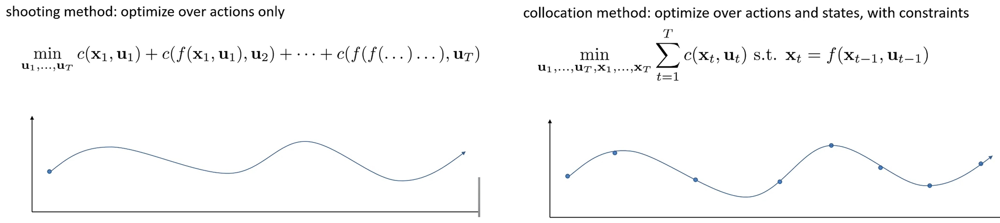

Trajectory optimization에서 자주 등장하는 shooting과 collocation의 차이를 알고 가자.

Shooting은 action에 대해 최적화하는 방법이다.
* Objective function에는 초기 action이 마지막 action보다 더 큰 영향을 끼칠 것이다.
* 비선형 objective function은 최소 2차함수일 것이고, 이러한 민감도는 나쁜 수치적 조건화로 이어진다.
  * Hessian은 초기 action에 대해선 매우 큰 eigenvalue고, 나중 action에 대해서는 매우 작은 eigenvalue이게 된다.
  * 즉, $u_1$가 조금만 움직여도 cost가 크게 변하기 되고 $u_10$은 많이 움직여도 cost가 조금만 변하게 된다.
  * 그렇기 때문에 둘 다 잘 학습하는 learning rate를 고정할 수 없기 때문에 gradient descent 결과가 나쁘게 된다.

Collocation은 추가 constraint와 함께 state과 action을 최적화하는 방법이다.
* 때로는 $x_t, x_{t-1}$을 보고 $u_t$를 결정이 되기 때문에 state에 대해서만 최적화를 진행할 수 있는데 이를 inverse dynamics라고 한다. (Inverse function으로 $u_t$를 도출하기 때문이다.)
* Trajectory의 모든 중간 지점(state)을 직접 조정할 수 있어서, shooting처럼 첫 action만 바꿔서 전체를 바꾸는 것보다 훨씬 유연하다.
  * 조작한 각 state 변화가 근처에만 영향을 미치기 때문에 모든 변수가 비슷한 민감도를 가지게 된다.
* 각 지점이 주변에만 영향을 주기 때문에 모든 변수의 중요도가 비슷해져서(좋은 조건화), gradient descent가 안정적으로 잘 작동한다.
* 예를 들어, 출발지 -> 경유지 -> 도착지에서 경유지 $x_t$를 조착하면 그 근처 action과 state만 영향을 받기 때문에 경유지 $x_t$에 대한 민감도는 $x_1, u_1, x_T, u_T$ 등과 유사하다.
* 물론 constraint를 어떻게 설정하냐에 따라 문제에 난이도에 다른 영향을 미친다.

이번 강의에서는 collocation 방법에 대해 많이 다루지 않을 것이다.
이들은 조금 더 복잡한 경향이 있지만 수치적으로 더 잘 조건화되어 있고 일반적으로 shooting 알고리즘보다 1차 방법에서 더 잘 작동하는 경향이 있다.

# 5. Linear Quadratic Regulator (LQR)

  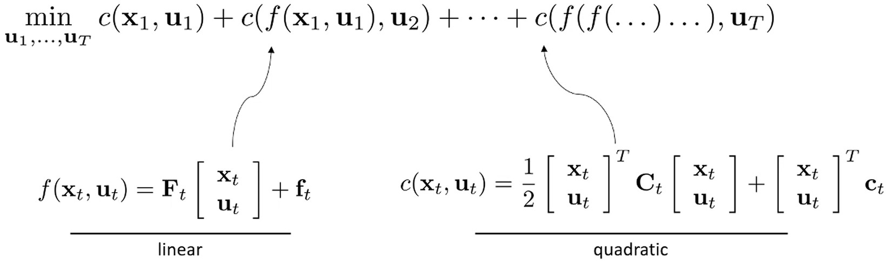

LQR은 고전적인 shooting 방법 중 하나로 Hessian을 활용한다.
먼저 dynamics constraint $f$가 선형인 문제를 살펴본 뒤, 비선형 경우를 살펴보자.
선형 함수로 $f$를 나타낼 때 $x_t, u_t$ vector에 대한 행렬 곱으로 나타낼 수 있다.
이 경우, dterministic dynamics인데 Gaussian을 도입하여 LQR을 stochastic case로 확장할 수 있다.

Dynamics는 선형이지만, cost $c$는 2차함수여야 한다.
Cost가 선형이면 $u_t$는 무한대로 가기 때문에 유용하지 않다.
1차 함수 $f$와 2차 함수 $c$로 trajectory를 regulate하기 때문에 Linear Quadratic Regulator라고 부른다.
* Time step $t$마다 다른 행렬 $F_t$와 $C_t$, 선형 항 $f_t, c_t$를 사용할 수있다.
* Model-based이기 때문에 $F_t, C_t, f_t, c_t$은 안다고 가정한다.

  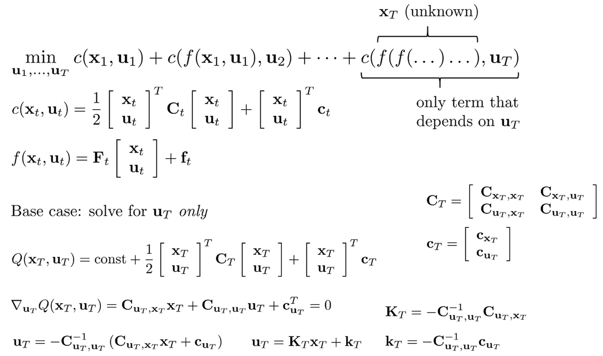

가장 기본적으로 $u_T$를 푼다고 생각해보자.
Objective function에서 유일하게 마지막 cost 항만 $u_T$에 영향을 받는다.
$x_T$를 모르지만, LQR 시스템에서 최적 $u_T$를 $x_T$에 의존하는 함수$(K_Tx_T + k_T)$로 표현 가능하다.

  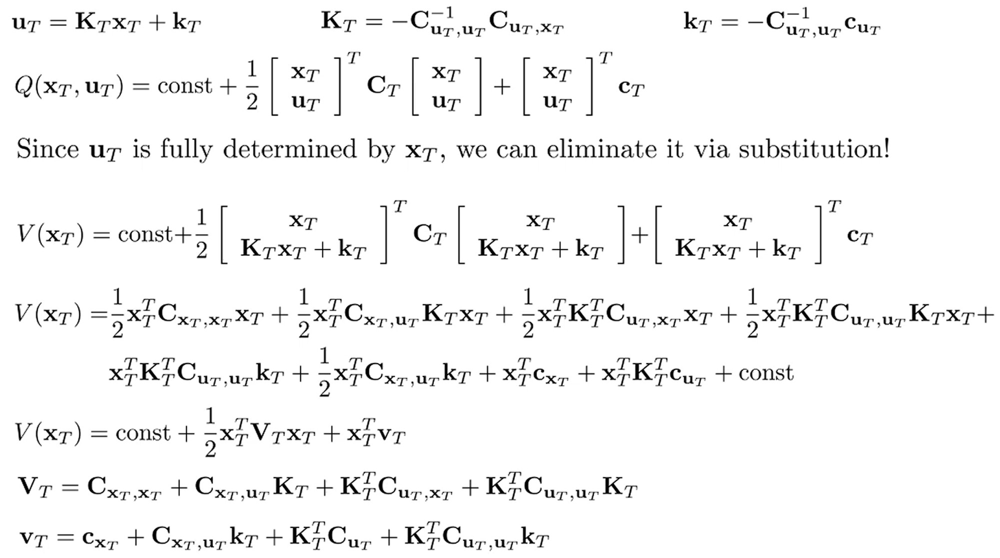

최적의 $u_T$ 값을 얻으려면 $x_T$가 무엇인지 알아야 한다.
* $Q(x_T, u_T) = Q(x_T, K_Tx_T + k_T) = V(x_T)$
* $u_T$를 $K_Tx_T + k_T$로 치환해 $V(x_T)$를 얻는다.
* $V(x_T)$는 $x_T$에서 시작해 최적 action을 따를 때 얻게도리 총 cost이다.
* 식이 복잡해 보이지만, $x_T$에 대한 2차항과 선형 항을 $V_T$와 $v_T$로 나타내면 결국 이전에 본 행렬과 벡터의 곱셈이다.

  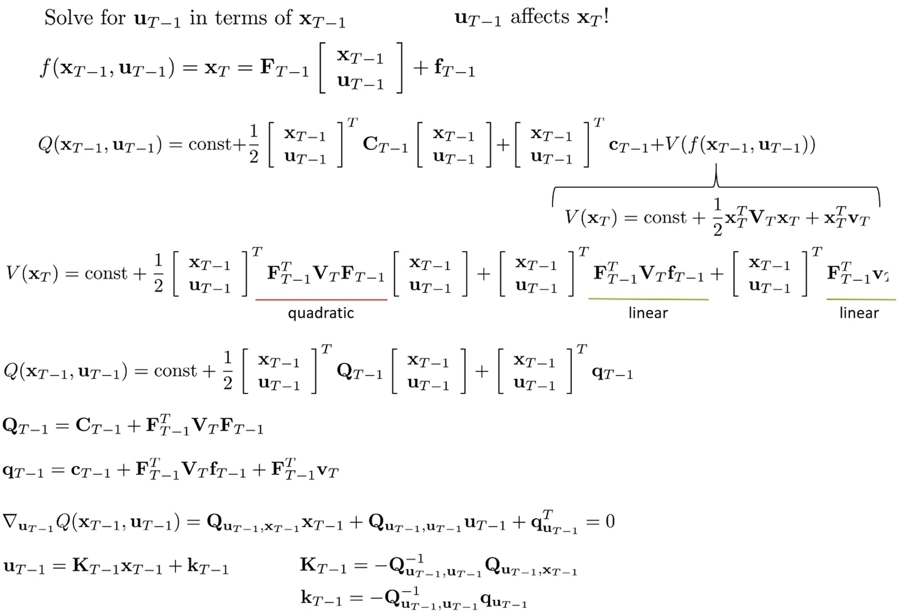

이제 이전 time step $T-1$에 대해 살펴보자.
* $u_{T-1}$은 $x_T$에 영향을 끼친다. 결과적으로 $u_T$는 $x_T$에 의존하므로 $u_T$도 $u_{T-1}$에 의존하지만, 계산에서 $u_T$는 $x_T$에 관한 식으로 치환되었다.
  * $x_T = F_{T-1} [x_{T-1}; u_{T-1}] + f_{T-1}$
* Time step $T-1$에서의 Q value는 $T-1$에서의 2차 cost에, 이후 time step에서 평가된 value $V(x_T)$를 더한 것이다.
* 식이 복잡하지만, 결국 $x_{T-1}, u_{T-1}$에 대한 2차 함수로 Q value가 표현되고 최적 $u_{T-1}$은 $x_{T-1}$에 의존하는 함수로 나타낼 수 있다.
* 주목할 점은 다음 time step $T$의 cost와 value function이 결합하여 유도한 matrix와 vector를 가지고 있다는 것이다.

  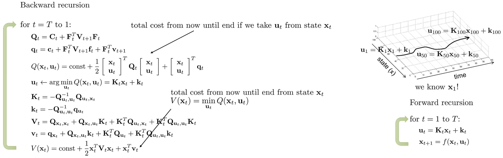

이것을 일종의 재귀적 알고리즘으로 표현할 수 있다.
* 맨 마지막 time step에서 시작하여 time step $T$부터 time step $1$까지 거꾸로 가면서 Q 행렬과 q 벡터를 계산하는데, 마지막 time step $T$에서는 $V_{T+1}$과 $v_{T+1}$이 없기 때문에 V들이 단지 0이다.
* $u_1$까지 갔을 때 좋은 점은 실제로 $x_1$을 안다는 것이다. 이를 통해 $u_T$까지 재귀적으로 값을 구할 수 있다.
* 그러면 이 선형 2차 시스템에서 최적 trajectory를 설명하는 x와 u의 시퀀스에 대한 수치 값을 얻게 된다.

MCTS는 $F, C, f, c$가 black box여도 관찰된 샘플링 기반으로 action을 선택하지만, LQR은 정확히 안다는 가정 하에 미분으로 정확한 action을 선택한다.
그리고 dynamics가 $x_t, u_t$에 선형 함수이고, cost가 $x_t, u_t$의 2차함수라는 선형 2차 가정을 설정했다.

# 6. LQR (Linear Quadratic Regulator ) for Stochastic

  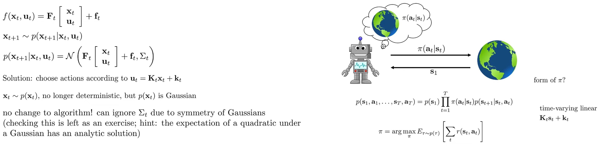

이전에 다뤘던 deterministic linear system에서의 LQR을 stochastic과 nonlinear system으로 확장하자.
Stochastic LQR에서는 dynamics에 Gaussian noise가 추가된다.
* Stochastic dynamics가 평균이 deterministic linear system에서 주어진 $F_t[x_t;u_t] + f_t$이고 공분산이 상수 $\sum_t$인 multivariate normal distribution일 때, deterministic linear system에서 유도한 control 법칙($u_T=K_Tx_T + k_T$ 등)이 여전히 최적인 것이 밝혀졌다.
  * Backward recursion은 $x_t, u_t$와 상관없이 오로지 $F_t, f_t, C_t, c_t$를 바탕으로 $K_t, k_t$를 구하는 것이고 forward는 $x_t$에 최적인 $u_t$를 구하는 것이다.
* 즉, deterministic linear system에 multivariate normal distribution 노이즈가 추가됐어도, 이전에 구한 최적화 식을 그대로 사용해도 된다는 뜻이다.
* 유도는 따로 하지 않지만, 직관적으로 Gaussian 분포 (normal 분포)가 대칭적이어서 quadratic cost에서 노이즈의 기댓값이 0이 되기 때문에 최적화 식이 변하지 않는다.
    * $\mathbb{E}[(\mu + \epsilon)^2] = \mu^2 + 2μ\mathbb{E}[\epsilon] + \mathbb{E}[\epsilon^2] = \mu^2 + \sigma^2$ 
    * $\partial\mathbb{E}[(\mu + \epsilon)^2]/\partial\mu =  ∂(\mu^2 + \sigma^2)/∂\mu = ∂(\mu^2)/∂\mu$

Stochastic LQR은 $u_t$에 따라 변하는 $x_{t+1}$을 관찰해야 하기 때문에 closed-loop policy가 된다.
즉, LQR은 open-loop plans뿐만 아니라 closed-loop plans도 생성한다.
LQR을 적용 후 얻게 된 $\pi$는 time-varing linear controller이다.
* $K_t, k_t$가 $t$에 따라 변하고 $x_t$가 $u_t$에 관한 linear combination이다.

# 7. LQR (Linear Quadratic Regulator ) for Nonlinear Systems

이제 비선형 (nonlinear)에서의 LQR을 살표보자.
이는 때때로 DDP (Differential Dynamic Programming), iLQR (iterative LQR)으로 불리고, linear Gaussian 설정이 있는 경우 iLPG라고 불린다.

  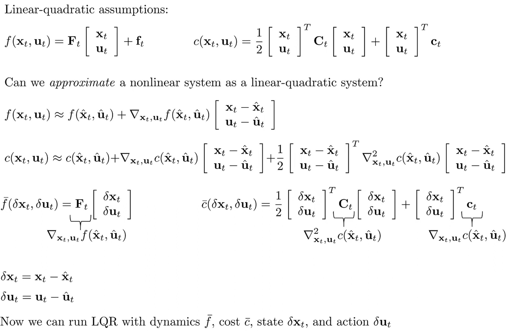

비선형 시스템을 이전에 살펴본 선형 2차 시스템으로 국소적으로 근사하는 방법은 Taylor expansion을 사용하는 것이다. 
비선형 시스템에서 특정한 point 근방에서 근사하는 1차 함수 또는 2차 함수를 얻고 싶다면, 1차 및 2차 도함수를 계산한 다음 Taylor expansion을 활용하면 된다.

LQR의 방법론은 $x_t, u_t$를 모르더라도, backward recursion을 통해 time step 별로 cost 함수를 최적화하는 $K_t, k_t$를 찾는 것이다.
* 현재까지 찾은 최적의 state와 action을 $\hat{x}_t$, $\hat{u}_t$라고 하자.
* 그럼 해당 point에서 $x_t, u_t$에 따른 $f(x_t, u_t), c(x_t,u_t)$의 근사값을 구할 수 있고, cost 근사 함수를 최적화하는 $K_t, k_t$ 또한 구할 수 있다.
* 이를 바탕으로 초기 $x_1, u_1$를 기반으로 forward recursion에서 계산한 $\delta x_t \delta u_t$에서 $\hat{x}_t, \hat{u}_t$를 더해 최적의 $x_t, u_t$를 구한다.
* 그리고 구한 최적의 $x_t, u_t$를 새로운 $\hat{x}_t, \hat{u}_t$로 업데이트 한다.
* 이것이 수렴할 때 까지 반복한다.

  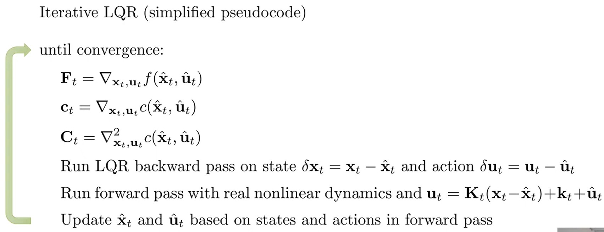

* $\hat{x}_t$, $\hat{u}_t$은 랜덤으로 초기화된다.

  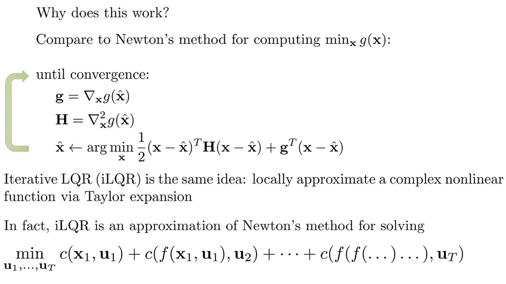

Iterative LQR이 작동하는 이유는 Newton's method와 유사하다. 
Newton's method는 어떤 함수 g(x)를 최소화 하기 위해 $\hat{x}$에서 gradient와 Hessian을 계산한 다음, $\hat{x}$을 해당 gradient와 Hessian으로 형성된 함수의 2차 근사(quadratic approximation)의 최적해로 설정한다.
* Newton's method는 gradient에서 learning rate를 $\frac{1}{f^{\prime\prime}(x)}$로 설정한다.
* Hessian이 크다 = 함수의 곡률이 급격하다 = 조금만 움직여도 함수값이 크게 변한다 → 조심스럽게 작은 step으로 이동 (learning rate ↓)
* Hessian이 작다 = 함수의 곡률이 완만하다 = 많이 움직여도 함수값이 조금만 변한다 → 과감하게 큰 step으로 이동 (learning rate ↑)

  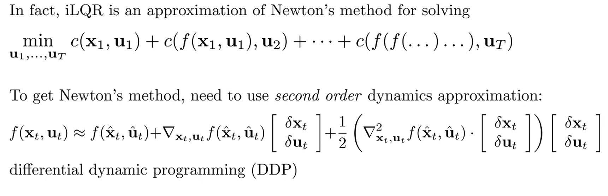

iLQR과 Newton's method의 차이점은 dynamics는 second derivative를 고려하지 않는다는 것이다.
2차 dynamics를 고려하는 LQR 버전이 바로 DDP (Differential Dynamic Programming)이다.
* 2차 dynamics 근사를 사용할 때 텐서 곱(tensor product)이 필요하다는 단점이 있다.

실제로는 dynamics를 선형화하는 것만으로도 꽤 좋은 성능을 보인다.

  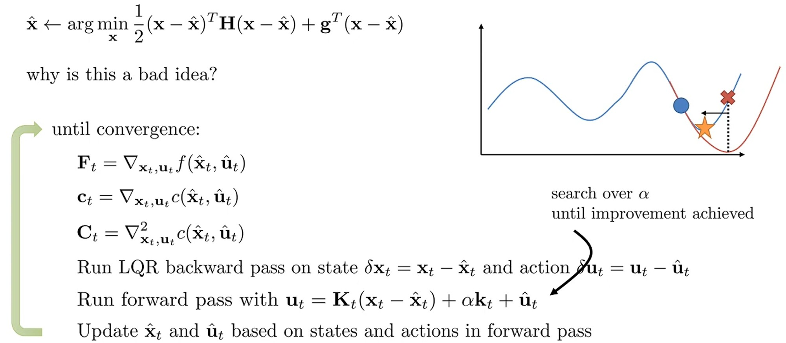

Newton's method와의 연결을 통해 iterative LQR 조금 더 개선해 보자.
* 실제 성능에 매우 중요하다.

일반적인 Newton's method로 내부 루프에서 최적화를 수행하는 것은 좋지 못한 선택이다.
그림을 보면 Newton's method의 결과 이전보다 결과가 안 좋아진 걸 확인할 수 있다.
* Newton's method는 2차 근사에 의존하기 때문에, 현재 위치에서 멀리 떨어진 곳에서는 실제 함수와 2차 근사가 크게 다를 수 있다.

이를 해결하는 방법 중 하나는 backtracking을 수행해 시작점에 가까운 지점을 찾는 것이다.
가까운 지점은 2차 근사에서 신뢰할 수 있는 구역으로, 이러한 trustworthiness (신뢰성) 개념은 trust regions와 매우 관련 있다.

iLQR에서는 forward pass에서 backtracking을 수행할 수 있다.
* 계산한 해가 이전보다 더 나은지 확인하고, 더 나아지지 않았다면 이전 위치에 더 가까이 이동한다.
* 상수항인 $k_t$에 0과 1 사이의 상수 $\alpha$를 곱해 시작점에서 얼마나 벗어날 지를 제어한다.
* $\alpha$를 줄이면 이전에 가졌던 action sequence에 점점 더 가까워지게 된다.
    * $\alpha$를 0으로 설정하면 첫 번째 time step에서 $x_1$은 항상 같으므로 $x_1 - \hat{x}_1 = 0$이 되어 $u_t = \hat{u}_t$가 된다.
    * 이를 반복하면 $\hat{x}_t, \hat{u}_t$는 변화 없이 그대로 유지된다.
* 개선을 얻을 때까지 $\alpha$를 탐색한다.
  * 매우 간단한 방법은 새로운 cost가 이전 cost보다 낮아질 때까지 $\alpha$를 줄인다.
  * 또 다른 방법은 2차 근사로부터 예상되는 cost 개선량을 계산하고, 실제로 그 예상 개선량의 일정 비율을 얻을 때까지 $\alpha$를 줄이는 것이다.
  * Bracketing line search를 같은 것이 좋은 선택이 될 수 있다.

추가로 읽은 만한 paper는 lecture 10, part 5 강의를 참고하자.

