# 1. Learning the Model

이전 강의에서는 dynamics $f(s_t, a_t) = s_{t+1}$이 주어진 상황에서, LQR 등의 tool을 이용해 planning을 수행했다.
Stochastic인 경우 $p(s_{t+1}|s_t,a_t)$에도 deterministic과 유사한 방법이 적용되었다.

이번 강의에서는 dynamics $f(s_t, a_t) = s_{t+1}$를 학습하고, lecture 10에서 배웠던 tool을 이용해 planning(optimal control)을 하는 방법을 알아볼 것이다.
Stochatsic인 경우(dynamics의 확률 모델을 추정)도 유사한 방법을 사용할 수 있는데, 구분이 필요할 때는 명시를 할 것이다.

직관적으로 생각할 수 있는 가장 간단한 버전(model-based RL version 0.5라고 부르자)은 아래와 같다.
1. run base policy $\pi_0(a_t|s_t)$ (e.g. random policy) to collect $\mathcal{D} = \{(s, a, s^\prime)\}$
2. learn dynamics model $f(s,a)$ to minimize with supervised learning $\sum_i||f(s_i, a_i) - s_i^\prime||^2$
    * 일반적으로 state가 discrete이면 cross-entorpy loss를 사용할 것이고, continuous이면 squared error loss (Gaussian일 때 negative log likelihood)를 사용할 것이다.
3. plan through $f(s,a)$ to choose actions

해당 방법은 classical robotics에서 system identification이 작동하는 본질적인 원리이다.
Robotics에서 System ideitification이란, 수집된 데이터로 dynamics model의 unknown parameter를 식별하는 문제이다.
식별되는 parameter는 DNN의 weight가 아니라, 알려진 physics model의 unknown parameter를 뜻한다.
이러한 접근법은 물리학 지식을 사용해 dynamics representation을 설계할 수 있으면 상대적으로 적당한(적은) 수의 parameter만 fitting하면 되기 때문에 효과적이다.
* 예를 들어 로봇의 운동 방정식은 알고 있지만 질량이나 다양한 부품의 마찰 계수를 모를 때 이를 활용한다.
운동 방정식이란 입력(힘/토크)가 주어지면 로봇의 다음 상태(위치, 속도 등)을 구할 수 있는 방정식을 의미한다.

주의해야 할 점은 좋은 base policy를 설계해야 한다는 것이다.
좋은 policy란 시스템의 다양한 상태를 탐색해 어떻게 반응하는지 데이터를 수집하는 것을 의미한다.
만약 방문하지 않은 큰 영역이 있다면, 그 영역을 고려하지 못하는(모델링하지 못하는) 잘못된 parameter를 사용할 수 있기 때문이다.

# 2. Distirubiton Shift

  

하지만, DNN과 같이 high-capacity model에서는 잘 작동하지 않는다.
* 산 정상에 도달하는 예시를 들어보자.
* 알고리즘에 따르면 무작위 보행($\pi_0$)를 통해 데이터를 수집했을 때, 오른쪽으로 가면 높이 올라간다고 추론하는 것은 합리적이다.
* 하지만, 계속 오른쪽으로 가면 낭떠러지로 가기 때문에 결코 좋지 않다.

Distirubtion shift 문제로 이러한 현상이 발생한다.
* Policy $\pi_0$로 유도된 state 분포를 $p_{\pi_0}(s_t)$라고 했을 때, 이 분포로 계획한 policy를 $\pi_f$라 하자.
* $\pi_f$는 데이터를 수집하면서 등장한 state, 즉 $p_{\pi_0}(s_t)$에서 높은 확률을 가지는 state에 대해서만 유효하다.
* 계획 과정에서 $\pi_f$에 따라 높은 reward (높이 올라가는 것)를 주는 action을 선택했을 때의 state 분포를 $p_{\pi_f}(s_t)$라 하자.
* 이때, $p_{\pi_f} \neq p_{\pi_0}$이기 때문에 경험하지 못하는 state가 나올 확률이 매우 크다.
* Planning할 때 보지 못한 state, 즉 $p_{\pi_0}(s_t)$에서 낮은 확률을 가지는 state이기 때문에 잘못된 action을 선택할 확률이 높다.
* 이것이 반복되면 결국 좋지 못한 state에 도달하게 된다.
* State $s_t$의 분포, 즉 dynamics model의 분포가 shift 되었기 때문에 planning한 것이 최적의 결과를 보여주지 않는 것이다.

이것은 이전에 imitation learning에서 살펴본 것과 유사한 문제이다.
* 전체 궤적 분포: $p(s_1, a_1, s_2, a_2, ...) = p(s_1)\pi(a_1|s_1)p(s_2|s_1,a_1)\pi(a_2|s_2)p(s_3|s_2,a_2)...$
  * Imitation learning: policy $\pi$가 달라져 분포 이동 발생
  * Model-based RL: dynamics $p(s_{t+1}|s_t,a_t)$가 달라져 분포 이동 발생

Distribution shift 문제는 expressive한 model class(DNN 등)을 사용할 때 더욱 두드러진다.
Expressive한 model은 수집된 데이터(학습 데이터) 영역에 더욱 과적합되기 때문이다.

  

Distribution shift 문제를 완화할 수 있는 방법 중 하나는 imitation learning에서 DAgger와 비슷하게 데이터를 추가로 수집하는 것이다.
DAgger는 전문가를 통해 정답 label(최적의 행동)을 수집해야 했지만, model-based RL은 특정 state에서 action을 한 결과만 관찰하면 된다.
데이터를 추가로 수집하는 procedure를 추가한 것은 일반적으로 작동하는 가장 간단한 model-based RL이기 때문에 model-based RL version 1.0이라 부르자.

Model-based RL version 1.0은 잘 동작하지만, 실수를 했을 때 그것을 깨닫는 시점이 느리다는 문제가 있다.
* 자율주행 자동차를 학습할 때, model이 핸들을 왼쪽으로 2도 정도 꺾으면 직진한다고 잘못 알고 있다고 가정하자.
* 복잡한 dynamics model system에서 크지 않는 실수처럼 보일 수 있으나 계속해서 왼쪽으로 가기 때문에 결국 사고가 날 것이다.

  

데이터를 지속적으로 수집하면서 전체 model이 업데이트되면서 점진적으로 문제가 해결될 수 있지만, 실수가 발생했을 때 즉시 re-planning함으로써 더 빨리 문제를 해결할 수 있다.
이를 model-based RL version 1.5라고 부를 것이다.
Paper에서는 MCP(Model Predictive Control)이라고 부른다.
* Dynamics model을 통해 planning한 것 중 첫 번째 action만 선택하고 다시 planning을 하기 때문에 computation cost가 늘어난다.
* 하지만, 이를 통해 훨씬 더 나쁜 model로도 훨씬 더 잘할 수 있다.

마지막으로 어떻게 re-plan을 하는지 살펴보자.
* 직관적으로 re-plan을 많이 할수록, 각 step에서의 planning이 부정확해도 된다는 것이다.
  * 각 step에서 planning이 부정확해도 re-plan에서 수정될 수 있기 때문에 실수에 관대하다.
* 이러한 특징 덕분에 version 1.5를 구현할 때 일반적으로 표준 open loop planning을 할 때보다 훨씬 더 짧은 horizon(더 적은 dataset)을 사용한다.
  * Random shooting은 긴 open loop planning에서는 잘 작동하지 않을 수 있지만, version 1.5에서는 random sampling이 잘 작동할 수 있다.

# 3. Uncertainty in Model-Based RL

이전에 살펴본 알고리즘(version 1.0/1.5)에는 문제가 존재한다. 그렇기 때문에 uncertainty가 model-based RL에서 중요한 역할을 한다.

  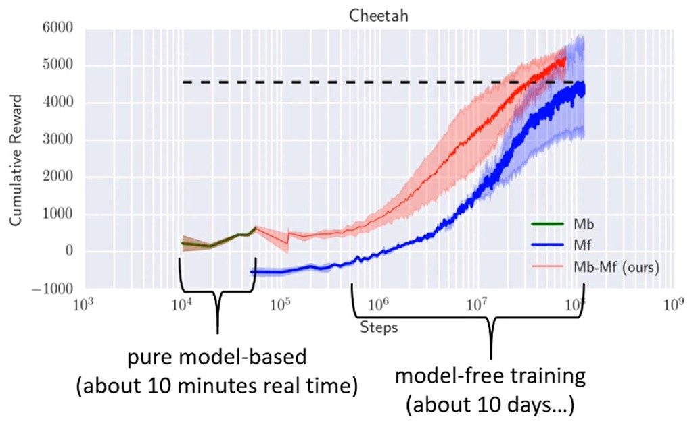

위의 예시에서는 치타 시뮬레이션을 학습한 것이다.
* 곡선의 초반 주황색 부분은 model-based RL version 1.5에서 DNN model을 사용해 학습한 결과이다.
* 그리고 초기에 학습된 model-based RL로 model-free RL을 bootstrapping해서 더 오래 실행시켰고, 후반의 빨간 곡선이 그 학습한 결과이다.
  * Bootstrapping한다는 것은 model-based RL로 수집된 데이터와 policy를 초기값으로 활용한다는 뜻이다.

결과를 살펴보면 model-free learning이 훨씬 더 좋은 최종 성능에 도달한다.
이는 반복적으로 데이터를 수집하여 RL 문제의 특성과 overfitting에 더 취약한 model-based RL의 특징 때문이다.
* Model-based와 model-free 방법론은 적은 데이터에서 시작해 점점 많은 데이터를 수집한다.
* 그래서 적은 데이터에 과적합되지 않아야 하지만, 추후에 많은 데이터를 표현할 수 있는 capacity를 가진 DNN 모델이 필요하다. 이게 쉽지 않다.
* 후반을 고려해 큰 capacity를 가진 DNN을 사용하면, 초반에 overfitting될 가능성이 높다.
* Model-free인 경우 Q 함수를 학습하며 지금 당장은 좋아 보이는 state $s_t$에 도달하여도 끝이 좋지 않다면, 결국 실제 environment와 상호작용을 하며 전달된 reward가 전파되어 state $s_t$의 가치를 떨어뜨릴 것이기 때문에 policy가 개선된 것이다.
  * 따라서 초반에 Q 함수 model이 부정확해도 데이터가 수집될수록 정확해지기 때문에 성능이 나아지게 된다.

  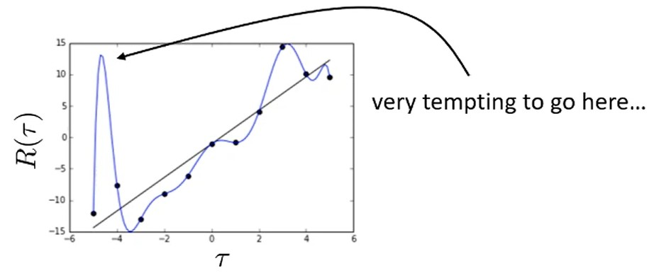

하지만, dynamics model을 학습하는 model-based 방법론의 경우, 지금 당장 좋아 보이는 state로 갔을 때 그곳을 벗어나기 쉽지 않다.
  * Model-based RL version 1.5는 dynamics model을 학습하고 이 결과로 lecture 10에서 배웠던 planning을 수행하는 것이다.
  * 산 정상을 향하는 문제에서 해발 높이가 reward일 때, 절벽으로 가는 길이라도 그 과정이 정상으로 가는 것보다 reward가 좋으면 LQR은 학습 초기에 주로 절벽으로 향하는 action을 선택하게 될 것이다.
  * 그러면 절벽으로 향하는 $s, a, s^\prime$ transition이 과도하게 수집되어 data 분포가 편향된다.
  * 이로 인해, 다른 영역(산 정상으로 가는 경로)로 가는 action을 선택해도 $f(s, a)$가 overfitting 되어 있기 때문에 부정확하게 예측을 하게 된다.
  극단적으로 $s^\prime$이 절벽으로 향하는 지점이 될 수 있다.
  * 더불어, 절벽 근처에서 떨어지는 방향으로 action을 취해도 안전한 state로 간다고 잘못 예측하여 높은 reward를 줄 수 있는 문제가 발생한다.
  * 그러면 절벽으로 향하는 action을 선택하도록 planning하는 spurious peaks가 악용(exploit)되는 현상이 발생할 수 있다.
  * 즉, overfitting된 dynamics model이 절벽 근처를 어떤 action을 해도 안 떨어지는 '안전한 고지대'로 잘못 예측하면서, 실제로는 위험한 영역이 계속 탐색될 수 있다.

  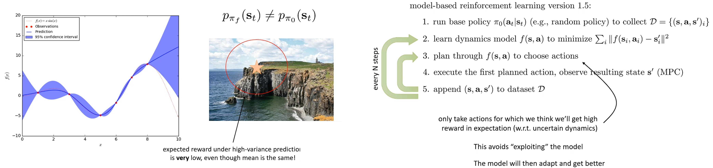

이를 완화하는 방법 중 하나는 uncertainty estimation이다.
State-atction pair에 대해 단일 next state $s^\prime$만 예측하는 것이 아니라, 도달 가능한 모든 next state에 대한 확률(분포)를 예측하는 것이다.
* DNN model이 예측 결과를 확신한다면 바다 절벽 가장자리에 도달하도록 planning을 하게 되지만, uncertainity를 고려하면 planning 시 reward의 expectation을 계산할 때 절벽 가장자리는 떨어질 확률이 높다는 것을 깨닫게 될 것이다.

Uncertainty estimation을 하면 특별한 constraints(절벽 가장자리를 가지 마라, 등)을 제시하지 않아도 자동으로 부정적인 영역을 피해 안전한 행동을 planning한다.
* Uncertainty를 고려하면 평균이 같더라도 절벽 가장자리에 접근할 때 높은 분산으로 reward expectation 값이 매우 낮아지게 된다.

Pseodu code에서 추가로 해야 할 것은 step 3에서 uncertain dynamics를 고려해 높은 reward expectation을 얻는 action을 planning하는 것이다.
* 이는 학습 초기에 데이터가 적어 uncertainty가 높을 때 훨씬 더 효과적이다.
* 초기에는 절벽이 어디에 있는지 모르기 때문에 거리를 두지만, 데이터를 수집하여 model이 개선되면 절벽 쪽으로 조금 더 가까이 갈 수 있을 것이다.

여기서 중요한 것은 탐색을 해야 한다는 것이다.
* 만약 조심스럽게 행동한다면, 주변에 큰 negative reward가 있는 높은 reward를 주는 영역 근처에 전혀 가지 않을 수 있다.
* 그렇기 때문에 uncertainty를 고려하는 과정이 탐색을 너무 많이 방해하면 안된다.
* 이는 추후에 더 자세히 다룰 것이다.

또한, expected value가 pessimistic(비관적) value, optimistic(낙관적) value와 같지 않은 것을 기억해야 한다.
* Pessimistic value란 최악의 상황을 가정하는 것으로 lower confidence bound를 설정할 수 있다.
  * 평균에 2 * 표준편차를 lower confidence bound으로 생각해 특정 state에서 얻을 수 있는 reward의 신뢰도를 99% 등으로 만들 수 있다.
  * 그 결과 절벽과 매우 멀리 떨어지게 될 것이다.
* Optimistic value를 고려하면 $f(s, a)$를 악용할 확률이 높아져 절벽과 가까워질 가능성이 높아진다.

Pessimistic value, optimistic value는 추후에 다룰 것이고 지금은 오직 expected value만 생각 하자.

# 4. Uncertainty-Aware Neural Net Models

이제 uncertainty를 고려해 DNN model을 어떻게 학습시킬 지 얘기해 보자.

  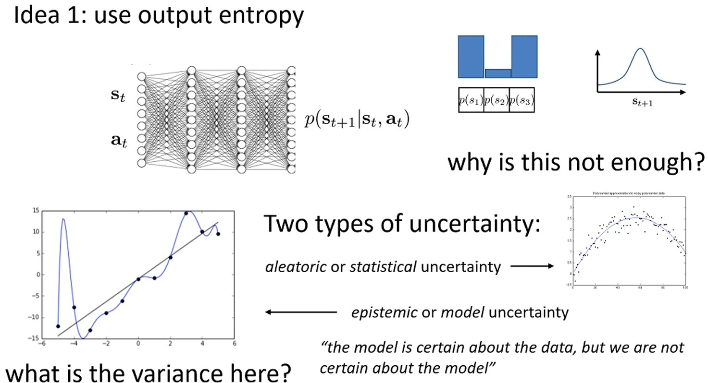

가장 간단하게는 model output 분포의 entropy를 사용하는 건데, 매우 안 좋은 방법이다.
* Model은 $p(s_{t+1}|s_t, a_t)$를 출력한다.
  * Discrete인 경우에는 softmax로 표현되고, continuous인 경우 평균과 분산을 구해 Gaussian 분포로 표현할 수 있다.
* 관심있는 것은 erroneous extrapolation에서 planning 할 때 오류를 악용하는 문제를 해결하는 것이다.
  * Extrapolation 수학에서 원래의 관찰 범위를 넘어서서 다른 변수와의 관계에 기초하여 변수의 값을 추정하는 과정을 의미한다.
  * 즉, erroneous extrapolation은 overfitting으로 인해 관찰하지 못한 영역을 잘못 예측하는 것을 뜻한다.
* 문제는 maximum likelihood로 학습한다면, 데이터 분포 밖 입력에 대한 uncertainty도 부정확하기 때문에 이전과 같은 이유로 sprious peak가 악용될 수 있다.
  * OOD state로 가도록 planning 되었을 때, OOD state에 대한 uncertainty에도 많은 오류가 있기 때문에 이전과 유사한 문제가 발행한다.
* Entropy 측정은 model의 uncertainty를 예측하는 것이 아니라 dynamics에 얼마나 noise가 많은지를 측정한다.
  * Uncertainty에는 2가지 종류가 있다: Aleatoric, Epistemic
  * Aleatoric은 statistical uncertainty라고 부르며, 정답 model 자체에 noise가 많은 경우이다.
    * 데이터를 많이 수집한다고 해서 반드시 감소하지 않는다.
    * 추정이 아닌 정답 model 자체에 noise가 많기 때문에 높은 entropy를 가질 수 있다.
    * 동전 던지기 경우 아무리 데이터를 많이 수집해도 확률이 반반이기 때문에 높은 entropy를 가지게 되고 결코 deterministic system으로 바꿀 수 없다.
  * Epistemic은 model uncertainty라고 부르며, model 자체의 noise가 아닌 올바른 model이 무엇인지 모르기 때문에 발생한다.
    * 충분한 데이터가 있으면 epistemic은 사라지지만, 제한된 데이터 체제에서는 정답 model을 모르기 때문에 uncertainty를 유지해야 한다.
    * MLE는 이것을 제공하지 못한다.

  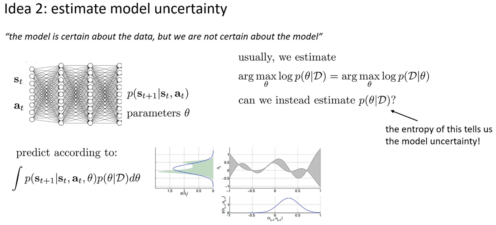

Model uncertainty는 data에 대해 확신을 가지지만 model에 대해 확신을 못 가지는 상황으로 이를 추정하는 방법은 여러 가지가 있다.
기본적으로 model uncertainty를 측정하려면 model을 분포로 표현할 수 있어야 한다.
* Model은 state $s_t$에 대한 분포를 출력하는데, 이 model은 parameter $\theta$를 가지고 있다. Model에 대해 확신하지 못한다는 것은 $\theta$에 대해 확신하지 못한다는 뜻이다.

일반적으로 MLE를 할 때, parameter $\theta$를 데이터셋 $D$에 대한 log 확률의 argmax로 추정한다.
* MLE를 할 때 데이터셋 $D$에 대한 log 확률의 arg max로 추정하는 것은 uniform prior를 가정하는 것이다.
* Prior $p(\theta)$가 uniform하면 $p(\theta|D) \propto p(D|\theta)$이기 때문에 $p(D|\theta)$의 최대값에 해당하는 $\theta$ 하나만 찾게 된다.

Log 확률의 argmax로 단일 $\theta$를 찾는 대신 $p(\theta|D)$로 전체 분포를 추정하면, 이것의 entropy가 model uncertainty가 될 것이다.
* Prior($p(\theta)$)가 uniform이 아닌 임의의 분포라고 가정하면, $p(\theta|D)=p(D|\theta) \times p(\theta) \div p(D)$로 전체 분포를 추정할 수 있다.

$p(\theta|D)$로 전체 분포를 추정한 후, $s_{t+1}$에 대한 posterior는 parameter $\theta$에 대한 평균으로 구할 수 있다.
  * $\int p(s_{t+1}|s_t, a_t, \theta)p(\theta|D)d\theta$

물론 크고 고차원의 parameter를 가지는 neural network에서는 이 연산을 정확히 수행하는 것은 어렵다.
따라서 다양한 근사 방법에 의존해야 하고, 이를 계속해서 살펴볼 것이다.

  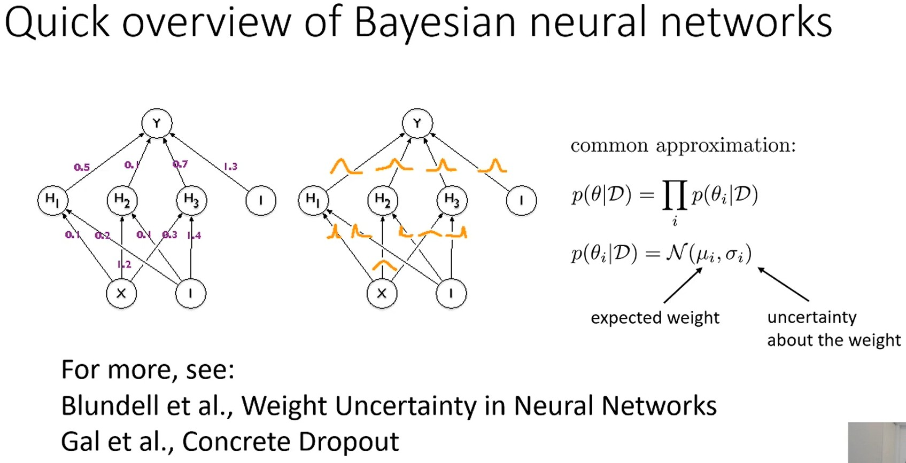

먼저 variational inference 메커니즘을 활용하는 Bayesian neural network를 간단하게 살펴보자.
자세한 것은 이후 lecture에서 다룰 것이다.

Bayeisn neural network에서는 모든 parameter $\theta$가 deterministic하지 않고 각자의 분포를 가진다.

일반적인 경우엔 모든 $\theta$의 결합 분포를 계산하고, 이 결합 분포에서 paramter를 샘플링하여 예측을 진행한다.
* $\theta$를 여러 번 샘플링하여 $y$의 posterior를 보다 정확하게 예측할 수 있다.
* $\theta$는 매우 고차원이이기 때문에 결합 분포를 근사하는 방법을 사용해야 한다.
  * 모든 parameter 분포가 서로 독립적이라고 가정하여 결합 분포를 $\theta_i$의 marginal 분포 $p(\theta_i|D)$ 곱으로 근사할 수 있다.
  * Parameter는 서로 dependent하기 때문에 근사값이 다소 부정확하지만, 계산이 간단하기 때문에 자주 사용된다.

보통 $p(\theta_i|D)$는 gaussian 분포라고 가정하고, 평균과 분산을 학습한다.
평균이 곧 model의 예상 값이고 분산이 model의 uncertainty이다.
이는 매우 간단한 방법으로 실무에서 사용할 수 있는 훨씬 더 간단하고 효과적인 방법들("Weight Uncertainty in Neural Networks", "Concrete Dropout" 등)이 많다.

# 5. Bootstrap ensembles in deep learning

Bayeisan neural network는 추후에 자세히 다루고, 지금은 경험상 성능을 높일 수 있는 방법인 bootstrap ensembles를 살펴보자. 

  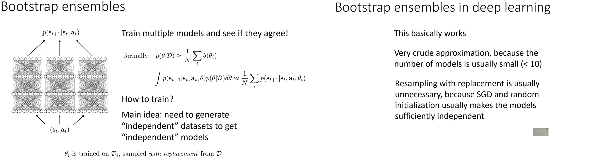

Bootstrap ensembles는 서로 다른 weight $\theta$를 가진 여러 models를 학습해 예측 값의 평균과 분산을 구하고 분산이 곧 uncertainty가 된다.
* 이는 수학적으로 posterior $p(\theta|D)$를 Dirac delta 분포들의 mixture로 추정한다고 해석할 수 있다.
  * 확률을 mixture한다는 것을 기억해야 한다.
  * Dirac delta를 보면 model outputs에 대한 평균과 분산을 구하여 또 다른 하나의 분포를 추정하는 것처럼 보일 수 있다.
  * 하지만, continuous space에서는 gaussian mixture로 다뤄야 하지, model outputs의 평균에 대한 하나의 gaussian을 구하는 것이 아니다.
  * Continuous space에서는 next state에 대한 Gaussian mixture 분포를 도출하고, 해당 분포에서 샘플링 해야 한다.
* 수집된 데이터 $D$에서 복원 추출로 데이터를 random 샘플링하여, 서로 독립적이고 $D$와 같은 크기를 가지는 dataset N개 ($D_1, \cdots, D_N$)을 생성한다.
* 비슷한 분포를 가지지만 조금씩 다른 dataset N개에 대해 models를 각각 학습한다.
* 학습 후 N개의 models의 출력의 평균과 분산을 계산한다.
  * 수집된 dataset에 있는 sample의 경우 N개의 model이 비슷하게 예측할 것이고 uncertaitny도 낮을 것이다.
  * 반면, ODD sample의 경우 N개 model의 예측값들이 매우 다를 것이고 그에 따라 uncertainty도 높게 추정된다.

Bayesian neural network 뿐만 아니라 deep learning에서도 ensemble이 작동한다.
하지만, DNN은 학습 시키는 cost 때문에 일반적으로 10개 미만의 model만 학습할 수 있다.
따라서 posterior에 대한 근사값도 상대적으로 부정확하다.
하지만, stochastic gradient descent와 weight가 random initialization되기 때문에 모두 같은 dataset으로 학습해도 다른 결과가 나온다는 편리함이 있다.

# 6. Planning with Uncertainty

Bootstrap ensemble으로 uncertainty aware model을 학습시키고, model-based RL version 1.5에서 planning하는 데 어떻게 사용하는지 살펴보자.

  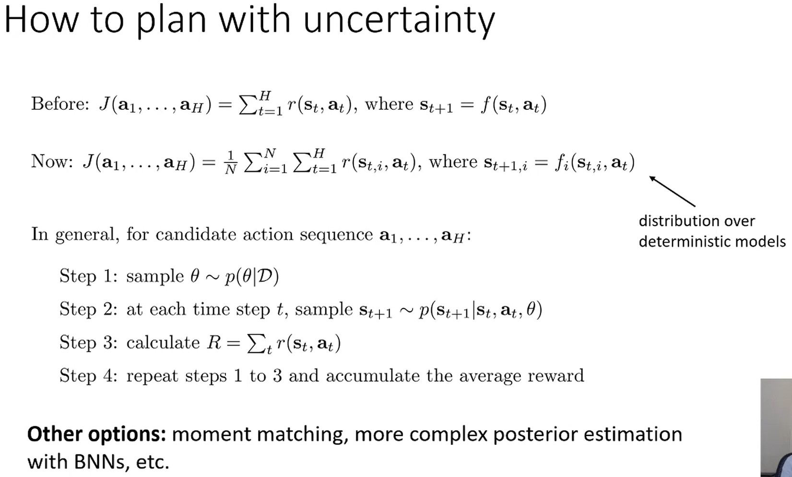

Verison 1.5의 objective는 random shooting, CEM 등을 활용해 reward/cost의 합을 최대/최소화 되도록 optimize하는 것이었다.

Bayesian 또는 ensemble을 활용한다면, N개 model의 평균 reward를 최대화하는 것으로 objective를 업데이트한다.
* Planning으로 도출된 action sequence가 있을 때, $p(\theta|D)$에 따라 model 한 개를 샘플링하고 action sequence를 수행했을 때 얻게되는 reward의 총합을 계산한다.
  * Bayesian인 경우 매번 전체 weight를 sampling하지만, bootstrap ensemble의 경우 미리 학습된 N개의 model 중 하나를 선택한다.
* 이를 K번 반복하면 평균 reward를 계산할 수 있다.
  * 수학적으로, mixture distribution의 기댓값을 reward로 사용한다고 볼 수 있다.
  * Mixture distribution에서 N번 샘플링 후 평균을 낸 것(Monte Calro)으로 reward의 기대값을 추정하는 것이다.
  * Continuous space에서도 이와 똑같이 수행되는데, 각 time step마다 state를 주로 gaussian 분포에서 샘플링한다.
* 이것이 유일한 방법은 아니다.
Moment matching 근사와 같은 것을 수행하면 실제 state 분포의 추정치를 파악할 수 있다.

Reward를 평가한 뒤, random shooting이나 CEM과 같은 최적화 방법을 사용해 action sequence를 최적화 한다.
LQR과 같은 continuous optimization 방법도 적용 가능 하다.

  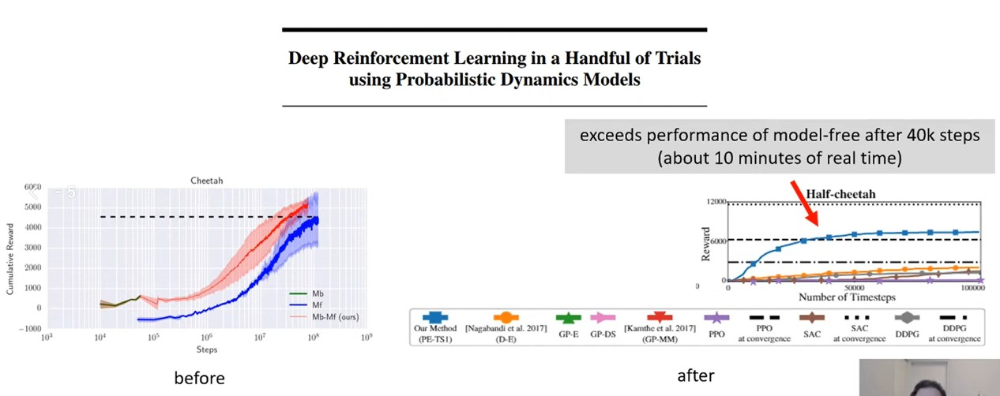

실제로 논문을 살펴보면 bootstrap ensemble로 epistemic uncertainty를 추정하여 다른 model-based RL version 1.5 대비 같은 시간동안 학습했을 때 얻을 수 있는 reward를 500에서 6000으로 향상시켰다.
* 특히 데이터가 적은 상황에서 효과적이다.

  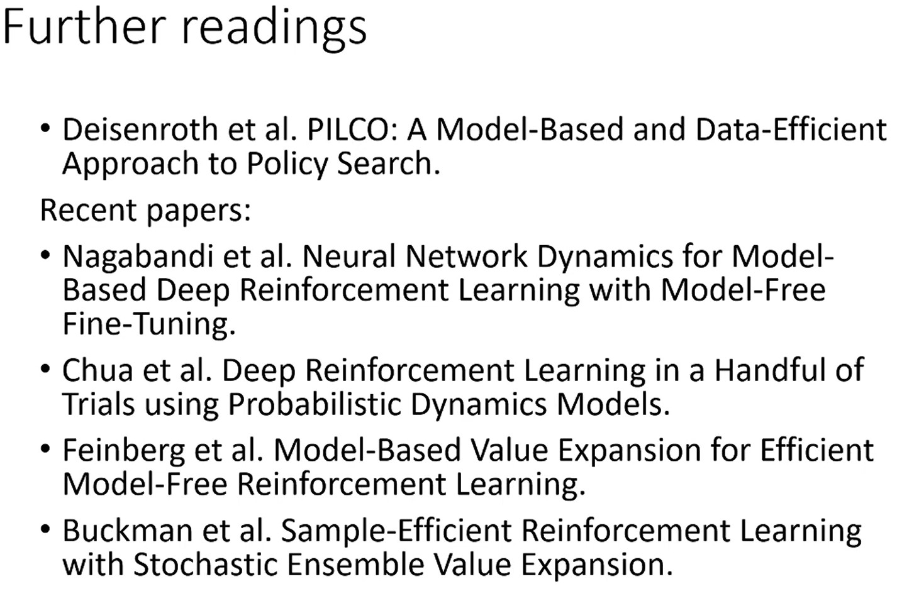

# 7. Model-Based RL with Images

  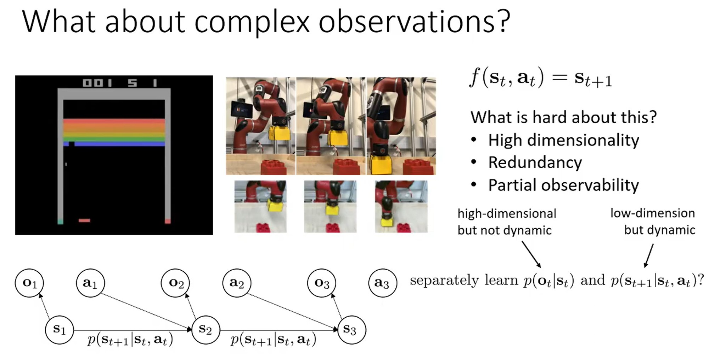

Atari 게임 등에서 image를 활용해 model-based RL을 수행할 때 몇 가지 challenge가 발생한다.
* High dimensionality
* Redundancy: Atari 게임의 경우 이전 state와 pixel 값이 거의 같다.
* Partial observability: Atari 게임의 경우 한 frame을 state로 고려한다면 공의 방향과 속도는 전혀 관측하지 못한다.

따라서 image를 다룰 땐 주로 POMDP(Partially Observable Markov Decision Process) model을 사용한다.
* POMDP는 2개의 분포 $p(s_{t+1}|s_t, a_t), p(o_t|s_t)$를 가진다.
* $p(s_{t+1}|s_t, a_t), p(o_t|s_t)$를 별도로 학습 하여 역할을 분리할 수 있다.
  * $p(o_t|s_t)$는 고차원을 다루지만 시간적 dynamics의 복장성을 알 필요가 없고 $p(s_{t+1}|s_t, a_t)$는 dynamics를 알아야 하지만 고차원을 다룰 필요가 없다.
  * Atari 게임의 경우 observation은 image dimension을 다뤄야 하지만, state (공의 위치, 속도, 벽돌 위치 등)은 저차원이라도 충분하다.

Image에서 직접 시간적 dynamics를 학습하는 것($p(o_{t+1}|o_t, a_t)$)도 나쁘지 않을 수 있다.
하지만 먼저 state를 다루는 state-space(latent space) model에 대해 살펴보자.

  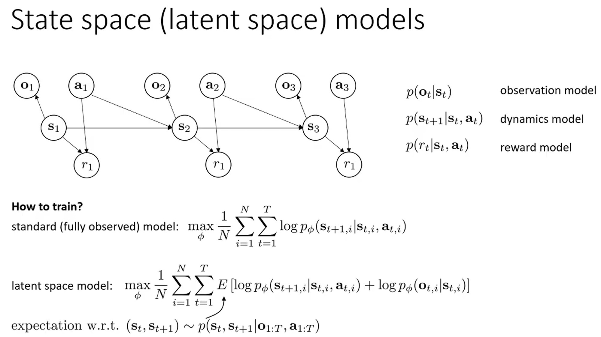

Fully observeation에서는 표준적으로 MLE를 최대화 하도록 학습한다.
기본적으로 state-space model에서는 state가 image로 매핑되는 것을 표현하는 observation model $p(o_t|s_t)$도 학습해야 하고, 필요하다면 reward도 state에 의존하기 때문에 reward node도 학습해야 한다.

문제는 일반적으로 image를 사용한 RL에서는 observation과 action은 알지만 state는 모른다는 것이다.
그렇기 때문에 알려지지 않는 state의 분포에 대한 expected log likelihood objective를 최대화하는 방향으로 가야한다.
* Image(observation)가 주어졌을 때, state의 posterior 분포를 계산할 수 있는 알고리즘이 필요하고 approximate posterior에서 샘플링된 state로 expected log likelihood를 추정한다.
* Time step마다 $o_{1:T}, a_{1:T}$가 주어졌을 때 $p(s_t, s_{t+1})$의 expectation을 구한다.
  * 모든 sequence가 필요한 이유는 partial obervation 때문이다.
  * Atari 게임의 경우 image 한 장으로 공의 속도를 모르기 때문에 과거 observation이 필요하다.
  * 반면, 체스 같은 경우 현재 보드 state만 관찰해도 모든 정보를 알 수 있다.

  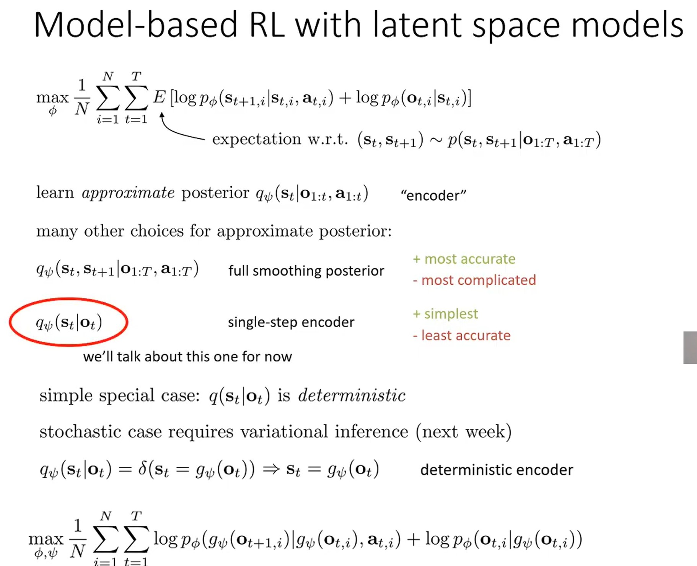

Approximate posterior를 알 수 있는 방법 중 하나는, observation과 action이 주어졌을 때 $s_t$의 분포를 제공하는 neural network $q_\psi$를 학습하는 것이다.
Approximate posterior를 encoder라고 부르고, 다양한 종류의 posterior를 선택할 수 있는데, 그 선택의 결과가 성능에 영향을 미친다.
* Full smoothing posterior는 $o_{1:T}, a_{1:T}$가 주어졌을 때 $q_\psi(s_t, s_{t+1})$를 샘플링하는 neural network를 학습하는 것이다.
  * State에 대한 uncertainty를 가장 정확하게 알 수 있지만, 학습하기도 그만큼 어렵다.
* 극단적으로 현재 observation $o_t$가 주어졌을 때 현재 state $s_t$를 추측하는 간단한 posterior인 single step encoder를 생각할 수 있다.
  * 만약 partial observability 효과가 최소한이라면, 즉 observability로부터 파악할 수 있는 state의 정보가 가장 적다면, single step encoder는 가장 정확하지 않은 posterior를 제공할 것이다.
* 상황에 따라 적절한 학습 방법을 선택해야 한다.
  * 체스의 경우 single step encoder로도 충분하지만, atari 게임에서는 k만큼의 과거 observation과 action $o_{t-k:t}, a_{t-k:t}$가 필요하다.

이러한 encoder를 학습하는데 variational inference가 필요한데 이는 다음 강의 lecture 12에서 살펴 볼 것이다.
대신 지금은 single step encoder이고 거의 fully observable라서 deterministic encoder인  가장 간단한 상황을 고려해볼 것이다.
* Fully observable이기 때문에 현재 $o_t$로 단일 $s_t$만 출력하고, 이는 deterministic encoding $g_psi(o_t)$에 기반한 delta function으로 볼 수 있다.
다음 lecture에서 논의할 stochastic case는 variational inference가 필요하다.
* Deterministic encoder를 사용하면, expectation을 제거해 단순히 $g_\psi(o_t)$를 대입할 수 있다.
* 그러면 objective는 $\phi, \psi$에 대해 N개의 trajectory의 reward 함을 최대화하는 것으로 바뀐다.
  * 첫 번째 항은 encode된 state들이 학습된 dynamics를 따라야 한다는 것을 강제한다.
    * 학습된 dynamics는 $p(s_{t+1}|a_t)$로, 첫 번째 항을 통해 dynamics에 맞춰 $o_{t+1}$을 예측하도록 훈련된다는 것이다.
  * 두 번째 항은 $o_t$를 encode하면 다시 $o_t$ 를 reconstruct하는, 일종의 auto encoder로 볼 수 있다.

  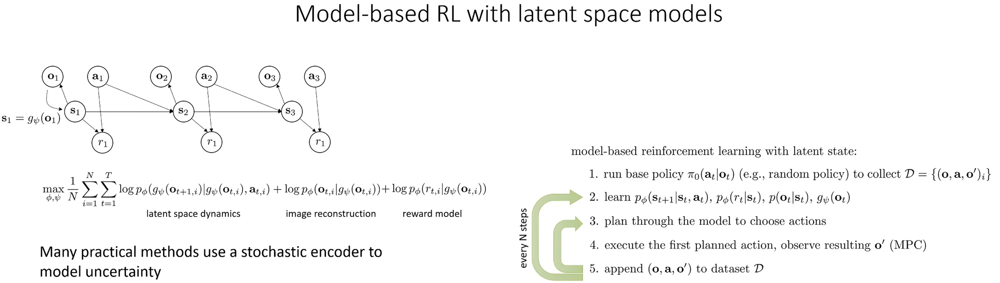

Reward model이 있다면, 세번 째 항의로 $\log p(r_t|g_\psi(o_t))$가 추가될 것이다.
그러면 latent space dynamics, image reconstruction, latent space reward model을 갖게 된다.
$s_t = g_\psi(o_t)$를 $o$에서 $s$로 매핑하는 추가 가상 edge로 생각할 수 있다.
실제 model-based RL 알고리즘에서는 이전에 살펴본 model-based RL version 1.5 알고리즘에 직접 대입할 수 있다.

다양한 examples는 lecture 11 part 5 후반부를 살펴보자.