# 1. Open-loop Case

  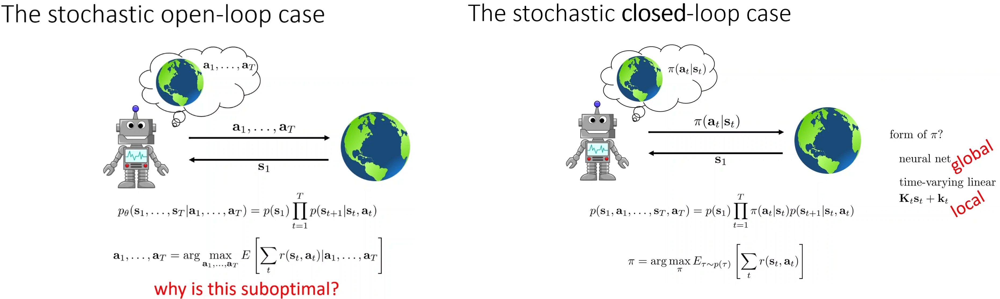

이전 강의에서 planning 후 하나의 transition만 관찰한 후 다시 planning을 진행(MPC)하는 model-based reinforcement learning version 1.5를 살펴보았다.
이 방법은 optimal control planning 또는 direct optimization 등 다양한 planning 방법을 사용할 수 있지만, 대부분 open loop plan이라는 단점이 있다.

Open loop plan은 관측되지 않은 state를 미리 예상하여 모든 action을 계획하기 때문에 suboptimal이라는 문제가 있다.
* 예를 들어, 2개의 숫자를 더하는 수학 문제가 있고, RL은 이를 2단계로 나눠서 planning한다고 가정하자.
  1. 문제를 풀지 안 풀지 결정한다.
    * 문제 풀 때 맞추면 1000 달러를 얻고, 못 맞추면 2000 달러를 잃는다.
    * 문제를 안 풀면 아무 것도 없다.
  2. 2개의 숫자 더한다.
* Open loop plan은 문제를 푼다고 가정했을 때, 문제를 보지도 않고 답을 제공해야 한다.
* 문제 관찰 없이 random으로 답을 제공해 답을 맞출 확률은 매우 낮기 때문에 optimal planner는 문제를 풀지 않는 결정을 내릴 것이다.

MPC 방법도 이를 해결하지 못한다.
MPC는 매 time step마다 replan을 하지만, 각 planning 시점에서는 open-loop이기 때문에 "나중에 다시 plan할 수 있다"는 사실을 고려하지 못한다.
* 수학 문제 푸는 예시로 확장하면, MPC는 문제를 푼다는 state로 갔을 때 답을 맞출 것이다.
하지만, 첫 step에서 문제를 보지 못한 open-loop 상황이기 때문에 문제를 푼다는 state로 나아가지 않는다.

이는 control 알고리즘 보다 간단하게 만들 수 있는 요인이지만, 가장 큰 단점 중 하나이다.
해결을 위해선 action의 sequence $a_1, \cdots, a_T$ 대신 policy $\pi(a_t|s_t)$를 출력하는 closed-loop case 방법을 활용해야 한다.

# 2. Closed-loop Case

  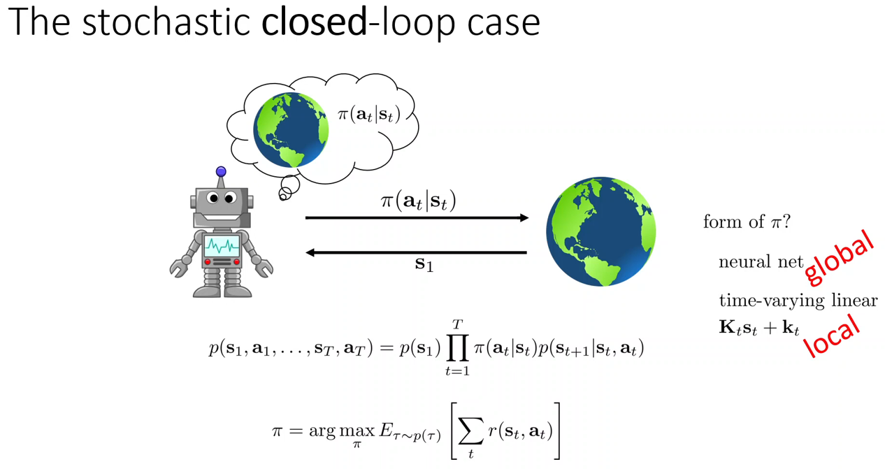

Closed-loop case에서는 state를 관찰하면, 그에 적절한 policy를 전달한다.
Closed-loop의 objective는 model-free RL problem과 동일하고, 차이점은 $p(s_{t+1}|s_t, a_t)$를 명시적으로 모델링한다는 것이다.
* Model-free RL은 경험을 통해 수집한 data $s_t, a_t, r_t, s_{t+1}$을 policy 학습에 사용하는 거였지만, model-based RL은 data를 수집하지 않아도 이미 알고 있는 model을 활용해 policy 학습을 진행한다.

Closed-loop contorl 알고리즘은 관찰 가능한 모든 state에 대해 올바들 답을 제공하는 policy를 학습할 수 있기 때문에 open-loop의 단점을 해결할 수 있다.
* 쉬운 수학 시험을 안전하게 치를 수 있다는 것을 인식하고 올바른 action을 취할 것이다.

Model-free RL에서는 neural network같은 high capacity로 policy를 표현해 모든 state에서 괜찮은 action을 생성하는 global policy를 제공하였다.
Model-based RL에서는 lecture 10에서 살펴본 것처럼 보다 간단한 time-varying linear policy인 iLQR로 local policy(linear feedback controller)를 제공할 수 있다.

이번 강의에서는 학습된 dynamics model을 활용해 neural network 같은 global policy를 학습하는 데 집중할 것이다.

# 3. Backpropagation Into The Policy

  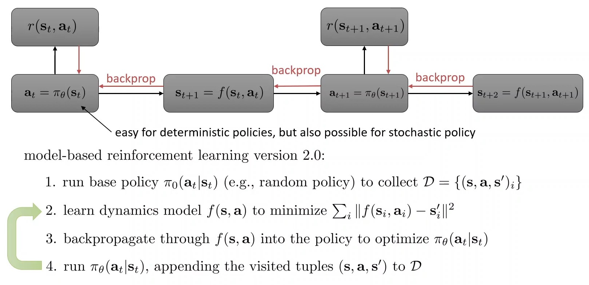

Objective는 reward의 총 합을 늘리는 것이다.
이를 computaiton graph로 나타내면 위와 같고 3개의 function(policy, dynamics model, reward)이 존재한다.
* Reward function $r$은 알고있고 미분 가능하고, dynamics model $f$와 policy $\pi$는 학습 가능하다고 가정한다.
* Stochastic의 경우 re-parameterization trick을 활용해 학습 가능하지만, 지금은 deterministic한 경우만 고려한다.

각 reward node에서 backpropagation을 진행해 $\pi_\theta$를 최적화할 것이다.
이를 model-based reinforcement learning version 2.0이라고 부르자.

  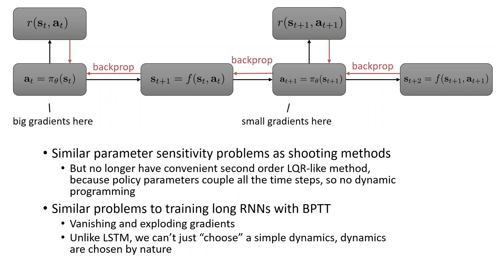

안타깝게도 version 2.0은 일반적으로 잘 작동하지 않는다.
* Lecture 10에서 살펴본 shooting 방법을 살펴봤을 때와 마찬가지로, trajectory 초반의 actions은 미래에 훨씬 더 큰 영향을 끼친다. 
  * 이런 관점으로 초반 actions는 큰 gradient를 가지고 마지막 actions는 작은 gradient를 가지게 된다.
  * 다른 분야에서 DNN model이 겪는 gradient exploding/vanishing 문제이다.
  * 일부 parameter는 큰 graidnet를 받고 일부 parameter는 작은 gradient를 받는, 수치 최적화 관점에서 ill-conditioned 상황이다.
* 초반 action에 대한 작은 변화로 나머지 trajectories가 많이 바뀌게 되는데, 이는 lecture 10 shooting 방법과 trajectory optimization에서 겪는 민감도와 유사하다.
다만, LQR와 같이 2-order Taylor expansion을 활용할 수 없다.
  * LQR은 cost fucntion에서 2-order Taylor expansion으로 Hessian의 근사치를 구하고 최적화를 진행한다.
  * Hessian은 curvature(곡률)까지 고려해서 최적화를 진행한다. 
  * 즉, reward 총 합계에 민감하게 영향을 주는 초반 actions는 curvature가 크고, 이를 반영해 최적화를 진행하기 때문에 gradient exploding이 완화된다.
  * Gradient vanishing도 마찬가지이다.
* Policy 최적화는 모든 time step을 함께 결합시키기 때문에 끝에서 시작해서 거꾸로 작업할 수 있는 편리한 optimization을 진행할 수 없다.
  * LQR은 현재 time step $t$ 해당하는 $a_t$의 Hessian 값만 계산한다.
    * $\partial J / \partial a_t$
    * 모든 time step 관점에서 Hessian의 대각 element $H_{ii}$만 계산한다.
  * Policy 최적화는 모든 time step $t$에 대한 Hessian 값을 계산하기 때문에 시간이 오래 걸린다.
    * $\partial J / \partial \{a_1, \cdots, a_T\}$
    * 모든 time step 관점에서 Hessian의 모든 element $H_{ij}$를 계산한다.
* 또한 DNN model에서 2-order optimization은 잘 동작하지 않는다.
  * Non-convexity 특성(saddle point, 여러 개의 local minima) 때문에 suboptimal이 될 수 있다.
  * Lecture 10강 마지막에서 살펴봤다시피 curvature의 급격한 변화가 있으면 수렴이 쉽지 않다.
  * ... 등등

이러한 현상은 기본적인 RNN의 BPTT(Back Propagation Through Time)에서 발생하는 gradient vanishing/exploding 문제와 유사하다.
* Pure RNN에서는 jacobian의 값이 계속 곱해지는 구조이기 때문에 jacobian의 값이 1보다 크면 gradient exploding이 발생하고 1보다 작으면 gradient vanishing이 발생한다.

RNN에서의 해결책을 model-based에 적용할 수 있지 않을까라는 생각을 가질 수 있는데 결론적으로 불가능하다.
* RNN에서는 dynamics model 구조(GRU, LSTM, transformer, ...)를 선택하여 문제를 해결한다.
  * LSTM에서는 역전파를 통한 시간에 참여하는 함수들의 형태를 선택할 수 있어 jacobian이 거의 1에 가깝도록 강제한다.
* 하지만, model-based에서 dynamics model($f(s_t, a_t)$)는 실제 environment에 근사하도록 학습한 것으로 직접 선택할 수 없다.
  * 로봇을 학습시킨다고 했을 때 로봇에 적용되는 물리법칙은 바꿀 수 없다.
  * 실제 물리 법칙이 높은 curvature를 가질 수 있고 jacobian이 1에서 매우 먼 값을 가질 수 있다.

이러한 이유로 model-based RL에서 gradient 기반 policy 최적화는 매우 까다로운 주제이다.

  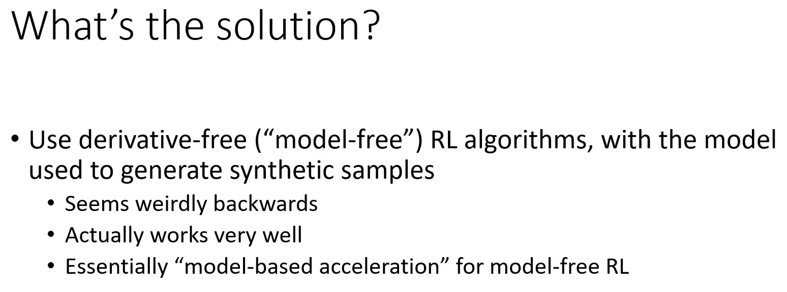

이번 강의에서 논의할 해결책은 학습한 dynamics model을 synthetic sample을 생성하는 데만 활용하고, model-free RL 알고리즘으로 policy를 학습하는 것이다.
* Policy 학습 시 dynamics model을 simulator로만 활용하며, dynamics model을 통한 backpropagation은 수행하지 않는다.
* Simulation으로 생성된 많은 data를 model-free RL을 가속화하기 위해 사용한다.

기본 model-free RL 방법은 이전에 살펴 본 것과 거의 동일할 것(policy gradient, actor-critic, Q-learning)이다.
하지만 학습된 dynamics model에 의해 생성된 추가 데이터를 활용한다.
이는 역설적으로 보일 수 있지만, 매우 잘 작동한다.
* 실제로는 model-free RL과 planning 중간인 어느 정도 hybrid 방법론으로 볼 수 있다.

# 4. Model-Free Learning With a Model

Policy gradient와 model-based RL을 수식적으로 비교로 이전에 언급한 model-based RL의 단점을 살펴보자.

  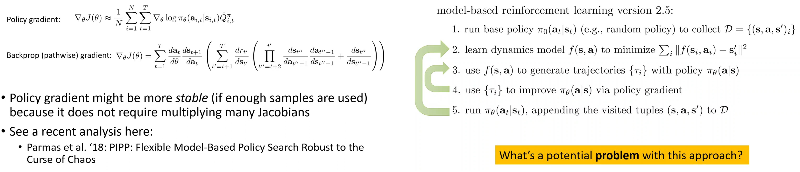

Model-free RL에서 본 policy gradient은 likelihood ratio gradient estimator 또는 REINFORCE gradient estimate라고도 불린다.
이는 policy parameter데 대한 reward의 gradient를 추정하는 gradient estimator로 생각할 수 있기 때문이다.
중요한 것은 gradient estimator가 반드시 RL과 관련있을 필요는 없고, $p_\theta(\tau)$와 같이 stochastic computation graph가 있는 상황에서 일반적으로 사용될 수 있다.
* 확률이 있으면 미분이 불가능 하지만, lecture 5에서 여러 trick을 사용해 미분을 하였다.

즉, gradient estimator가 model-free만 아니라 model-based에서도 활용될 수 있음을 의미한다.
또한, policy gradient에서는 샘플 생성하는데 transition pobability가 필요하지만, 미분을 할 땐 필요가 없다.
* 샘플링을 통해 학습한다는 점이 고전적인 수치 최적화의 finite differencing과 원리가 유사하다.
* 일반적인 backpropagation은 $f = ax + b$를 안 상태에서 $a, b$를 추정하는 것인데, model-free RL은 reward 관점에서 $f = ax + b$를 모르는 상태에서 오직 샘필링으로만 학습이 진행된다.

Section 3에서 살펴 본 model-based RL을 수식으로 나타낸 것은 pathwise gradient라고 불린다.
이는 복잡해 보이지만, 단순히 chain rule을 활용해 policy parameter $\theta$에 대한 gradient를 계산하는 것이다.
주목할 점은 BPTT와 같이 Jacobian의 곱이 계속해서 반복되기 때문에 gradient exploding/vanishing이 발생할 수 있다는 것이다.

위 수식에서 gradient estimator는 stochastic policy와 stochastic transition에만 유효하고, pathwise gradient는 deterministic policy와 transition에만 유효하다.
이는 해결 가능한 문제이다.
* Stochastic -> deterministic: 분산을 0으로 강제
* Deterministic -> stochastic: reparameterization trick으로 해결

이렇게만 보면 model-free RL이 좋아보이지만, model-free RL은 Jacobian 곱을 제거하지만,  샘플링이 필요하다.
샘플이 충분하다면 Jacobian 곱을 제거할 수 있기 때문에 더 안정적으로 학습 가능하다.
반면, model-based RL은 model을 시뮬레이션 할 computation이 필요하지만 실제로 물리적인 environment와 상호작용할 필요가 없다는 장점이 있다.

결론적으로 model-free gradient로 policy를 학습하는 것이 더 나을 수 있다는 것이다.

  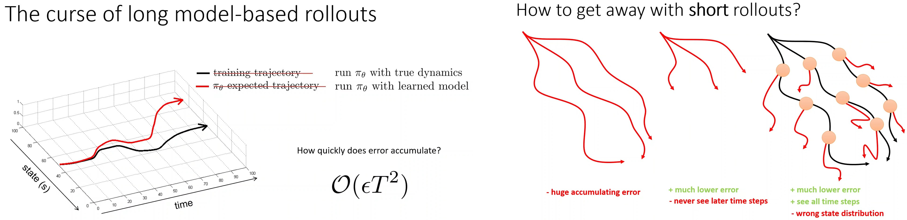

Model-based RL에서 model-free 방법으로 policy를 학습하는 간다한 방법론을 version 2.5라고 부르자.
Version 2.0과 차이점은 backpropagation을 사용하는 대신 policy gradient(step 3, 4)를 도입한 것이다.
Policy gradient를 통해 policy 개선이 충분이 되었다면 dynamics model을 학습하는 step 2로 돌아가서 계속 반복된다.

하지만 long model-based rollouts 저주라는 문제가 생긴다.
학습된 dynamics model이 부정확하기 때문에 distributional shift가 발생하고 policy는 이전에 보지 못한 state에서 실수를 할 확률이 크다.
검은색 곡선이 실제 dynamics로 $\pi_\theta$를 실행했을 때 trajectory이고 빨간색 곡선이 학습된 dynamics로 $\pi_\theta$를 실행했을 때 trajectory이다.
Model-based rollout이 길다면 실수가 누적되기 때문에 두 trajectories의 차이가 커질 것이다.
즉, 기대한 reward와 실제 얻은 reward의 차이가 커진다는 것을 의미한다.
* 오차의 bound는 $O(\epsilon T^2)$이다.

Horizon이 길수록 오차가 exponential하게 커지기 때문에 짧은 rollout만 사용하고 싶을 것이다.
* Horizon은 task 자체의 전체 길이를 의미하고, rollout은 model을 사용해 시뮬레이션하는 길이를 의미한다.
* 예를 들어, task의 horizon이 1000이고 rollout을 50step으로 제한한다면 훨씬 낮은 오차를 가질 것이다.

하지만, 짧은 rollout만 사용하면 초기 time step에서 발생하는 state만 학습할 수 있고 나중 time step에서 일어나는 일은 보지 못할 것이다.
30분 요리 중 초기 5분 길이의 model-based rollout만 만드는 것을 의미하는데, 이는 냄비를 불에 올리기에도 부족한 시간이다.

따라서 horizon을 전부 고려하지만, 처음 time step에서 시작하는 것이 아니라 전체 horizon에 걸쳐 무작위 샘플링을 하고 각각으로부터 짧은 model-based rollout을 만들 것이다.
Model-based roolout이 짧기 때문에 낮은 오차를 가지며 모든 time step을 볼 수 있지만, state distribution이 달라진다는 문제가 발생한다.
* Old policy로 샘플링을 하여 시작 state $s_t$를 얻었지만, 학습된 dynamics model로 rollout하고 새로운 policy가 학습된다.
그리고 새로운 policy로 data를 다시 샘플링하게 되므로 state의 distirubiton이 변하게 된다.
  * State 분포가 old policy와 new policy가 혼합된 것이다.
  * 시작 state $s_t$까지는 old policy state 분포를 다르고 그 이후 rollout은 new policy state 분포를 따른다.

Policy gradient에서 처럼 trust region 하에 작은 변경만 준다면 안정적으로 학습이 진행될 것 이다.
하지만, model-based RL의 목적은 적은 실제 data로 policy를 많이 개선하는 것이라 on-policy를 사용할 때 state distribution 불일치가 해를 끼치기 때문이다.
따라서 일반적으로 Q-learning이나 Q-function actor-critic 방법과 같은 off-policy 알고리즘을 사용하는 것이 더 낫다.

  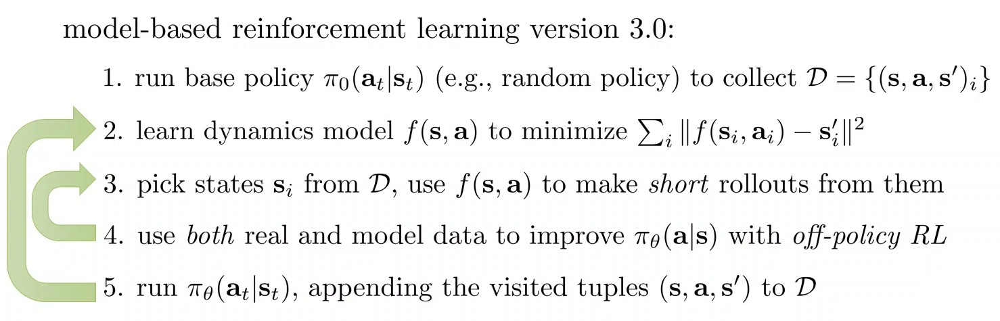

학습된 dynamics model로 짧은 rollout(데이터 증강)하여 model-free RL의 off-policy방법으로 policy를 개선하는 것을 model-based RL version 3.0이라고 부르자.
이는 실제로 사람들이 실무에서 사용하는 방법론과 매우 유사하다.
* State들로부터 짧은 rollout의 길이는 1 time step만큼 짧을 수 있고 더 길때는 10 time step 정도 이다.
* 각 단계에서 섬세한 설계가 필요하다. (step 3,4를 얼마나 반복할지, step 2~5를 얼마나 반복할지 등)

# 5. Dyna-Style Algorithms

Model-based RL version 3.0을 기반으로 실용적으로 사용할 수 있는 방법론을 살펴보자.
Step 4에서 사용할 off-policy 알고리즘은 기본적으로 Q-learning라고 가정한다.

  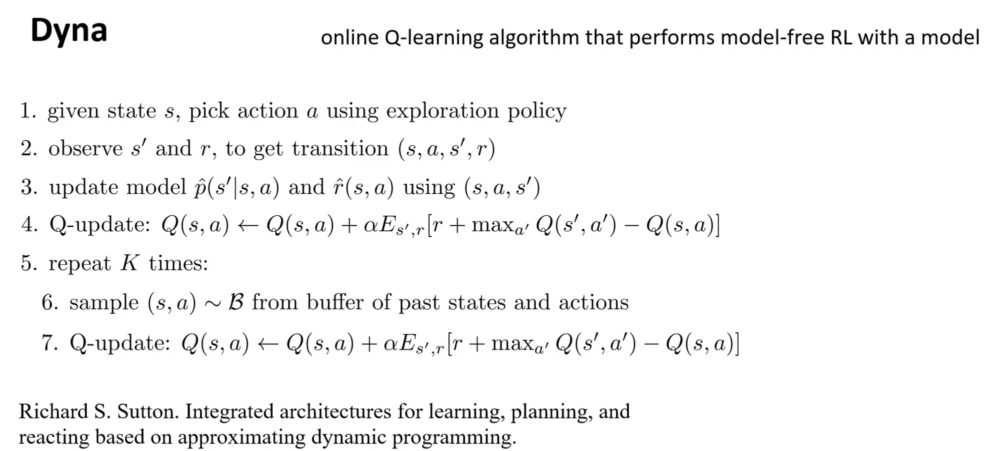

Dyna는 online Q learning을 위해 instance화된 method로 model-based accleration을 추가하였다.
Dyna는 online 방법으로 제안되었기 때문에 1 step으로 dynamics model과 reward function을 학습한다.
* 하나의 transiton을 input으로 받고 한 번의 gradient descent만 수행한다.

그리고 classic Q learning을 업데이트할 때, 1 time step model-based rollout을 사용하고 이를 K번 반복한다.
* Buffer에서 이전 state와 action을 샘플링하고 학습된 dynamics model로 시뮬레이션 한다.

제안된 Dyna는 stochastic 시스템에 최적화되어 있고, dstributional shift에 취약할 것이라고 예상되는 경우 좋은 선택이다.
* 1 step rollout, buffer에서 샘플링 등은 실제 data 분포에서 크게 벗어나지 않는다.

  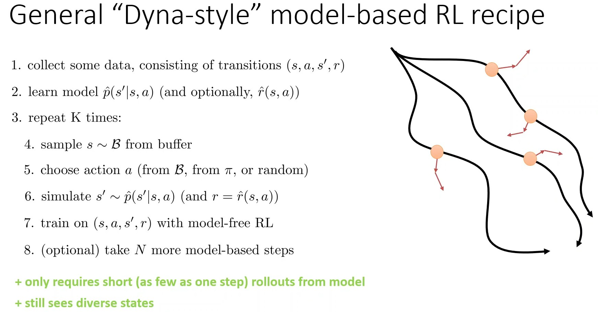

Distributional shift에 안전한 것 대신 일반화된 version을 도출할 수 있고, 실무에서 사용되는 version에 더 가깝다.
자세한 설계는 신중히 선택해야 한다.
* Reward function을 모른다면 학습을 진행한다.
* 1 step gradient 대신 여러 step gradient를 수행할 수 있다.
* Model-based rollout에서 굳이 buffer에서 sampling하지 않고 최신 policy에 따라 action을 선택할 수 있고, random exploration할 수도 있다.
* 1 step 대신 여러 step을 rollout할 수 있다.

# 6. Model-accelerated Off-policy RL

  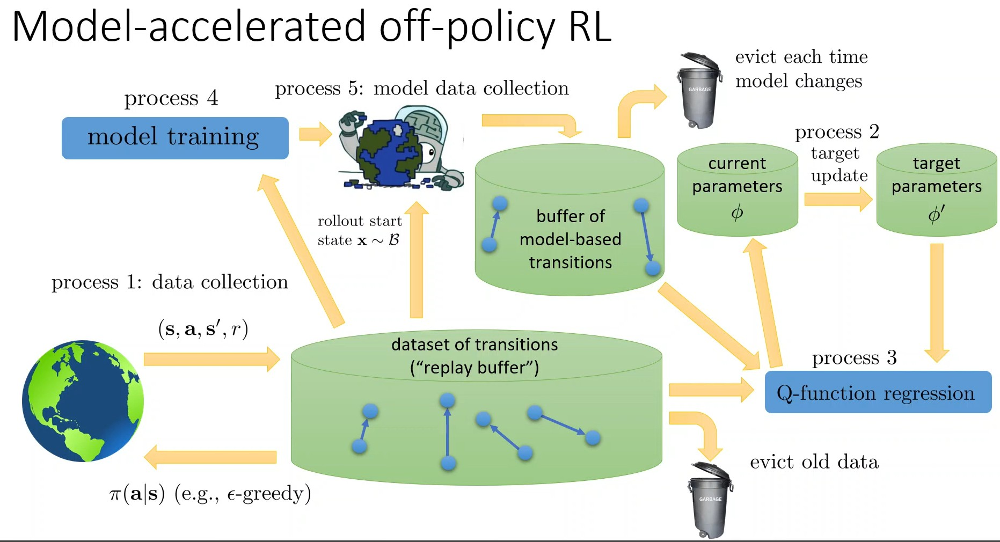

일반화된 Dyna를 그림으로 설명하면, 위와 같다.
* Process 1, 2, 3은 Q-learning에서의 절차와 동일하다.
* Process 4, 5는 model-based로 데이터를 증강한다.
* 일반적으로 synthetic data가 많기 때문에 많이 사용되고 dynamics model이 업데이트 되면 model-based buffer에 있는 synthetic data를 제거한다. (물론, buffer data를 재사용할 수 있다.)

  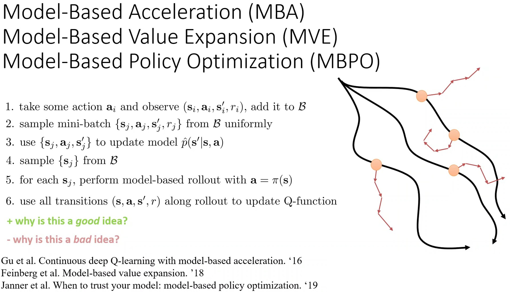

위의 diagram에서 구현 선택에 따라 제안된 다양한 algorithm이 존재한다.
* MBPO: Q-learning process에서 사용되는 데이터 설계
* MVE: model-based rollout으로 더 나은 target value 추정치를 얻지만 Q function 자체를 훈련시키는 데는 사용하지 않음

각각의 설계 선택이 다르지만, 높은 수준에서 공통된 recipe를 가진다.
* Rollout 데이터를 사용하면 실제 MDP에서 수집한 것보다 훨씬 더 많은 데이터를 사용할 수 있다는 장점이 있지만, dynamics model이 부정확하기 때문에 bias가 생긴다는 단점이 있다.
  * Dynamics model ensemble을 사용하면 stochasticity가 오류를 평균화하고 exploitation을 줄이는 데 도움이 된다.
* Section 4에서 언급했듯이 state distribution이 shift되어 실제 결과가 예상한 것과 다를 수 있다는 단점이 있지만, trade-off로 model-based acceleration을 사용하기 때문에 훨씬 빠르게 학습하는 경향이 있다.

짧은 rollout을 사용하고 설계를 잘 하더라도 dynamics model의 정확성의 한계로 인해 bias가 추가되기 때문에 성능의 상한선이 있다는 것을 유의해야 한다.

